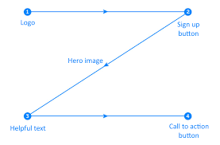

# 
COURSE PROJECT

    <strong>Universidad Peruana de Ciencias Aplicadas</strong> 
     
     
     
    <strong>Ingeniería de Software - 2024-01</strong> 
     
    <strong>Aplicaciones Web - WX54</strong>   
     
    <strong>Profesor: Alex Humberto Sánchez Ponce</strong> 
      <strong>INFORME DE TRABAJO FINAL - TB1 </strong> 

    <strong>Startup: PeaceApp </strong> 
    <strong>Producto:  PeaceApp </strong>

<h3 align="center" >Team Members:</h3>

    <table align="center">
        <tr>
            <th style="text-align:center;">Member</th>
            <th style="text-align:center;">Code</th>
        </tr>
        <tr>
            <td>Escalante Baygorrea, Janiel Franz</td>
            <td>U201912668</td>
        </tr>
        <tr>
            <td>Noriega Suschenko, Anatoly Andrey</td>
            <td>U202211813</td>
        </tr>
        <tr>
            <td>Príncipe Godoy, Johan</td>
            <td>U202014511</td>
        </tr>
        <tr>
            <td>Rodriguez Zuluoeta, Andres Fernando</td>
            <td>U202124213</td>
        </tr>
        <tr>
            <td>Zarate Caceres, Victor Ernesto</td>
            <td>U202112907</td>
        </tr>
    </table>

 

# Registro de Versiones del Informe

| Versión |   Fecha    |              Autor               | Descripción de modificación                                                                  |
| :-----: | :--------: | :------------------------------: | :------------------------------------------------------------------------------------------- |
|   TB1   | 14/04/2024 | Todos los integrantes del equipo | Capitulo I, Capitulo II, Capitulo III, Capitulo IV y Capitulo V. Creación de Landing Page |
|   TB2   | 01/05/2024 | Todos los integrantes del equipo | Correción del presentable anterior Mejora de Landing Page Creación de App Web          |

 

# Project Report Collaboration Insights

Para el desarrollo del informe se dividió la implementación de secciones de la siguiente forma para cada integrante del equipo:

| Integrantes                         | Tareas designadas                                                                                                                                                                      |
| :---------------------------------- | :------------------------------------------------------------------------------------------------------------------------------------------------------------------------------------- |
| Escalante Baygorrea, Janiel Franz   | Lean UX Process, Software Object-Oriented Design, Diagrama de base de datos, Diagrama UML y parte del Landing Page                                                                     |
| Noriega Suschenko, Anatoly Andrey   | Segmentos objetivo, Competidores, Analisis Competitivo, Entrevista, Landing Page UI Design, Web Application UX/UI Design, Web Application Prototyping y parte del Landing Page         |
| Príncipe Godoy, Johan               | Needfinding, Ubiquitous Language, To-Be Scenario Mapping, Domain-Driven Software Architecture y parte del Landing Page                                                                 |
| Rodriguez Zuluoeta, Andres Fernando | Diseño de entrevistas, Analisis de entrevistas, Needfinding, User Personas, User Stories, Impact Mapping, Product Backlog, Software Configuration Managemente y parte del Landing Page |
| Zarate Caceres, Victor Ernesto      | Startup Profile, Solution Profile, Registor de entrevista, Style Guidelines, Information Arquitecture y parte del Landing Page                                                         |

Informe: https://github.com/G2WebApplication-WX54/Final-Report-Project-Web-Development/tree/develop

# Contenido

## Tabla de Contenidos

### [Registro de versiones del informe](#registro-de-versiones-del-informe)

### [Project Report Collaboration Insights](#project-report-collaboration-insights)

### [Contenido](#contenido)

### [Student Outcome](#student-outcome-1)

### [Capítulo I: Introducción](#capc3adtulo-i-introduccic3b3n-1)

- [1.1. Startup Profile](#11-startup-profile)
  - [1.1.1. Descripción de la Startup](#111-description-de-la-startup)
  - [1.1.2. Perfiles de integrantes del equipo](#112-perfiles-de-integrantes-del-equipo)
- [1.2. Solution Profile](#12-solution-profile)
  - [1.2.1 Antecedentes y problemática](#121-antecedentes-y-problemática)
  - [1.2.2 Lean UX Process](#122-lean-ux-process)
    - [1.2.2.1. Lean UX Problem Statements](#1221-lean-ux-problem-statements)
    - [1.2.2.2. Lean UX Assumptions](#1222-lean-ux-assumptions)
    - [1.2.2.3. Lean UX Hypothesis Statements](#1223-lean-ux-hypothesis-statements)
    - [1.2.2.4. Lean UX Canvas](#1224-lean-ux-canvas)
- [1.3. Segmentos objetivo](#13-segmentos-objetivo)

### [Capítulo II: Requirements Elicitation & Analysis](#capc3adtulo-ii-requirements-elicitation--analysis-1)

- [2.1. Competidores](#21-competidores)
  - [2.1.1. Análisis competitivo](#211-análisis-competitivo)
  - [2.1.2. Estrategias y tácticas frente a competidores](#212-estrategias-y-tácticas-frente-a-competidores)
- [2.2. Entrevistas](#22-entrevistas)
  - [2.2.1. Diseño de entrevistas](#221-diseño-de-entrevistas)
  - [2.2.2. Registro de entrevistas](#222-registro-de-entrevistas)
  - [2.2.3. Análisis de entrevistas](#223-análisis-de-entrevistas)
- [2.3. Needfinding](#23-needfinding)
  - [2.3.1. User Personas](#231-user-personas)
  - [2.3.2. User Task Matrix](#232-user-task-matrix)
  - [2.3.3. User Journey Mapping](#233-user-journey-mapping)
  - [2.3.4. Empathy Mapping](#234-empathy-mapping)
  - [2.3.5. As-is Scenario Mapping](#235-as-is-scenario-mapping)
- [2.4. Ubiquitous Language](#23-ubiquitous-language)

### [Capítulo III: Requirements Specification](#capc3adtulo-iii-requirements-specification-1)

- [3.1. To-Be Scenario Mapping](#31-to-be-scenario-mapping)
- [3.2. User Stories](#32-user-stories)
- [3.3. Impact Mapping](#33-impact-mapping)
- [3.4. Product Backlog](#34-product-backlog)

### [Capítulo IV: Product Design](#capc3adtulo-iv-product-design-1)

- [4.1. Style Guidelines](#41-style-guidelines)
  - [4.1.1. General Style Guidelines](#411-general-style-guidelines)
  - [4.1.2. Web Style Guidelines](#412-web-style-guidelines)
- [4.2. Information Architecture](#42-information-architecture)
  - [4.2.1. Organization Systems](#421-organization-systems)
  - [4.2.2. Labeling Systems](#422-labeling-systems)
  - [4.2.3. SEO Tags and Meta Tags](#423-seo-tags-and-meta-tags)
  - [4.2.4. Searching Systems](#424-searching-systems)
  - [4.2.5. Navigation Systems](#425-navigation-systems)
- [4.3. Landing Page UI Design](#43-landing-page-ui-design)
  - [4.3.1. Landing Page Wireframe](#431-landing-page-wireframe)
  - [4.3.2. Landing Page Mock-up](#432-landing-page-mock-up)
- [4.4. Web Applications UX/UI Design](#44-web-applications-uxui-design)
  - [4.4.1. Web Applications Wireframes](#441-web-applications-wireframes)
  - [4.4.2. Web Applications Wireflow Diagrams](#442-web-applications-wireflow-diagrams)
  - [4.4.3. Web Applications Mock-ups](#443-web-applications-mock-ups)
  - [4.4.4. Web Applications User Flow Diagrams](#444-web-applications-user-flow-diagrams)
- [4.5. Web Applications Prototyping](#45-web-applications-prototyping)
- [4.6. Domain-Driven Software Architecture](#46-domain-driven-software-architecture)
  - [4.6.1. Software Architecture Context Diagram](#461-software-architecture-context-diagram)
  - [4.6.2. Software Architecture Container Diagrams](#462-software-architecture-container-diagrams)
  - [4.6.3. Software Architecture Components Diagrams](#463-software-architecture-components-diagrams)
- [4.7. Software Object-Oriented Design](#47-software-object-oriented-design)
  - [4.7.1. Class Diagrams](#471-class-diagrams)
  - [4.7.2. Class Dictionary](#472-class-dictionary)
- [4.8. Database Design](#48-database-design)
  - [4.8.1. Database Diagram](#481-database-diagram)

### [Capítulo V: Product Implementation, Validation & Deployment](#capc3adtulo-v-product-implementation-validation--deployment-1)

- [5.1. Software Configuration Management](#51-software-configuration-management)
  - [5.1.1. Software Development Environment Configuration](#511-software-development-environment-configuration)
  - [5.1.2. Source Code Management](#512-source-code-management)
  - [5.1.3. Source Code Style Guide & Conventions](#513-source-code-style-guide--conventions)
  - [5.1.4. Software Deployment Configuration](#514-software-deployment-configuration)
- [5.2. Landing Page, Services & Applications Implementation](#52-landing-page-services--applications-implementation)
  - [5.2.1. Sprint 1](#521-sprint-1)
    - [5.2.1.1. Sprint Planning 1](#5211-sprint-planning-1)
    - [5.2.1.2. Sprint Backlog 1](#5212-sprint-backlog-1)
    - [5.2.1.3. Development Evidence for Sprint Review](#5213-development-evidence-for-sprint-review)
    - [5.2.1.4. Testing Suite Evidence for Sprint Review](#5214-testing-suite-evidence-for-sprint-review)
    - [5.2.1.5. Execution Evidence for Sprint Review](#5215-execution-evidence-for-sprint-review)
    - [5.2.1.6. Services Documentation Evidence for Sprint Review](#5216-services-documentation-evidence-for-sprint-review)
    - [5.2.1.7. Software Deployment Evidence for Sprint Review](#5217-software-deployment-evidence-for-sprint-review)
    - [5.2.1.8. Team Collaboration Insights during Sprint](#5218-team-collaboration-insights-during-sprint)
- [5.3.Validation Interviews](#53-validation-interviews)
  - [Diseño de Entrevistas](#531-sprint-1)
  - [Registro de Entrevistas](#532-sprint-1)
  - [Evaluaciones según heurísticas](#533-sprint-1)
- [5.4.Video About-the-Product](#54-video-about-the-product)

### [Conclusiones](#conclusiones-1)

- [Conclusiones y recomendaciones](#conclusiones-y-recomendaciones)
- [Video About-the-Product](#video-about-the-product)

### [Bibliografía](#bibliografc3ada-1)

### [Anexos](#anexos-1)

# Student Outcome

    Criterio: Trabaja efectivamente en un equipo cuyos miembros juntos proporcionan liderazgo; crea un entorno colaborativo e inclusivo y establece metas, planifica tareas y cumple objetivos.     
    En el siguiente cuadro se describe las acciones realizadas y enunciados de conclusiones por parte del grupo, que permiten sustentar el haber alcanzado el logro del ABET – EAC - Student Outcome 5.
      
    <table>
      <tr>
        <td><b>Criterio específico</b></td>
        <td><b>Acciones realizadas</b></td>
        <td><b>Conclusiones</b></td>
      </tr>
      <tr>
          <td>
              <b>Participa en equipos multidisciplinarios con eficacia, eficiencia y objetividad, en el marco de un proyecto en soluciones de ingeniería de software.</b>
          </td>
          <td>
              TB1  
              <b>Escalante Baygorrea, Janiel Franz</b> 
              He realizado la seccion del UX LEAN Process, Software Object-Oriented Design, Diagrama de base de datos, Diagrama UML y parte del Landing Page.
              Mi participación en el equipo fue fundamental para el desarrollo del proyecto, cumpliendo con todas las tareas asignadas y aportando ideas para 
              el desarrollo de la plataforma.
                
              <b>Noriega Suschenko, Anatoly Andrey</b> 
              He realizado la sección de Segmentos objetivos para identificar cuales serán nuestros principales usuarios para la plataforma, también el analisis de competidores junto con las estrategias 
              para evaluar quienes son nuestros rivales potenciales dentro del mercado y evaluar estrategias para poder aprovechar nuestras oportunidades y fortalezas para afrontar las debilidades y amenazas.
              También realice la entrevista del segmento usuario para poder evaluar lo que requieren nuestros usuarios potenciales y realice los diseños tanto de los Wireframes y Mock-Ups de la Landing Page 
              como de la Web Application y realizar un prototipo de como sera nuestra plataforma.
                          
              <b>Príncipe Godoy, Johan</b> 
              Para el desarrollo del proyecto, participé eficazmente en la creación de los User Task Matrix, Journey Mapping, Empathy Mapping, As-Is y To-be Scenario Mapping
                
              <b>Rodriguez Zuluoeta, Andres Fernando</b> 
              He realizado el diseño y posterior analisis de entrevistas,user personas de cada segmento obejtivo, user stories con sus respectivos criterios de aceptacion, impact mapping, product backlog y el 
              software configuration management.
                
              <b>Zarate Caceres, Victor Ernesto</b> 
              Se participo activamente en identificar el problema a enfrentar y la solución que se utilizara. Para cumplir el trabajo, se realizaron todas las tareas encomendadas, como lo son la introducción,
              el perfil de la Startup, el perfil de la solución y el diseño de producto con todas las guidelines e información de arquitectura necesaria.  
              TP  
              <b>Escalante Baygorrea, Janiel Franz</b> 
                
              <b>Noriega Suschenko, Anatoly Andrey</b> 
              He realizado la corrección de algunos puntos del proyecto como lo serían el Ubiquitous Language, el Domain-Driven Software Architecture, junto con el Sprint 1 que en el envío pasado no estaba presente. Así mismo participe en la realización de la Web Application y poner como predeterminado el idioma inglés en la Landing Page.            
              <b>Príncipe Godoy, Johan</b> 
              Para el sprint 2, se realizó la corrección de algunos puntos de la entrega anterior como los user stories, product backlog. De la misma manera, implementé las vistas asignadas para el web application.
                
              <b>Rodriguez Zuluoeta, Andres Fernando</b> 
                
              <b>Zarate Caceres, Victor Ernesto</b> 
              Se participo con la correción de puntos anteriores, como en el resumen y análisis de entrevistas, el Journey Mapping en su versión As-Is, las User Stories y su Product Backlog. Además, se realizo
              la recopliación de evidencias para la creación del Sprint 2, correspondiente a esta entrega. 
          </td>
          <td>
              TB1 
              Se llevó a cabo un análisis completo que ayudo a identificar a nuestros potenciales clientes, evaluando a la competencia y como enfrentarla. El desarrollo del proyecto incluyó la elaboración de 
              diversos mapas para entender todo de mejor manera. En general, se aseguro el cumplimiento de todas las tareas encomendadas y para dar un enfoque sólido y bien fundamentado al proyecto.  
              TP 
                
          </td>
      </tr>
      <tr>
        <td>
            <b>Conoce al menos un sector empresarial o dominio de aplicación de soluciones de software.</b>
        </td>
        <td>
            TB1  
            <b>Escalante Baygorrea, Janiel Franz</b> 
            Para llevar acabo el desarrollo del LEAN UX y el diagrama UML estudie como funciona el sector de la seguridad ciudadana y como se puede aplicar la tecnología para mejorar la seguridad de los ciudadanos.
              
            <b>Noriega Suschenko, Anatoly Andrey</b> 
            Hice uso de lo aprendido dentro del curso de Aplicaciones Web y trabajos anteriores para identificar los problemas a resolver sobre nuestro trabajo. Asimismo, en base a lo aplicado como analizar 
            nuestro público objetivo, las estrategias frente a nuestros competidores, las entrevistas realizadas, y el diseño de los Wireframes y Mock-Ups junto con los UserFlows, Wireflows y el prototipo 
            de la plataforma web, nos sirvio para tener una idea más clara de como avanzar con el trabajo en cuestión.
                        
            <b>Príncipe Godoy, Johan</b> 
            Para el cumplimiento de este trabajo usé lo aprendido dentro del curso y proyectos antereriores. De esta manera pude cumplir con los puntos que me fueron asignado como Diagrama de Contexto, Contenedor y Componentes.
              
            <b>Rodriguez Zuluoeta, Andres Fernando</b> 
            Use el conocimiento previamente adquirido en trabajos anteriores para asi poder realizar el proyecto de este curso. Pude realizar con exito el diseño y posterior analisis de entrevistas,user personas, 
            user stories, impact mapping, product backlog y el software configuration management. 
              
            <b>Zarate Caceres, Victor Ernesto</b> 
            Se hizo uso del conocimiento previo adquirido en el desarrollo de aplicaciones web, aplicaciones de escritorio y trabajos anteriores. Este conocimiento se vio reflejado en identificar los problemas
            que deben ser resueltos mediante la recopilación de testimonios a través de entrevistas. Además, sirvio para identificar los colores más adecuados para que la plataforma se vea funcional y sea 
            atractiva al usuario.  
            TP  
            <b>Escalante Baygorrea, Janiel Franz</b> 
              
            <b>Noriega Suschenko, Anatoly Andrey</b> 
            Hice uso de los nuevos conocimientos que aprendí en el curso junto con la retroalimentación dada por el profesor para corregir los errores del envío pasado. Esto me sirvió para seguir mejorando en el proyecto además que con lo aprendido en clase me sirvió para avanzar la Web Application.            
            <b>Príncipe Godoy, Johan</b> 
            Se realizó la implementación del Sprint 2, para la cual se realizó reunionen con el grupo para definir el alcanze y los objetivos que tendríamos con esta entrega. Asimismo, hubo frecuente comunicación para conocer los constantes avances durante la entrega.
              
            <b>Rodriguez Zuluoeta, Andres Fernando</b> 
              
            <b>Zarate Caceres, Victor Ernesto</b> 
            Se utilzo lo aprendido durante el curso y de manera previa para corregir los errores existentes en nuestro informe y aplicaciones. Este conocimiento se vio reflejado dar un mejor diseño a las plataformas
            y en presentar un nuevo informe mejorado, más apegado a lo que se espera en el curso.
        </td>
        <td>
            TB1  
            Se aplicó toda la experiencia y conocimientos previos para abordar el trabajo de manera efectiva. Esto incluyó el análisis de problema, la identificación del público objetivo, y el diseño de la plataforma.  
            TP 
              
        </td>
      </tr>
    </table>

# Capítulo I: Introducción

## 1.1. StartUp Profile

### 1.1.1. Description de la StartUp

    La idea de crear PeaceApp nace ante la creciente ola de inseguridad ciudadana en Lima, y en todo el país. Según el INEI, el 45,6% de ciudadanos de Lima se siente inseguros de vivir en 
    dicha ciudad, con un registro de mas de 75 mil denuncias por hurtos y/o asaltos. Para enfrentar esta situación, la aplicación brindara un mapa con información de las calles, resaltando 
    el nivel de peligro en las distintas zonas de la ciudad. Ante esto, el usuario podrá hacer denuncias ante los crímenes a través de fotos, audios y/o videos, en tiempo real, pudiendo 
    brindar sus datos o hacerlo de manera anónima. Además, el ciudadano podrá compartir su ubicación con sus contactos cercanos para que monitoreen su trayecto y enviar mensajes de emergencia
    a la policía nacional, bomberos o ambulancia, usando un sistema de marcación rápida.
    <ul>
        <li><b>Misión:</b></li>
        Nuestra misión es garantizar la seguridad de nuestros usuarios, para que puedan transitar sin miedo alguno por las distintas calles del Perú.
        <li><b>Visión:</b></li>
        Vemos el mundo en constante cambio y buscamos ser parte de ello. Creemos que todas las personas deben poder sentirse seguras de vivir y transitar en su propio país y que los gobiernos 
        deben engargarse de ello. Por ello, buscamos ser conocidos como líderes en el mercado de seguridad por nuestra labor para todos nuestros usuarios.
    </ul>

### 1.1.2. Perfiles de Integrantes del equipo

| Nombre Completo del integrante      | Descripcion de Carrera                                                                      | Fotografía                               | Conocimientos y Habilidades a apuntar                                                                                                                                                                                                                   |
| ----------------------------------- | ------------------------------------------------------------------------------------------- | ---------------------------------------- | ------------------------------------------------------------------------------------------------------------------------------------------------------------------------------------------------------------------------------------------------------- |
| Escalante Baygorrea, Janiel Franz   | Ingenieria de Software  Universiad Peruana de Ciencias Aplicadas                         |   | Conocimientos en lenguajes de Programación como C++, Java, HTML, CSS. Me considero que soy una persona muy trabajadora.                                                                                                                              |
| Noriega Suschenko, Anatoly Andrey   | Ingeniería de Software  5to Ciclo 2024-1 Universidad Peruana de Ciencias Aplicadas |  | - Conocimientos en lenguajes de Programación como C++, Python, HTML, CSS. -Considero que soy una persona muy perseverante y que sabe trabajar en equipo.                                                                                             |
| Príncipe Godoy, Johan               | Ingenieria de Software  Universiad Peruana de Ciencias Aplicadas                         |     | - Conocimiento en lenguajes de programación como C++, Python, HTML, CSS, JS, SQL, MongoDB.   - Me considero una persona comprometida y perseverante para lograr lo mejor con el equipo.                                                              |
| Rodriguez Zuluoeta, Andres Fernando | Ingenieria de Software  Universiad Peruana de Ciencias Aplicadas                         |  | Tengo conocimiento de lenguaje de programación como C ++ y Python. Me considero una persona centrada y responsable al momento de realizar trabajos en grupo.                                                                                            |
| Zarate Caceres, Victor Ernesto      | Ingeniería de Software Universidad Peruana de Ciencias Aplicadas                         |   | - Conocimiento de Programación en C++, Python, HTML, CSS, MAtLab y SQL. -Me considero una persona responsable, capaz de aportar ideas para el proyecto. -Tengo el compromiso de trabajar de manera eficiente y cumplir con los plazos de entrega. |

## 1.2. Solution Profile

### 1.2.1 Antecedentes y problemática

    <ul>
        <li>
            <b>What (Qué): </b>PeaceApp esta enfocada en ayudar a los usuarios en su día a día, teniendo como objetivo crear una comunidad entre usuarios y autoridades para mantener información
            detallada y confiable de las calles en todo el Perú. Tambien, nos encargaremos de mantener el sistema actualizado para que funcione de manera óptima. 
        </li>
        <li>
            <b>When (Cuándo): </b>PeaceApp estara lista para funcionar las 24 horas del día, cada día de la semana. Con esto se busca que la base de datos tenga información verificada y actualizada en todo momento. 
        </li>
        <li>
            <b>Where (Dónde): </b>PeaceApp esta hecha para ser utilizada en cualquier momento y lugar, pues funcionara en base a la ubicación del usuario. Además de que las distintas autoridades
            deben estar al tanto de la situación actual de su jurisdicción.
        </li>
        <li>
            <b>Who (Quién): </b>Los personas más afectadas por la delincuencia veran mejoras en la situación de sus distritos. Estos, a su vez, tendrán la capacidad de colaborar con mantener la
            información actualizada, por medio de una herramienta integrada, que les permitirá publicar sobre los distintos sucesos que observan y ponerse en contacto rápidamente con las 
            autoridades con las cuales se relaciona PeaceAppp (comisarías, bomberos, hospitales, municipalidades, etc.).
        </li>
        <li>
            <b>Why (Por qué): </b>PeaceApp fue creada para enfrentar la creciente delincuencia en la ciudad de Lima y en todo el país. Esta tiene el objetivo de informar sobre los sucesos más 
            recientes del entorno del usuario y ayudar a otros usuarios y a las municipalidades a prevenir estas situaciones en el futuro.
        </li>
        <li>
            <b>How (Cómo): </b>PeaceApp tiene un personal altamente capacitado para mantener actualizada y funcional la base de datos de los distritos y ciudades en todo el Perú, para mantener
            a nuestros usuarios con la información actualizada sobre las calles que transitará. Además, se podrá compartir información con otros usuarios y autoridades para tomar las medidas
            correspondientes y que verifiquen la veracidad de todo lo que se publique. 
        </li>
        <li>
            <b>How Much (Cuánto):</b>PeaceApp estara disponible de forma gratuita para todas las personas naturales. Además, tendrá disponible una licencia de uso para las entidades, como 
            municipalidades. Así, estas tendrán un acceso preferencial a los datos recopilados y puedan utilzarlos para tomar acción directa en contra de la delincuencia. 
        </li>
    </ul>

### 1.2.2 Lean UX

#### 1.2.2.1. Problem Statements

El propósito de nuestro servicio es ofrecer rutas seguras, diseñadas en base a la ubicación de partida y la de llegada del usuario. A través de nuestro servicio, los usuarios
tienen acceso a un mapa de calor de la peligrosidad de las zonas de lima. Las actualizaciones de las zonas de peligrosidad se haran en base a reportes de los usuarios de
la aplicación. Por otro lado, las entidades que trabajen con nosotros podrán tener acceso a esta información y sus respectivos datos estadísticos. Estos datos pueden ser
usados para plantear una estrategía contra la delincuencia.

Hemos observado la insatisfacción de los clientes con respecto a la seguridad. Actualmente, los hurtos en la calle son comunes en la ciudad de Lima. Según Osiptel, la mayor
cantidad de robos de celulares por hora se reportan los lunes, esto sería aproximadamente 366 equipos móviles en promedio. Por otro lado, Según el último resultado
de la ENAPRES para el semestre móvil Ene-Jun 2023 publicado por el INEI, el 26.9% de la población de 15 años de edad, a más, a nivel nacional, ha sido victima de algún
hecho delictivo.

¿De qué forma podemos evitar los hurtos en la calle cuando se encuentran recorriendo una ruta?

#### 1.2.2.2. UX Assumptions

Ahora que hemos analizado la problematica y tenemos un panorama de cómo solucionar el problema, debemos saber que empresas tienen características similares a las nuestras
y cómo estas se han ido desarrollando a través del tiempo.
La aplicación UrSafe es similar a la nuestra, esta aplicación permite ver un mapa con lugares seguros y te permite comunicarte con familiares, amigos y el 911 en caso de
peligro.

**Assumptions:**

- Los ciudadanos de Lima necesitan una app que les muestre rutas seguras para movilizarse a tráves de la ciudad de Lima
- Los ciudadanos necesitan sentirse parte de una comunidad en la que se puedan reportar incidentes y verlo reflejado en un mapa que les permite visualizar las zonas más
  seguras de su ciudad.
- Mis clientes serán ciudadanos y entidades preocupadas por la seguridad de su distrito o trabajadores
- Generaré ingresos vendiendo nuestra aplicación web a municipalidades, instituciones del estado e interesedos en el tema de la seguridad
- No tengo ningún competidor en el mercado actualmente
- Las entidades que trabajen con nuestra aplicación podrán obtener datos de vital importancia para combatir la criminalidad
- Los ciudadanos de a pie estarán interesados en esta aplicación
- Las entidades públicas de este país necesitan este tipo de aplicaciones para combatir la criminalidad con más eficacia.

**Business outcomes:**

- Generar ingresos con la aplicación
- Mejorar la calidad de la vida de los ciudadanos del Perú
- Reducir la cantidad de robos que ocurren en el país

**User outcomes:**

- ¿Quién es el usuario?  
  Cualquier ciudadano que se encuentre en una zona en la que una entidad este asociada con nosotros. Por otro lado, las entidades públicas
  como municipalidades, PNP, etc. También empresas privadas interesadas en contar con esta aplicación para sus trabajadores, de preferencia
  extranjeros que no conocen bien las calles de la ciudad.
- ¿Dónde encaja nuestro producto en su trabajo o vida?  
  Encaja en su vida diaria, ya que con nuestra aplicación podrá movilizarse por la ciudad evitando riesgos
- ¿Qué problemas tiene nuestro producto?  
  Un problema que tiene nuestro producto es que para geenera ingresos, dependemos exclusivamente de las entidades que se van a asociar con nosotros
- ¿Cuándo y cómo es usado nuestro producto?  
  Nuestros usuarios utilizarían la aplicación cuando tengan que pasar por lugares que no conocen o deseen reportar un incidente para que otros ciudadanos tengan cuidado.
  Por otro lado, las entidades podrán recopilar información de los ciudadanos y esto les facilitará tomar acciones para combatir la criminalidad en ciertas areas.

- ¿Qué características son importantes?  
  Sera una aplicación sencilla de usar para los usuarios y que las información se accesible de una manera sencilla.

- ¿Cómo debe verse nuestro producto y comportarse?  
  Nuestra app debe tener una buena selección de colores para que sea agradable a la vista. Además el registro debe ser fácil para todos los usuarios.

**User benefits**

- Evitar robos y cualquier tipo de incidentes que ponga en peligro al usuario al movilizarse por la ciudad
- Información en tiempo real de zonas peligrosas mediante el uso del mapa de calor
- Información de rutas seguras para movilizarse mediante el mapa
- Acceso a datos estadísticos para comprender mejor el problema

#### 1.2.2.3. Lean UX Hypothesis Statements

- **Hypothesis Statement 01**  
  **Creemos que** las entidades publicas y privadas estarán interesadas en nuestro producto  
  **Sabremos que** hemos tenido éxito  
  **Cuando** podamos trabajar con un mapa de calor de toda la ciudad de Lima
- **Hypothesis Statement 02**  
  **Creemos que** la aplicación logrará formar una comunidad interesada en la seguridad  
  **Sabremos que** hemos tenido exito  
  **Cuando** tengamos se perciba un aumento en la cantidad de usuarios registrados diariamente.
- **Hypothesis Statement 03**  
  **Creemos que** la disponibilidad de datos de vital importancia permitarán a distintas entidades planificar una estrategia contra la delincuencia  
  **Sabremos que** se está cumpliendo ese objetivo  
  **Cuando** se perciba una disminución en los reportes de criminalidad sin que se reduzca la cantidad de usuarios
- **Hypothesis Statement 04**  
  **Creemos que** nuestra aplicación será usada a nivel nacional  
  **Sabremos que** hemos tenido exito  
  **Cuando** la aplicación sea adquirida por la mayoria de las entidades de distintas ciudades del Perú

#### 1.2.2.4. Lean UX Canvas

A continuación se puede ver el Lean UX Canvas trabajado por el equipo:

Enlace para acceder a Miro: https://miro.com/app/board/uXjVKZpPpnQ=/?share_link_id=692620192853

## 1.3. Segmentos objetivo

### Segmento 1: Ciudadanos preocupados por su seguridad personal en espacios públicos

En muchos centros urbanos, la seguridad pública sigue siendo una preocupación mayor para los ciudadanos que buscan maneras efectivas de protegerse en su día a día. Aplicaciones como PeaceApp podrían ofrecer soluciones prácticas para estos desafíos. Según un estudio del Banco Mundial sobre seguridad urbana, la implementación de tecnologías que aumentan la percepción y la realidad de la seguridad puede tener impactos significativos en la reducción del crimen y la mejora de la calidad de vida urbana (Banco Mundial, 2017).

### Segmento 2: Entidades Gubernamentales responsables de la seguridad pública y la planificación urbana

Las entidades gubernamentales, desde la policía local hasta los planificadores urbanos, enfrentan retos constantes para mejorar la eficiencia de sus respuestas y estrategias de prevención del crimen. Según la Organización de las Naciones Unidas, el acceso a datos precisos y actualizados es crucial para la planificación efectiva de la seguridad y el desarrollo urbano (Naciones Unidas, 2019). Herramientas como PeaceApp, que proporcionan datos en tiempo real y facilitan la comunicación entre ciudadanos y autoridades, son esenciales para desarrollar respuestas más rápidas y fundadas a los problemas de seguridad pública.

# Capítulo II: Requirements Elicitation & Analysis

## 2.1. Competidores.

<table>
  <tr>
    <td colspan="3">Citizen Link: https://citizen.com/</td>
    <td colspan="4">Citizen es una aplicación de seguridad pública que alerta a los usuarios sobre incidentes cercanos en tiempo real, como crímenes o emergencias. Fomenta la 
      participación comunitaria al permitir a los usuarios transmitir videos en vivo y compartir alertas, ayudando a mantener informada a la comunidad sobre situaciones de 
      seguridad cercanas.</td>
  </tr>
  <tr>
    <td colspan="3">Safetipin Link: https://safetipin.com/</td>
    <td colspan="4">Safetipin es una herramienta de seguridad personal que permite a los usuarios calificar la seguridad de diferentes áreas basándose en criterios como 
      iluminación y presencia de personas. Proporciona un mapa de seguridad para ayudar a otros a tomar decisiones informadas sobre dónde ir y cómo moverse de manera segura.</td>
</tr>
  <tr>
    <td colspan="3">SafeMapp Link: https://www.linkedin.com/company/safemapp/</td>
    <td colspan="4">SafeMapp ofrece una plataforma para informar y consultar sobre áreas seguras e inseguras, creando un mapa interactivo de alertas de seguridad. Permite a los 
      usuarios enviar alertas SOS a contactos de emergencia y navegar por rutas seguras, mejorando la seguridad personal y comunitaria.</td>
  </tr>
  <tr>
  <td colspan="3">URSafe Link: https://ursafe.com/</td>
  <td colspan="4">URSafe es una aplicación de seguridad personal avanzada que utiliza reconocimiento de voz y geolocalización para activar alertas de emergencia. Los usuarios 
    pueden configurar frases clave que, al ser pronunciadas, envían notificaciones a contactos seleccionados, facilitando una rápida respuesta en situaciones de peligro.</td>
    </tr>
</table>

### 2.1.1. Análisis competitivo.

<table>
  <tr>
    <th colspan="22">Competitive Analysis Landscape</th>
  </tr>
  <tr>
    <td colspan="1">¿Por qué llevar a cabo el análisis?</td>
    <td colspan="17">Este análisis nos ayuda a entender las particularidades de cada sitio web o aplicación, identificar la competencia en el mercado y planificar cómo abordar 
      las oportunidades. También nos permite trabajar en la mejora continua de nuestras áreas de desarrollo.</td>
  </tr>
  <tr>
    <td colspan="2">(En la cabecera colocar por cada competidor nombre y logo)</td>
    <td>Citizen </td>
    <td>Safetipin </td>
    <td>SafeMapp </td>
    <td>URSafe </td>
</tr>
  <tr>
    <td rowspan="2">Perfil</td>
    <td>Overview</td>
    <td>Aplicación que proporciona a los usuarios información en tiempo real sobre incidentes de seguridad como crímenes, accidentes y emergencias en un área local.</td>
    <td>Aplicación que evalúa la seguridad de una ubicación específica mediante la recopilación de datos sobre iluminación, visibilidad, presencia policial, transporte público 
      y otros factores relevantes para la seguridad.</td>
    <td>Aplicación que proporciona mapas de calor de seguridad y herramientas de navegación para ayudar a los usuarios a moverse de manera segura por la ciudad.</td>
    <td>Aplicación de seguridad personal que ofrece funciones de seguimiento en tiempo real, alertas de seguridad y asistencia en casos de emergencia.</td>
  </tr>
  <tr>
  <td>Ventaja Competitiva</td>
  <td>Proporciona datos actualizados y colaborativos para mejorar la conciencia de seguridad en la comunidad.</td>
    <td>Ofrece información precisa y práctica para ayudar a los usuarios a tomar decisiones informadas sobre su seguridad personal.</td>
    <td>Proporciona consejos de seguridad personalizados y alertas adaptadas a las necesidades individuales de los usuarios.</td>
    <td>Ofrece herramientas prácticas y útiles para ayudar a los usuarios a mantenerse seguros en diversas situaciones y entornos.</td>
    </tr>
<tr>
    <td rowspan="2">Perfil de Marketing</td>
    <td>Mercado Objetivo</td>
    <td>Ciudadanos urbanos interesados en la seguridad en tiempo real y la colaboración comunitaria.</td>
    <td>Residentes y viajeros buscando evaluar la seguridad de áreas específicas.</td>
    <td>Usuarios urbanos preocupados por la seguridad, buscando información y consejos personalizados.</td>
    <td>Personas que buscan herramientas prácticas para mejorar su seguridad personal.</td>
  </tr>
  <tr>
  <td>Estrategias de Marketing</td>
  <td>Publicidad en línea.</td>
    <td>Publicidad en línea.</td>
    <td>Publicidad en línea.</td>
    <td>Publicidad en línea.</td>
    </tr>
<tr>
    <td rowspan="3">Perfil de Producto</td>
    <td>Productos y Servicios</td>
    <td>- Ofrece alertas en tiempo real sobre incidentes de seguridad o delitos. - Permite a los usuarios informar sobre incidentes y compartir información con otros residentes.
       - Proporciona datos actualizados para mejorar la conciencia de seguridad en la comunidad mediante su plataforma.</td>
    <td>- Proporciona mapas detallados de seguridad. - Ofrece evaluaciones de seguridad basada en la iluminación, visibilidad, etc. - Aconseja a los usuarios a tomar decisiones
      informadas sobre su seguridad personal.</td>
    <td>- Ofrece mapas de seguridad detallados y evaluaciones de riesgo en diversas áreas. - Proporciona consejos de seguridad personalizados y alertas adaptadas a las necesidades 
      de usuario. - Ofrece información específica sobre el entorno del usuario.</td>
    <td>- Proporciona herramientas para la seguridad personal: alertas de emergencia y seguimiento en tiempo real. - Permite establecer contactos de emergencia y enviar notificaciones
      automáticas en situaciones desfavorables. - Ofrece un enfoque práctico y útil para ayudar a los usuarios a mantenerse seguros en diversas situaciones y entornos.</td>
  </tr>
  <tr>
  <td>Precios y Costos</td>
  <td>Gratuito</td>
    <td>Gratuito/Servicios premium</td>
    <td>Gratuito/Servicios premium</td>
    <td>Gratuito/Servicios premium</td>
    </tr>
<td>Canales de distribución (Web y/o Móvil)</td>
  <td>Aplicación móvil de iOS y Android</td>
    <td>Aplicación móvil de iOS y Android</td>
    <td>Aplicación móvil de iOS y Android</td>
    <td>Aplicación móvil de iOS y Android</td>
    </tr>
<tr>
    <td rowspan="4">Análisis SWOT</td>
    <td>Fortalezas</td>
    <td>- Interfaz intuitiva y fácil de usar para reportar incidentes y alertas. - Gran base de usuarios en areas urbanas densamente pobladas. - Actualizaciones en tiempo real
      sobre incidentes de seguridad.</td>
    <td>- Ofrece evaluaciones de seguridad detalladas basadas en multiples factores - Interfaz amigable y fácil de usar. - Colaboraciones con organismos gubernamentales y 
      organizaciones de seguridad.</td>
    <td>- Enfoque en proporcionar consejos de seguridad personalizados y alertas adaptadas a las necesidades de los usuarios. - Interfaz intuitiva y fácil de usar. - Potencial 
      para crear una comprometida y activa a través de funciones de participación y colaboraciones</td>
    <td>- Proporciona herramientas prácticas para mejorar la seguridad personal. - Interfaz intuitiva y facil de usar. - Potencial para desarrollar asociaciones estratégicas 
      con empresas de seguridad y proveedores de servicios de emergencia para mejorar la eficacia y la cobertura de la aplicación.</td>
  </tr>
  <tr>
  <td>Debilidades</td>
  <td>- Dependencia de la participación activa de la comunidad para reportar incidentes. - Posible vulnerabilidad a la propagación de información errónea o falsa. - Competencia
    creciente de otras aplicaciones de seguridad ciudadana.</td>
    <td>- Dependencia de la retroalimentación de los usuarios para recopilar datos de seguridad. - Posible falta de precisión en evaluaciones de seguridad. - Competencia creciente
      de otras aplicaciones y servicios que ofrecen información similar sobre seguridad urbana.</td>
    <td>- Dependencia activa de los usuarios para mantener actualizada la información sobre seguridad. - Posible falta de fiabilidad en la información proporcionada por usuarios
      individuales. - Competencia de otras aplicaciones y servicios que ofrecen consejos de seguridad y alertas personalizadas.</td>
    <td>- Dependencia de la participación activa de los usuarios para reportar incidentes. - Posible falta de confiabilidad en la precisión de las alertas de seguridad. - Competencia
      de otras aplicaciones y dispositivos de seguridad personal que ofrecen características similares.</td>
    </tr>
<tr>
<td>Oportunidades</td>
  <td>- Expansión de nuevas ciudades y regiones. - Colaboraciones con agencias gubernamentales y organismos de seguridad. - Incorporación de nuevas funciones como servicios de
    seguridad personalizada para usuarios premium.</td>
    <td>- Expansión a nuevas ciudades y países. - Desarrollo de asociaciones estratégicas con empresas de transporte y servicios publicos. - Incorporación de nuevas funciones como
      alertas de seguridad en tiempo real para usuarios premium.</td>
    <td>-  Expansión a nuevas ciudades y regiones. - Desarrollo de asociaciones con empresas de seguridad privada o proveedores de servicios de emergencia. - Incorporación de nuevas
      funciones como asistencia en tiempo real o acompañamiento para usuarios premium.</td>
    <td>- Expansión a nuevas regiones y mercados. - Desarrollo de características innovadoras como integración con dispositivos wearables o servicios de asistencia personalizada.
       - Incorporaciones de planes premium con funciones avanzadas como monitoreo de seguridad las 24 horas o servicios de asesoramiento de seguridad personal.</td>
</tr> 
<tr>
<td>Amenazas</td>
  <td>- Cambios en la legislación de privacidad de datos que pueda afectar a la recopilación de la información del usuario. - Riesgo de incidentes de seguridad cibernética que comprometan
    con la integridad y la confianza. - Posible perdida de confianza de los usuarios debido a la incapacidad de la aplicación para prevenir o responder de manera inmediata.</td>
    <td>- Riesgo de perdida de confianza de los usuarios debido a la inclusión de datos incorrectos o sesgados. - Posible resistencia por parte de las autoridades locales o empresas afectadas
      por las evaluaciones de seguridad negativas. - Vulnerabilidad a la manipulación por parte de usuarios malintencionados que intentan distorsionar la percepción de la seguridad</td>
    <td>- Riesgo de perdida de confianza de los usuarios debido a la incapacidad de la aplicacion. - Posible exposición a riesgos legales relacionados con la privacidad de datos y la 
      responsabilidad por la seguridad de los usuarios. - Vulnerabilidad a la manipulación por parte de usuarios malintencionados que intentan difundir información falsa o engañosa.</td>
    <td>- Riesgo de perdida de confianza de los usuarios debido a la incapacidad de la aplicación para responder eficazmente a emergencias. - Posible exposición a riesgos legales relacionados
      con la privacidad de los datos. - Vulnerabilidad a la competencia agresiva de otras empresas que ofrecen soluciones de seguridad personal más establecidas o con mayores recursos financieros.</td>
</tr>
</table>

### 2.1.2. Estrategias y tácticas frente a competidores.

  Para asegurar una posición líder en el mercado de aplicaciones de seguridad ciudadana, PeaceApp se enfocará en una estrategia de diferenciación basada en la hiperlocalización y la participación
  comunitaria. Esta estrategia se complementará con el desarrollo de tecnología de mapeo avanzada que proporcione datos precisos y actualizados sobre la seguridad en áreas específicas, aprovechando
  informes en tiempo real de los usuarios. Este enfoque no solo resalta nuestras fortalezas, como la capacidad de proporcionar información detallada y relevante, sino que también nos permite explorar
  nuevas oportunidades al expandirnos a nuevas regiones y colaborar con agencias gubernamentales y de seguridad. 
  En respuesta a las debilidades del sector, como la dependencia de la retroalimentación activa de los usuarios y la vulnerabilidad a la información incorrecta, PeaceApp implementará mecanismos robustos
  de verificación de datos para asegurar la confiabilidad de la información compartida. Esto ayudará a mitigar las amenazas como la pérdida de confianza del usuario y los posibles riesgos legales 
  relacionados con la privacidad de los datos. Al mismo tiempo, estas alianzas y mejoras tecnológicas reforzarán nuestra posición frente a competidores establecidos y emergentes, permitiendo a PeaceApp 
  ofrecer un servicio indispensable para la seguridad personal y comunitaria, y responder de manera efectiva a las emergencias.

## 2.2. Entrevistas.

### 2.2.1. Diseño de entrevistas.

- **Introducción antes de la entrevista:**
   
  Buenos días/ tardes/ noches. Le agradezco de antemano que haya aceptado la entrevista. Nuestro objetivo es recopilar información de nuestros potenciales usuarios, para el desarrollo de un proyecto que
  consiste en un servicio que ofrece rutas seguras, diseñadas en base a la ubicación de partida y la de llegada del usuario. Además de que los usuarios tienen acceso a un mapa de calor de la peligrosidad
  de las zonas de lima que serán actualizadas en base a reportes de los usuarios de la aplicación.  
   

- **Preguntas Personales:**

1.  ¿Cuál es su nombre? 
2.  ¿Cuántos años tiene? 
3.  ¿Qué destinos frecuenta y cómo se transporta a estos? 
4.  ¿Cómo se siente con respecto a la delincuencia al paso? 
5.  ¿Qué tan familiarizado está con las aplicaciones de mapas virtuales?  

#### Segmento objetivo (Ciudadanos):

- **Preguntas principales:**

1. ¿Cómo te desplazas habitualmente por la ciudad? 
2. ¿Conoces que zonas de Lima son las más peligrosas? 
3. ¿Has tenido alguna vez preocupaciones sobre la seguridad en ciertas zonas de la ciudad? 
4. ¿Utilizas alguna aplicación o servicio para planificar tus rutas? Si es así, ¿cuál? 
5. ¿Qué características valoras más en un servicio de planificación de rutas? 
6. ¿Estarías dispuesto a compartir tus experiencias de seguridad para ayudar a actualizar un mapa de calor de peligrosidad? 
7. ¿Cómo te gustaría recibir actualizaciones sobre las zonas de peligrosidad? 
8. ¿Qué tipo de datos estarías dispuesto a compartir para mejorar la seguridad de las rutas? 
9. ¿Estarías interesado en recibir recomendaciones de rutas seguras basadas en tu ubicación? 
10. ¿Cuánto valoras la seguridad en comparación con la eficiencia (por ejemplo, el tiempo de viaje) al elegir una ruta? 
11. ¿Qué navegadores web utilizas con más frecuencia? 
12. ¿Cuánto tiempo estás dispuesto a esperar que una página web se cargue antes de considerarla demasiado lenta? 
13. ¿Qué dispositivos móviles utilizas para acceder a aplicaciones web (marca)? 

#### Segmento objetivo (Gerentes de entidades publicas o empresas):

- **Preguntas generales:**
  - ¿Cuál es tu nombre?
  - ¿Qué edad tienes?
  - ¿Dónde vives actualmente?
  - ¿A qué te dedicas?
- **Preguntas objetivas:**

  - ¿Cuál es tu cargo o función en el área de seguridad de la entidad?
  - ¿Con qué frecuencia utilizas aplicaciones o herramientas basadas en mapas para tu trabajo?
  - ¿Qué sistema operativo utilizas principalmente en tu computadora de trabajo?
  - ¿Qué navegador web prefieres utilizar en tu computadora?
  - ¿Qué dispositivo móvil sueles utilizar para acceder a aplicaciones relacionadas con tu trabajo?
  - ¿Qué navegador móvil prefieres para acceder a herramientas o aplicaciones relacionadas con la seguridad?

- **Preguntas subjetivas:**
  - ¿Cómo describirías la importancia del monitoreo de la delincuencia en tu área de responsabilidad?
  - ¿Cuál es tu mayor desafío al utilizar herramientas tecnológicas para mejorar la seguridad en tu entorno?
  - ¿Cuál es tu opinión sobre la integración de la tecnología en el campo de la seguridad ciudadana?

### 2.2.2. Registro de entrevistas.

#### Enlace de las entrevistas: [Enlace](https://upcedupe-my.sharepoint.com/:v:/g/personal/u201912668_upc_edu_pe/Ee-KEPn8lOdNmwOa9bFyd4EBSI_z7olPvkuzJgcn3r2WQQ?e=VBFk2G&nav=eyJyZWZlcnJhbEluZm8iOnsicmVmZXJyYWxBcHAiOiJTdHJlYW1XZWJBcHAiLCJyZWZlcnJhbFZpZXciOiJTaGFyZURpYWxvZy1MaW5rIiwicmVmZXJyYWxBcHBQbGF0Zm9ybSI6IldlYiIsInJlZmVycmFsTW9kZSI6InZpZXcifX0%3D)

#### Segmento 1:

<table>
  <tr>
    <td>Entrevista 1: </td>
    <td>Mauricio Abraham Rivo Rojas Sánchez</td>
  </tr>
  <tr>
    <td colspan="2">
      En la entrevista realizada a Mauricio Abraham Rivo Rojas Sánchez, un joven de 18 años residente de Lima, se destaca su preocupación significativa por la delincuencia en la ciudad. Mauricio
      utiliza principalmente el auto para sus desplazamientos diarios, aunque ocasionalmente utiliza el bus o camina, especialmente cuando se dirige a su lugar de estudio en San Isidro. Reconoce
      áreas como San Juan de Lurigancho y Comas entre las más peligrosas, aunque nota un incremento de la delincuencia en zonas tradicionalmente consideradas seguras como Miraflores y San Isidro.
      Utiliza aplicaciones como Waze para planificar sus rutas, valorando especialmente aquellas que le ofrecen seguridad y eficiencia. Está dispuesto a compartir sus experiencias y recibir 
      actualizaciones en tiempo real para mejorar la seguridad en sus rutas, demostrando un alto grado de compromiso con la mejora de la situación de seguridad en su comunidad.
    </td>
  </tr>
  <tr>
    <td colspan="2"></td>
  </tr>
  <tr>
    <td colspan="2">Tiempo en el video: 00:00</td>
  </tr>
</table>
<table>
  <tr>
    <td>Entrevista 2: </td>
    <td>Carlos Leon</td>
  </tr>
  <tr>
    <td colspan="2">
      Carlos prefiere desplazarse en bicicleta o a pie, y evita el transporte público. Aunque conoce de la peligrosidad de algunas zonas de Lima, como el Callao o San Juan de Lurigancho, se siente
      seguro en las rutas que recorre gracias a la presencia de patrulleros o serenos. Carlos usa Google Maps para planificar rutas y valora la exactitud en el tiempo estimado de llegada. A la hora
      de elegir una ruta, valora más la eficiencia en términos de tiempo de viaje, aunque también le importa la seguridad. Menciona estar dispuesto a compartir experiencias de seguridad para mejorar
      un mapa de calor de peligrosidad y le gustaría recibir actualizaciones sobre zonas peligrosas a través de notificaciones móviles. Carlos está dispuesto a compartir información sobre las zonas
      más transitadas o peligrosas de la ciudad y se muestra interesado en recibir recomendaciones de rutas seguras basadas en su ubicación.
    </td>
  </tr>
  <tr>
    <td colspan="2"></td>
  </tr>
  <tr>
    <td colspan="2">Tiempo en el video: 07:32</td>
  </tr>
</table>
<table>
  <tr>
    <td>Entrevista 3:</td>
    <td>Fatima Urbina</td>
  </tr>
  <tr>
    <td colspan="2">
      La entrevistada es Fatima Urbina, una joven de 22 años que vive en Lima. Se desplaza a su trabajo en Jesús María utilizando transporte público y a veces taxi por aplicativo o el metropolitano.
      Fatima está familiarizada con las aplicaciones de mapas virtuales y utiliza Moovit para planificar sus rutas.  Fatima está consciente de la delincuencia en la ciudad y no se siente completamente
      segura al caminar, especialmente en zonas que considera peligrosas como Comas, San Juan de Lurigancho y San Martín de Porres. Está dispuesta a compartir sus experiencias de seguridad para ayudar a
      actualizar un mapa de calor de peligrosidad y le gustaría recibir actualizaciones sobre las zonas de peligrosidad a través de notificaciones.  En cuanto a la elección de rutas, Fatima valora más 
      la seguridad que la eficiencia, incluso si eso significa que su viaje tome más tiempo. Estaría interesada en recibir recomendaciones de rutas seguras basadas en su ubicación.  Fatima utiliza
      los navegadores web Safari y Google Chrome y considera que una página web que tarda más de 30 segundos en cargarse es demasiado lenta. Accede a las aplicaciones web a través de su iPhone. </td>
  </tr>
  <tr>
    <td colspan="2"></td>
  </tr>
  <tr>
    <td colspan="2">Tiempo en el video: 12:53</td>
  </tr>
</table>

#### Segmento 2:

  <table>
    <tr>
      <td>Entrevista 1:</td>
      <td>Silvana Salazar</td>
    </tr>
    <tr>
      <td colspan="2">
        La entrevistada es la jefa de seguridad de una empresa privada en Lima. Utiliza herramientas de mapeo casi a diario para analizar patrones de delincuencia en su zona de operación. Prefiere Windows
        10 como sistema operativo en su computadora de trabajo y Google Chrome como navegador web. Para acceder a aplicaciones relacionadas con su trabajo de seguridad, utiliza un smartphone Android y 
        prefiere Google Chrome como navegador móvil. Considera crucial el monitoreo de la delincuencia para proteger al personal, clientes y activos, y facilitar medidas preventivas y respuestas efectivas 
        ante situaciones de riesgo. Su mayor desafío en el uso de herramientas tecnológicas es asegurar la actualización y compatibilidad de las mismas con las necesidades específicas de seguridad, además 
        de garantizar la integridad y privacidad de los datos. Opina que la integración de la tecnología es esencial para mejorar la seguridad ciudadana, permitiendo la recopilación y análisis eficiente de 
        datos para prevenir delitos y responder rápida y efectivamente ante emergencias.
      </td>
    </tr>
    <tr>
      <td colspan="2"></td>
    </tr>
    <tr>
      <td colspan="2">Tiempo en el video: 17:07</td>
    </tr>
  </table>
  <table>
    <tr>
      <td>Entrevista 2:</td>
      <td>Jorge Coras</td>
    </tr>
    <tr>
      <td colspan="2">El entrevistado es el coordinador de seguridad ciudadana en la Municipalidad de Lima. Utiliza herramientas de mapeo diariamente para monitorear incidentes, identificar áreas de 
        riesgo y planificar estrategias de seguridad. Prefiere Windows 10 como sistema operativo en su computadora de trabajo y Google Chrome como navegador web debido a su velocidad y compatibilidad 
        con diversas herramientas en línea. Utiliza un smartphone Android para acceder a aplicaciones relacionadas con su trabajo y prefiere Google Chrome en su dispositivo móvil por su funcionalidad 
        y sincronización con su cuenta. Considera que el monitoreo de la delincuencia es vital para garantizar la seguridad de los ciudadanos de Lima, permitiendo identificar tendencias delictivas, 
        implementar medidas preventivas y responder eficazmente a emergencias. Uno de sus mayores desafíos</td>
    </tr>
    <tr>
      <td colspan="2"></td>
    </tr>
    <tr>
      <td colspan="2">Tiempo en el video: 19:46</td>
    </tr>
  </table>

### 2.2.3. Análisis de entrevistas.

#### Segmento 1:

  Para este segmento objetivo se realizaron entrevistas a Fatima Urbina, Mauricio Abraham Rivo Rojas Sánchez y Carlos Leon, con el 100% de ellos siendo residentes de la ciudad de Lima. En cuanto a las
  características subjetivas, un 66% de los entrevistados mantiene una preocupación común por su seguridad personal en la ciudad. En general se obtuvo que el 100% de los entrevistados está dispuestos a 
  compartir sus experiencias de seguridad para mejorar el mapa de calor de peligrosidad y recibir recomendaciones de rutas seguras en tiempo real. Esto punto nos revelo que el 66% de entrevistados valoran
  la seguridad por encima de la velocidad en la planificación de rutas. 
  Por otro lado, en términos objetivos se observo que el 100% de los entrevistados menciona un uso frecuente de la tecnología para la movilidad diaria. Esta disposición sugiere una base de usuarios 
  comprometidos y una potencial comunidad de soporte para el desarrollo y adopción de una aplicación propuesta que integre mapas de calor de seguridad y recomendaciones de rutas personalizadas basadas
  en informes de usuarios y actualizaciones en tiempo real. El 100% de las distintas entrevistas ofrecieron una perspectiva para resaltar la necesidad de una solución tecnológica que proporcione rutas 
  eficientes y seguras, revelando una gran oportunidad en el mercado para nuestra aplicación web.

#### Segmento 2:

  Para este segmento objetivo se realizaron entrevistas a Silvana Salazar y Jorge Coras, siendo ambos residentes de la ciudad de Lima. En las entrevistas se evidencian características comunes, fundamentales
  para comprender el perfil de estos profesionales en el campo de la seguridad.En términos objetivos, el 100% de los entrevistados ha demostrado una tendencia hacia la especialización en la gestión de la
  seguridad, ya sea en el ámbito público o privado. Además, se obtuvo un 100% de confianza de los entrevistados en las herramientas de mapeo en su trabajo diario, lo que resalta la importancia de la tecnología
  para la gestión de la seguridad. En cuanto a preferencias tecnológicas, ambos prefieren Windows 10 como sistema operativo de escritorio y Android, en el apartado móvil. En ambos medios, se confirmo una 
  preferencia del 100% por Google Chrome como navegador web, lo que sugiere una preferencia por la consistencia y la sincronización entre dispositivos en el entorno laboral.  En cuanto a las características
  subjetivas, el 100% de los entrevistados resalta la importancia del monitoreo de la delincuencia para garantizar la seguridad de los ciudadanos. Esta preocupación compartida refleja un enfoque común en 
  la prevención y respuesta ante situaciones de riesgo. Además, destacan la necesidad de asegurar la interoperabilidad entre las diferentes herramientas tecnológicas utilizadas y la protección de datos y 
  privacidad de los ciudadanos como desafíos importantes en su trabajo diario.

## 2.3. Needfinding.

### 2.3.1. User Personas.

Con el objetivo de asegurar un entendimiento detallado y completo de los segmentos que hemos identificado como fundamentales para nuestro proyecto, hemos implementado un proceso meticuloso y riguroso de creación
de User Personas. Este proceso nos ha permitido desarrollar un User Persona específico y único para cada uno de estos segmentos objetivos, lo que nos facilita una visión más clara y precisa de nuestros usuarios
objetivo. De esta manera, podemos diseñar y ofrecer soluciones que se alineen de manera óptima con sus necesidades y expectativas.

- **UserPersona 1**
   
  

- **UserPersona 2**
   
  
   

### 2.3.2. User Task Matrix.

El User Task Matrix es una herramienta que ayuda a identificar y priorizar las tareas que los diferentes segmentos de usuarios realizan para alcanzar sus objetivos. 
En este caso, el User Task Matrix se centra en dos segmentos: Ciudadanos preocupados por su seguridad personal en espacios públicos y Entidades Gubernamentales responsables de la seguridad pública y la planificación urbana. 
La matriz presenta 15 tareas que son importantes para ambos segmentos, con una clasificación de frecuencia y importancia para cada uno. La matriz ayuda a comprender las necesidades y prioridades de cada segmento y a identificar cualquier similitud o diferencia en sus tareas. 

|                                                                        | Segmento 1             | Segmento 2             |
| ---------------------------------------------------------------------- | ---------------------- | ---------------------- |
| Task                                                                   | Frecuencia - Severidad | Frecuencia - Severidad |
| Identificar zonas inseguras                                            | Alta - Alta            | Alta - Alta            |
| Denunciar delitos                                                      | Alta - Alta            | Alta - Alta            |
| Buscar información sobre delitos                                       | Alta - Alta            | Alta - Alta            |
| Recibir alertas de emergencia                                          | Alta - Alta            | Alta - Alta            |
| Planificar rutas seguras                                               | Alta - Alta            | Alta - Alta            |
| Acceder a recursos de seguridad                                        | Alta - Alta            | Alta - Alta            |
| Analizar datos de delitos                                              | Alta - Alta            | Alta - Alta            |
| Desarrollar políticas de seguridad                                     | Baja - Alta            | Alta - Alta            |
| Implementar medidas de seguridad                                       | Baja - Alta            | Alta - Alta            |
| Monitorear zonas de riesgo                                             | Baja - Alta            | Alta - Alta            |
| Asistir a capacitaciones de seguridad                                  | Media - Alta           | Alta - Alta            |
| Participar en programas de prevención de delitos                       | Media - Alta           | Alta - Alta            |
| Colaborar con la comunidad en temas de seguridad                       | Media - Alta           | Alta - Alta            |
| Evaluar la eficacia de las medidas de seguridad                        | Baja - Alta            | Alta - Alta            |
| Mejorar continuamente la planificación urbana en términos de seguridad | Baja - Alta            | Alta - Alta            |

  En el User Task Matrix, se identifican 15 tareas que los usuarios realizan con diferentes frecuencias e importancias, independientemente de la solución de software. Las tareas más frecuentes e importantes para
  ambos segmentos son identificar zonas inseguras, denunciar delitos, buscar información sobre delitos, recibir alertas de emergencia y planificar rutas seguras. El segmento de Ciudadanos preocupados por su 
  seguridad personal en espacios públicos también da importancia a compartir su ubicación con contactos cercanos y enviar mensajes de emergencia, mientras que el segmento de Entidades Gubernamentales responsables
  de la seguridad pública y la planificación urbana destaca la importancia de analizar datos de delitos, desarrollar políticas de seguridad, implementar medidas de seguridad, monitorear zonas de riesgo y mejorar
  continuamente la planificación urbana en términos de seguridad. Ambos segmentos coinciden en la importancia de recibir alertas de emergencia y planificar rutas seguras.

### 2.3.3. User Journey Mapping.

  La siguiente sección ilustra el end-to-end journey de PeaceApp para los segmentos objetivos de Ciudanos preocupados y Entidades Gubernamentales. El User Journey Mapping empieza desde el momento en el que los 
  usuarios conocen a la aplicación, pasando por un proceso de decisión y adaptación a su uso. En este punto, se hace el registro en la aplicación, se registra el uso continuo y la posibilidad de dejar de usalo 
  ante un descontento o haber logrado su objetivo inicial. 

#### Segmento 1: Ciudadanos preocupados por su seguridad personal en espacios públicos

##### As-Is

##### To-Be

#### Segmento 2: Entidades Gubernamentales responsables de la seguridad pública y la planificación urbana

##### As-Is

##### To-Be

### 2.3.4. Empathy Mapping.

**Segmento 1: Ciudadanos preocupados por su seguridad personal en espacios públicos**

**Segmento 2: Entidades Gubernamentales responsables de la seguridad pública y la planificación urbana**
 

  Para crear un Empathy Map, primero recopilamos información hablando con personas que representan a nuestros usuarios. Les hacemos preguntas sobre sus experiencias y sentimientos, y anotamos todo lo que nos 
  dicen. Luego, organizamos esa información en un gráfico que muestra lo que los usuarios ven, escuchan, dicen, hacen, piensan y sienten. Por ejemplo, podríamos descubrir que muchos usuarios ven situaciones
  estresantes en su entorno, escuchan conversaciones sobre desafíos similares, dicen que están bien cuando se les pregunta pero en realidad están preocupados, hacen ejercicio para aliviar el estrés, piensan 
  en formas de mejorar su bienestar emocional y sienten ansiedad por el futuro. Esto nos da una comprensión más profunda de las necesidades y deseos de nuestros usuarios, lo que nos permite diseñar soluciones
  que realmente los ayuden.

### 2.3.5. As-is Scenario Mapping.

**Segmento 1: Ciudadanos preocupados por su seguridad personal en espacios públicos**

**Segmento 2: Entidades Gubernamentales responsables de la seguridad pública y la planificación urbana**

## 2.4. Ubiquitous Language.

**Market (Mercado):** Es el conjunto de transacciones de bienes y servicios entre compradores y vendedores.   
**Heat Map (Mapa de Calor):** Es una representación gráfica de datos donde los valores se representan mediante colores.   
**Route Monitoring (Monitoreo de Trayecto):** Supervisión continua del recorrido de una persona mediante una aplicación para garantizar su seguridad.   
**Quick Dial System (Sistema de Marcación Rápida):** Funcionalidad que permite a los usuarios contactar servicios de emergencia con sólo pulsar un botón.   
**Starting Location (Ubicación de Partida):** Punto inicial desde donde comienza el recorrido o viaje de un usuario.   
**Geolocation (Geolocalización):** Tecnología que utiliza datos de GPS o internet para determinar la ubicación exacta de un dispositivo.   
**Tracking Features (Funciones de Seguimiento):** Herramientas que permiten observar y registrar la ubicación o actividad de una persona o objeto en tiempo real.   
**Hyperlocalization (Hiperlocalización):** Técnica avanzada de localización que ofrece información extremadamente precisa y detallada de un área geográfica muy reducida.

# Capítulo III: Requirements Specification

## 3.1. To-Be Scenario Mapping

El "To-be Scenario Map" representa la visión de la experiencia del usuario una vez que se han implementado las soluciones o mejoras planificadas. 
Este mapa proporciona una representación visual de cómo queremos que sea la experiencia del usuario en el futuro, destacando las actividades que realizarán, 
los pensamientos que tendrán y los sentimientos que experimentarán en cada fase del proceso. Al visualizar el futuro deseado, el "To-be Scenario Map" nos ayuda a 
alinear al equipo en torno a una visión compartida y a identificar las áreas en las que necesitamos enfocarnos para lograr esa experiencia mejorada para el usuario.

**Segmento 1: Ciudadanos preocupados por su seguridad personal en espacios públicos**

**Segmento 2: Entidades Gubernamentales responsables de la seguridad pública y la planificación urbana**

## 3.2. User Stories

<table>
    <tr>
        <td align="center">User Story ID</td>
        <td align="center">Título</td>
        <td align="center">Descripción</td>
        <td align="center">Criterios de Aceptación</td>
        <td align="center">Relacionado con (Epic ID)</td>
    </tr>
<tr>
        <td align="center">EP01</td>
        <td align="justify">Diseño y Desarrollo de la Landing Page</td>
        <td align="justify">Como visitante de la Landing Page, quiero encontrar una landing page bien diseñada y fácil de usar que me proporcione información clara y concisa sobre la aplicación, para poder entender el propósito de la aplicación.</td>
        <td align="justify">
            No corresponde
        </td>
        <td align="center">No corresponde</td>
    </tr>
    <tr>
        <td align="center">EP02</td>
        <td align="justify">Contacto</td>
        <td align="justify">Como visitante de la Landing Page, quiero contactarme con las personas encargadas en el desarrollo de la aplicación, para poder presentarles mis dudas sobre la aplicación.</td>
        <td align="justify">
            No corresponde
        </td>
        <td align="center">No corresponde</td>
    </tr>
    <tr>
        <td align="center">EP03</td>
        <td align="justify">Información sobre los servicios de la aplicación</td>
        <td align="justify">Como visitante de la Landing Page, quiero encontrar los servicios y beneficios que ofrece la aplicación, para poder conocerlos y aprovecharlos al máximo.</td>
        <td align="justify">
            No corresponde
        </td>
        <td align="center">No corresponde</td>
    </tr>
    <tr>
        <td align="center">EP04</td>
        <td align="justify">Registro de usuarios</td>
        <td align="justify">Como usuario de la aplicación, quiero poder dar mis datos personales, para poder registrarme y usar la aplicación.</td>
        <td align="justify">
            No corresponde
        </td>
        <td align="center">No corresponde</td>
    </tr>
    <tr>
        <td align="center">EP05</td>
        <td align="justify">Sistema de notificaciones</td>
        <td align="justify">Como usuario de la aplicación, quiero recibir notificaciones en tiempo real sobre incidentes de seguridad en mi área, para estar siempre informado y tomar precauciones.</td>
        <td align="justify">
            No corresponde
        </td>
        <td align="center">No corresponde</td>
    </tr>
    <tr>
        <td align="center">EP06</td>
        <td align="justify">Perfiles de usuario</td>
        <td align="justify">Como usuario de PeaceApp, quiero poder crear y personalizar mi perfil de usuario, para tener una identidad dentro de la comunidad de la aplicación.</td>
        <td align="justify">
            No corresponde
        </td>
        <td align="center">No corresponde</td>
    </tr>
    <tr>
        <td align="center">EP07</td>
        <td align="justify">Ruta Segura</td>
        <td align="justify">Como ciudadano quiero que me recomieden la ruta mas segura para asi poder tener un viaje sin preocupaciones.</td>
        <td align="justify">
            No corresponde
        </td>
        <td align="center">No corresponde</td>
    </tr>
    <tr>
        <td align="center">EP08</td>
        <td align="justify">Registro de reportes</td>
        <td align="justify">Como ciudadano quiero que poder generar reportes para que el mapa de calor sea más preciso.</td>
        <td align="justify">
            No corresponde
        </td>
        <td align="center">No corresponde</td>
    </tr>
    <tr>
        <td align="center">EP09</td>
        <td align="justify">Mapa de Calor</td>
        <td align="justify">Como entidad gubernamental quiero poder contar con un mapa de calor de mi zona para poder administrar mejor la seguridad.</td>
        <td align="justify">
            No corresponde
        </td>
        <td align="center">No corresponde</td>
    </tr>
    <tr>
        <td align="center">EP10</td>
        <td align="justify">Visualización de reportes</td>
        <td align="justify">Como entidad gubernamental quiero poder ver los reportes de los ciudadanos para tener una mejor gestión de la seguridad.</td>
        <td align="justify">
            No corresponde
        </td>
        <td align="center">No corresponde</td>
    </tr>
    <tr>
        <td align="center">US01</td>
        <td align="justify">Contactar con la startup</td>
        <td align="justify">Como visitante de la Landing Page, quiero encontrar un formulario de contacto funcional y accesible para poder comunicarme con la startup.</td>
        <td align="justify">
            Escenario 1: Enviar mensaje a los desarrolladores  
            Given que el visitante tenga una consulta o comentario relacionado con la aplicación.   
            When redacte un mensaje y adjunte una dirección de correo electrónico para contactar a los desarrolladores  
            Then el sistema enviará el mensaje a la dirección de correo electrónico de la startup.  
        </td>
        <td align="center">EP02</td>
    </tr>
    <tr>
        <td align="center">US02</td>
        <td align="justify"> Navegar en el landing page</td>
        <td align="justify"> Como visitante de la landing page, quiero encotrar las secciones bien definidas para comprender fácilmente la información mostrada. </td>
        <td align="justify">
            Escenario 1: Visualizar información. 
            Given el visitante está recorriendo la landing. 
            When acceda a alguna sección de la landing 
            Then podrá comprender la información pues las secciones estarán bien organizadas.  
        </td>
        <td align="center">EP01</td>
    </tr>
 <tr>
        <td align="center">US03</td>
        <td align="justify"> Seleccion de tipo de usuario</td>
        <td align="justify"> Como usuario de la aplicacion, quiero poder elegir el tipo de usuario que soy para poder tener mis beneficios según el tipo de usuario</td>
        <td align="justify">
            Escenario 1: El usuario ingresa a la aplicacion 
            Given el usuario desee comenzar a usar la aplicacion 
            When se registre tiene que seleccionar el tipo de usuario 
            Then pasará al formulario para completar sus datos 
	    And podrá entrar a la aplicacion con las funcionalidades para su tipo de usuario 
        </td>
        <td align="center">EP04</td>
    </tr>
<tr>
        <td align="center">US04</td>
        <td align="justify"> Registro como ciudadano</td>
        <td align="justify"> Como ciudadano, quiero poder rellenar un formulario con mis datos personales para poder hacer uso mis funcionalidades como ciudadano</td>
        <td align="justify">
            Escenario 1: Usuario registra información. 
		Given que un ciudadano llena el formulario 
		When presione el boton "crear cuenta" 
		Then el sistema guardará la informacion personal del usuario en la base de datos 
	    Escenario 2: Usuario registra información incompleta.  
		Given que un ciudadano no llena en la totalidad el formulario 
		When presione el boton "crear cuenta" 
		Then el sistema le mostrara una alerta en la parte del formlario que le falta llenar 
        </td>
        <td align="center">EP04</td>
    </tr>
    <tr>
        <td align="center">US05</td>
        <td align="justify"> Registro como entidad gubernamental</td>
        <td align="justify"> Como entidad gubernamental, quiero poder rellenar un formulario con mis datos necesarios para poder hacer uso mis funcionalidades como entidad gubernamental</td>
        <td align="justify">
            Escenario 1: Entidad gubernamental completa registro 
		Given que la entidad gubernamental completó el formulario exitosamente 
		When presione el boton "siguiente" 
		Then el sistema redireccionará a pantalla de pago de la suscripcion 
	    Escenario 2: Sistema rechaza credenciales 
		Given que la entidad gubernamenta haya intentado registrarse en la aplicacion 
		When el sistema verifique que las credenciales no son validas 
		Then la entidad gubernamental recibira una notificacion para reintentar subir sus credenciales 
        </td>
        <td align="center">EP04</td>
    </tr>
    <tr>
        <td align="center">US06</td>
        <td align="justify">Alertas de Zonas de Riesgo</td>
        <td align="justify">Como ciudadano, quiero recibir alertas si me acerco y/o estoy en una zona de alto riesgo, para estar atento y tomar las precauciones pertinentes</td>
        <td align="justify">
            Escenario 1: Ciudadano recibe una alerta anticipada. 
            Given el ciudadano se esta desplazando usando sus dispositivo movil 
            When el sistema la aplicación detecta que el ciudadano se está acercando a una zona de alto riesgo. 
            Then la aplicación envía una alerta visual y auditiva al ciudadano.
	    Escenario 2 Ciudadano recibe alerta:
     	    Given el ciudadano se esta caminando en una zona de peligro segun la aplicacion 
	    And empieza a usar su dispositivo movil 
            When el sistema detecta que esta usando sus dispositivo movil y en una zona de peligro 
      	    Then la aplicacion envia una alerta visual y auditiva al ciudadano 	
        </td>
        <td align="center">EP05</td>
    </tr>
    <tr>
        <td align="center">US07</td>
        <td align="justify">Recibir notificaciones sobre reportes recientes</td>
        <td align="justify">Como ciudadano, quiero recibir notificaciones sobre los reportes recientes para poder estar mejor informado del lugar donde me encuentro</td>
        <td align="justify">
            Escenario 1: Actualizacion sobre reportes recientes 
            Given que el ciudadano tiene la opcion de recibir notificaciones sobre los reportes reciente activada 
            When la aplicacion reciba nuevas reportes de otros ciudadanos en la zona donde el se encuentra 
            Then el ciudadano será notificado sobre nuevos reportes por la aplicacion 
        </td>
        <td align="center">EP05</td>
    </tr>
    <tr>
        <td align="center">US08</td>
        <td align="justify">Añadir foto de perfil</td>
        <td align="justify">Como usuario, quiero tener la opción de añadir una foto de perfil, para personalizar mis perfil</td>
        <td align="justify">
            Escenario 1: Subida exitosa de una foto de perfil 
            Given el usuario accede a la configuración de su cuenta, 
            When el usuario encuentra la opción de "Foto de Perfil" 
            Then se debe abrir un cuadro de diálogo que permita al usuario seleccionar una foto de su dispositivo, 
            And cuando el usuario selecciona una foto y confirma la acción,  
            Then la foto de perfil del usuario debe actualizarse con la foto seleccionada.  
            Escenario 2: Fallo al subir una foto de perfil  
            Given la imagen seleccionada por el usuario no cumple con los requisitos de formato especificados  
            When el usuario confirme la acción de cambiar su foto de perfil  
            Then el sistema muestra un mensaje de error indicando que el formato de la imagen no es válido.  
        </td>
        <td align="center">EP06</td>
    </tr>
    <tr>
        <td align="center">US09</td>
        <td align="justify">Editar información de perfil</td>
        <td align="justify">Como usuario, quiero poder editar mi información de perfil, para arreglar algunos errores de registro</td>
        <td align="justify">
            Escenario 1: Edición exitosa de información de perfil  
            Given el usuario se registró en la aplicación  
            And alguna parte de sus datos están incorrectos 
            When el usuario accede a la configuración de su cuenta  
            And selecciona la opción de "Editar Información", 
            Then se debe abrir una página o un cuadro de diálogo que permita al usuario editar su información de perfil, 
            And cuando el usuario realiza los cambios y confirma la acción  
            Then la información de perfil del usuario debe actualizarse con la nueva información.  
        </td>
        <td align="center">EP06</td>
    </tr>
    <tr>
        <td align="center">US10</td>
        <td align="justify">Personalización de rutas</td>
            <td align="justify">Como ciudadano, quiero poder personalizar preferencias de seguridad, para que mis rutas se ajusten a ellas.</td>
        <td align="justify">
            Escenario 1:  Personalización de preferencias de seguridad antes de seleccionar una ruta 
            Given el ciudadano ha accedido a las opciones de personalización. 
            When el ciudadano ajusta sus preferencias de seguridad. 
            Then la aplicación personaliza la ruta del ciudadano en función de sus preferencias.
            Escenario 2: Cambio de preferencias de seguridad durante la navegación  
            Given Un ciudadano está utilizando la ruta que le sugirió la aplicación.  
            When durante el viaje, el ciudadano se da cuenta de que prefiere ajustar sus preferencias de seguridad.  
            Then el ciudadano puede cambiar sus preferencias de seguridad en cualquier momento  
            And la aplicación ajustará la ruta en consecuencia.  
        </td>
        <td align="center">EP07</td>
    </tr>
 <tr>
        <td align="center">US11</td>
        <td align="justify">Visualización de Rutas Seguras</td>
        <td align="justify">Como ciudadano, quiero poder ingresar mi destino en la aplicación, para poder elegir la ruta más segura para mi viaje</td>
        <td align="justify">
            Escenario 1: Selección de una ruta segura. 
            Given el ciudadano desea desplazar hacia su destino usando la aplicación. 
            When ingreso su destino en la aplicación y solicite las rutas posibles. 
            And la aplicación  muestre varias rutas posibles hacia su destino.  
            Then el usuario selecciona una ruta de acuerdo a sus preferencias y necesidades.
        </td>
        <td align="center">EP07</td>
    </tr>
    <tr>
        <td align="center">US12</td>
        <td align="justify">Reporte de incidentes</td>
        <td align="justify">Como ciudadano, quiero poder reportar incidentes de seguridad que ocurran en mi ubicación a través de la aplicación, para alertar a otros usuarios que se encuentren en la zona y contribuir a la seguridad de la comunidad.</td>
        <td align="justify">
            Escenario 1: Reporte de un incidente de seguridad 
            Given el usuario ha presenciado un incidente de seguridad. 
            And decida usar la opción de "nuevo reporte" en la aplicación  
            When el usuario ingresa los detalles del incidente en la aplicación. 
            Then la aplicación registra el incidente y actualiza la información de peligrosidad de la zona correspondiente.  
            Escenario 2: Adjuntar Evidencia Visual al Reporte de Incidentes   
            Given el usuario quiere darle credibilidad a un reporte  
            When llena los detalles del reporte  
            Then tendrá la opción de "subir evidencia"   
            And podrá compartir una foto del incidente  
        </td>
        <td align="center">EP08</td>
    </tr>
    <tr>
        <td align="center">US13</td>
        <td align="justify">Visualización de reportes</td>
        <td align="justify">Como ciuddano, quiero poder ver los reportes de otros usuarios sobre incidentes ocurridos en la zona, para estar al tanto de los eventos de seguridad y tomar medidas apropiadas si es necesario.</td>
        <td align="justify">
            Escenario 1: Visualización de reportes recientes 
            Given el ciudadano está navegando por la aplicación. 
            When acceda a la opción de "ver reportes" 
            And la aplicación reciba nuevos reportes de usarios  
            Then la aplicación mostrará los reportes más recientes en la zona del ciudadano.  
            And para cada reporte, se proporciona información detallada, como la ubicación, la descripción, tipo, la fecha, hora del incidente en que ocurrió.  
            Escenario 2: Filtrado de reportes por tipo de incidente  
            Given el ciudadano está interesado en un tipo específico de incidente.  
            When seleccione un tipo de incidente en la aplicación  
            Then la aplicación mostrará solo los reportes de ese tipo de incidente.  
        </td>
        <td align="center">EP10</td>
    </tr>
    <tr>
        <td align="center">US14</td>
        <td align="justify">Acceso a reportes</td>
        <td align="justify">Como entidad gubernamental, quiero tener acceso a los reportes de los usuarios para entender mejor la situación de seguridad.</td>
        <td align="justify">
            Escenario 1: Análisis de reportes por parte de la entidad gubernamental 
            Given la entidad gubernamental accede al sistema de gestión de reportes de la aplicación 
            When la app permita a la entidad acceder a una interfaz que muestra todos los reportes de incidentes realizados por los usuarios. 
            Then la entidad usarará los reportes para identificar tendencias o patrones en la incidencia de ciertos tipos de incidentes en áreas específicas.  
            Escenario 2: Colaboración con la comunidad basada en datos de reportes  
            Given la entidad gubernamental ha identificado un patrón de incidentes en una zona específica.  
            When la entidad comparte esta información con la comunidad a través de la aplicación  
            Then la entidadad organiza reuniones comunitarias para discutir los problemas de seguridad identificados y las posibles soluciones.    
        </td>
        <td align="center">EP10</td>
    </tr>
    <tr>
        <td align="center">US15</td>
        <td align="justify">Priorización de reportes</td>
        <td align="justify">Como entidad, quiero poder priorizar los reportes en función de su gravedad y urgencia para responder de manera más eficiente.</td>
        <td align="justify">
            Escenario 1: Priorización de un reporte de emergencia
            Given que la entidad gubernamental recibe un reporte de un tiroteo en una zona  
            When prioriza este reporte sobre otros menos urgentes en la cola de trabajo.  
            Then la entidad asignará rápidamente recursos y unidades policiales para responder al incidente.  
            Escenario 2: Manejo de un reporte menos urgente
            Given que la entidad gubernamental recibe un reporte de un robo en una zona  
            When la entidad decide que el robo no es una amenaza inmediata para la seguridad pública  
            Then la entidad asignará recursos para investigar el incidente en un plazo de 24 horas.  
        </td>
        <td align="center">EP10</td>
    </tr>
    <tr>
        <td align="center">US16</td>
        <td align="justify">Análisis de datos</td>
        <td align="justify">Como entidad gubernamental, quiero poder analizar los datos recopilados en el mapa de calor de mi zona para identificar áreas con alta densidad de incidentes de inseguridad</td>
        <td align="justify">
            Escenario 1: entidad analiza los datos recopilados 
            Given la entidad accede al mapa de calor 
            When la entidad selecciona una región más destacada 
            Then podrá veer los detalles de reportes de incidentes en esa área  
            And usarlos para su análisis.  
        </td>
        <td align="center">EP09</td>
    </tr>
    <tr>
        <td align="center">US17</td>
        <td align="justify">Estrategias usando el mapa de calor</td>
        <td align="justify">Como comisario, quiero utilizar la información recopilada para planificar estrategias contra la delincuencia.</td>
        <td align="justify">
            Escenario 1: Entidad gubernamental planea estrategias con los datos del mapa de calor 
    	    Given la entidad gubernamental busca la zona que le corresponde 
            And empieza a recopilar los datos necesarios 
            When la entidad gubernamental realice el análisis 
            Then se planean estrategias para poder combatir la delincuencia en esas zonas.
        </td>
        <td align="center">EP09</td>
    </tr>
    <tr>
        <td align="center">US18</td>
        <td align="justify">Mapa de calor</td>
        <td align="justify">Como usuario, quiero poder ver un mapa de calor sobre los niveles de peligro en mi zona para tomar las medidas necesarias</td>
        <td align="justify">
            Escenario 1: Acceso al mapa de calor 
            Given que el usuario está en la página principal de la aplicación, 
            When el usuario selecciona el mapa de calor, 
            Then se debe mostrar el mapa de calor señalando las zonas peligrosas y/o seguras de acuerdo a su ubicación
        </td>
        <td align="center">EP09</td>
    </tr>
    <tr>
        <td align="center">US19</td>
        <td align="justify">Compartir ubicación</td>
        <td align="justify">Como usuario, quiero poder compartir mi ubicación con mis contactos cercanos, para que conozcan el nivel de peligrosidad de la zona</td>
        <td align="justify"> 
            Escenario 1: usuario comparte su ubicación 
            Given un usuario que comparte su ubicación con sus contactos cercanos 
            When se desplaza por las distintas zonas de la ciudad 
            Then podrán monitorear su trayecto y saber si esta seguro.  
            Escenario 2: error al compartir ubicación 
            Given un usuario que intenta compartir su ubicación con sus contactos cercanos 
            When la aplicación no puede acceder a la ubicación del usuario 
            Then se mostrará un mensaje de error indicando que no se puede compartir la ubicación.  
        </td>
        <td align="center">EP09</td>
    </tr>
    <tr>
		<td align="center">TS01</td>
        <td align="justify">POST Inicident</td>
        <td align="justify">Como desarrollador que trabaja en la aplicación de PeaceApp
Quiero registrar los incidentes reportados mediante una API
Para visualizar los reportes que realizan los ciudadanos.</td>
        <td align="justify">
	        Escenario 1: 
		Dado que tengo acceso al API de registro de inicidentes 
		Cuando envio una solicitud con datos válidos de un nuevo incidente 
		Entonces el incidente se registra exitosamente en la base de datos 
		Escenario 2: 
		Dado que tengo acceso al API de registro de inicidentes 
		Cuando envio una solicitud con datos válidos de un nuevo incidente 
		Entonces el incidente se registra exitosamente en la base de datos
	    </td>
        <td align="center">-</td>
	</tr>
	<tr>
		<td align="center">TS02</td>
        <td align="justify">GET Incident</td>
        <td align="justify">Como desarrollador que trabaja en la aplicación de PeaceApp
Quiero obtener la información de un incidente mediante una API
Para mostrarla en la aplicación cuando se solicite.
</td>
        <td align="justify">
            Escenario 1: 
		Dado que tengo acceso al API de obtención de información de incidentes 
		Cuando solicito la información de un incidente existente  
		Entonces recibo la información en el formato esperado. 
		Escenario 2: 
		Dado que tengo acceso al API de obtención de información de incidentes 
		Cuando solicito la información de un incidente no existente  
		Entonces recibo un mensaje de error adecuado.
        </td>
        <td align="center">-</td>
	</tr>
	<tr>
		<td align="center">TS03</td>
        <td align="justify">POST User</td>
        <td align="justify">Como desarrollador que trabaja en la aplicación de PeaceApp
Quiero registrar a un nuevo usuario mediante una API
Para visualizar a los usuarios afiliados a nuestra app.</td>
        <td align="justify">
	        Escenario 1: 
Dado que tengo acceso a al API de registro de usuarios  
Cuando envío una solicitud con datos válidos de un nuevo usuario 
Entonces el usuario se registro exitosamente en la base de datos y recibo una confirmación 
Escenario 2: 
Dado que tengo acceso a al API de registro de usuarios  
Cuando envío una solicitud con datos no válidos de un nuevo usuario 
Entonces la solicitud es rechazada y recibo un mensaje de error adecuado.
		</td>
        <td align="center">-</td>
	</tr>
	<tr>
		<td align="center">TS04</td>
        <td align="justify">GET User</td>
        <td align="justify">Como desarrollador que trabaja en la aplicación de PeaceApp
Quiero obtener la información de un usuario mediante una API
Para mostrarla en la aplicación cuando se solicite.</td>
        <td align="justify">
	       Escenario 1: 
Dado que tengo acceso al API de obtención de información de usuarios  
Cuando solicito la información de un usuario existente 
Entonces recibo la información del usuario en el formato esperado. 
Escenario 2: 
Dado que tengo acceso a al API de obtención de información de usuarios  
Cuando solicito la información de un usuario que no existe 
Entonces recibo un mensaje de error adecuado
        </td>
        <td align="center">-</td>
	</tr>
	<tr>
		<td align="center">TS05</td>
        <td align="justify">POST Payment Card</td>
        <td align="justify">Como desarrollador que trabaja en la aplicación de PeaceApp
Quiero registrar la información de pago de las empresas o entidades mediante una API
Para contar con la información para pagos seguros.</td>
        <td align="justify">
	        Escenario 01: 
Dado que tengo acceso al API de registro de la información de pago 
Cuando envio la solicitud con datos válidos de una tarjeta  
Entonces la tarjeta de pago se registra correctamente en la base de datos y recibo una notificación 
Escenario 02: 
Dado que tengo acceso al API de registro de la información de pago 
Cuando envio la solicitud con datos invalidos de una tarjeta 
Entonces recibo un mensaje de error adecuado.
	    </td>
        <td align="center">-</td>
	</tr>
	<tr>
		<td align="center">TS06</td>
        <td align="justify">GET Payment Card</td>
        <td align="justify">Como desarrollador que trabaja en la aplicación de PeaceApp
Quiero obtener la información de pago de las empresas o entidades mediante una API
Para recibir los pagos en la aplicación cuando lo solicite.</td>
        <td align="justify">
	        Escenario 01: 
Dado que tengo acceso al API de registro de la información de pago 
Cuando solicito la información de tarjetas de pago de una organización  
Entonces recibo la información la tarjeta de pago en el formato esperado 
Escenario 02: 
Dado que tengo acceso al API de registro de la información de pago 
Cuando solicito la información de tarjetas de pago de una organización que no tiene tarjetas registradas  
Entonces recibo un mensaje indicando que no hay tarjetas registradas
	    </td>
        <td align="center">-</td>
	</tr>
	<tr>
		<td align="center">TS07</td>
        <td align="justify">GET Reports by user</td>
        <td align="justify">Como desarrollador que trabaja en la aplicación de PeaceApp
Quiero obtener la información de que usuarios realizan los reportes mediante una API
Para mostrarla en la aplicación cuando se solicite.</td>
        <td align="justify">
	        Escenario 01: 
Dado que tengo acceso al API de obtención de reportes por usuario 
Cuando solicito la información de reportes por usuario existente 
Entonces recibo la información de los reportes en el formato esperado 
Escenario 02: 
Dado que tengo acceso al API de obtención de reportes por usuario 
Cuando solicito la información de reportes por un usuario que no existente 
Entonces recibo un mensaje de error adecuado.
	     </td>
        <td align="center">-</td>
	</tr>
	<tr>
		<td align="center">TS08</td>
        <td align="justify">GET zones by Quantity Incidents</td>
        <td align="justify">Como desarrollador que trabaja en la aplicación de PeaceApp
Quiero obtener la información de en que zonas se registraron los incidentes mediante una API
Para mostrarla en la aplicación cuando se solicite la cantidad de incidentes en una zona.</td>
        <td align="justify">
	        Escenario 01: 
Dado que tengo acceso al API de obtención de zonas por cantidad de incidentes  
Cuando solicito la información de zonas existentes por cantidad de incidentes 
Entonces recibo la información de las zonas por la cantidad de incidentes en el formato esperado 
Escenario 02: 
Dado que tengo acceso al API de obtención de zonas por cantidad de incidentes  
Cuando solicito la información de zonas inexistentes por cantidad de incidentes 
Entonces recibo un mensaje de error adecuado.
        </td>
        <td align="center">-</td>
	</tr>
	<tr>
		<td align="center">TS09</td>
        <td align="justify">POST address To Go</td>
        <td align="justify">Como desarrollador que trabaja en la aplicación PeaceApp
Quiero registrar la información de la dirección a la que se va a movilizar el ciudadano mediante una API
Para contar con la información que necesitará el API de Google Maps.</td>
        <td align="justify">
	        Escenario 01: 
Dado que tengo acceso al API de registro de la dirección a la que el usuario irá 
Cuando envio la solicitud con la información de una dirección existente 
Entonces la dirección se registra exitosamente en la base de datos y recibo una confirmación 
Escenario 02: 
Dado que tengo acceso al API de obtención de la dirección a la que el usuario irá 
Cuando envio una solicitud con la información de una dirección no existente 
Entonces la solicitud es rechazada y recibo un mensaje de error adecuado.
        </td>
        <td align="center">-</td>
	</tr>
 <tr>
		<td align="center">TS10</td>
        <td align="justify">GET users by kind</td>
        <td align="justify">Como desarrollador que trabaja en la aplicación PeaceApp
Quiero obtener la información de los usuarios por el tipo de usuario mediante una API
Para brindar la diferentes funcionalidades en la aplicación de acuerdo a la membresia.</td>
        <td align="justify">
	        Escenario 01: 
Dado que tengo acceso al API de obtención de usuarios por el tipo 
Cuando solicito la información de usuarios existentes por el tipo  
Entonces recibo la información de los usuarios por el tipo 
Escenario 02: 
Dado que tengo acceso al API de obtención de usuarios por el tipo 
Cuando solicito la información de usuarios inexistentes por el tipo  
Entonces recibo un mensaje de error adecuado.
        </td>
        <td align="center">-</td>
	</tr>
</table>

## 3.3. Impact Mapping

## 3.4. Product Backlog

| #Orden |  ID  | Título                                          | Descripción                                                                                                                                                                                                                                        | Story Points |
| :----: | :--: | :---------------------------------------------- | :------------------------------------------------------------------------------------------------------------------------------------------------------------------------------------------------------------------------------------------------- | :----------: |
|   01   | US02 | Navegar en el landing page                      | Como visitante de la landing page, quiero encotrar las secciones bien definidas para comprender fácilmente la información mostrada.                                                                                                                |      1       |
|   02   | US18 | Mapa de calor                                   | Como usuario, quiero poder ver un mapa de calor sobre los niveles de peligro en mi zona para tomar las medidas necesarias                                                                                                                          |      3       |
|   03   | US17 | Estrategias usando el mapa de calor             | Como comisario, quiero utilizar la información recopilada para planificar estrategias contra la delincuencia.                                                                                                                                      |      5       |
|   04   | US19 | Compartir ubicación                             | Como usuario, quiero poder compartir mi ubicación con mis contactos cercanos, para que conozcan el nivel de peligrosidad de la zona                                                                                                                |      2       |
|   05   | US06 | Alertas de Zonas de Riesgo                      | Como ciudadano, quiero recibir alertas si me acerco y/o estoy en una zona de alto riesgo, para estar atento y tomar las precauciones pertinentes                                                                                                   |      5       |
|   06   | TS08 | GET zones by Quantity Incidents                 | Como desarrollador que trabaja en la aplicación de PeaceApp Quiero obtener la información de en que zonas se registraron los incidentes mediante una API Para mostrarla en la aplicación cuando se solicite la cantidad de incidentes en una zona. |      1       |
|   07   | US11 | Visualización de Rutas Seguras                  | Como ciudadano, quiero poder ingresar mi destino en la aplicación, para poder elegir la ruta más segura para mi viaje                                                                                                                              |      2       |
|   08   | US10 | Personalización de rutas                        | Como ciudadano, quiero poder personalizar preferencias de seguridad, para que mis rutas se ajusten a ellas.                                                                                                                                        |      3       |
|   09   | TS09 | POST address To Go                              | Como desarrollador que trabaja en la aplicación PeaceApp Quiero registrar la información de la dirección a la que se va a movilizar el ciudadano mediante una API Para contar con la información que necesitará el API de Google Maps.             |      1       |
|   10   | US12 | Reporte de incidentes                           | Como ciudadano, quiero poder reportar incidentes de seguridad que ocurran en mi ubicación a través de la aplicación, para alertar a otros usuarios que se encuentren en la zona y contribuir a la seguridad de la comunidad.                       |      5       |
|   11   | TS07 | GET Reports by user                             | Como desarrollador que trabaja en la aplicación de PeaceApp Quiero obtener la información de que usuarios realizan los reportes mediante una API Para mostrarla en la aplicación cuando se solicite.                                               |      1       |
|   12   | US13 | Visualización de reportes                       | Como ciuddano, quiero poder ver los reportes de otros usuarios sobre incidentes ocurridos en la zona, para estar al tanto de los eventos de seguridad y tomar medidas apropiadas si es necesario.                                                  |      2       |
|   13   | US14 | Acceso a reportes                               | Como entidad gubernamental, quiero tener acceso a los reportes de los usuarios para entender mejor la situación de seguridad.                                                                                                                      |      1       |
|   14   | US15 | Priorización de reportes                        | Como entidad, quiero poder priorizar los reportes en función de su gravedad y urgencia para responder de manera más eficiente.                                                                                                                     |      2       |
|   15   | US16 | Análisis de datos                               | Como entidad gubernamental, quiero poder analizar los datos recopilados en el mapa de calor de mi zona para identificar áreas con alta densidad de incidentes de inseguridad                                                                       |      3       |
|   16   | TS01 | POST Inicident                                  | Como desarrollador que trabaja en la aplicación de PeaceApp Quiero registrar los incidentes reportados mediante una API Para visualizar los reportes que realizan los ciudadanos.                                                                  |      1       |
|   17   | TS02 | GET Incident                                    | Como desarrollador que trabaja en la aplicación de PeaceApp Quiero obtener la información de un incidente mediante una API Para mostrarla en la aplicación cuando se solicite.                                                                     |      3       |
|   18   | US07 | Recibir notificaciones sobre reportes recientes | Como ciudadano, quiero recibir notificaciones sobre los reportes recientes para poder estar mejor informado del lugar donde me encuentro                                                                                                           |      3       |
|   19   | TS05 | POST Payment Card                               | Como desarrollador que trabaja en la aplicación de PeaceApp Quiero registrar la información de pago de las empresas o entidades mediante una API Para contar con la información para pagos seguros.                                                |      3       |
|   20   | TS06 | GET Payment Card                                | Como desarrollador que trabaja en la aplicación de PeaceApp Quiero obtener la información de pago de las empresas o entidades mediante una API Para recibir los pagos en la aplicación cuando lo solicite.                                         |      3       |
|   21   | US03 | Seleccion de tipo de usuario                    | Como usuario de la aplicacion, quiero poder elegir el tipo de usuario que soy para poder tener mis beneficios según el tipo de usuario                                                                                                             |      2       |
|   22   | TS03 | POST User                                       | Como desarrollador que trabaja en la aplicación de PeaceApp Quiero registrar a un nuevo usuario mediante una API Para visualizar a los usuarios afiliados a nuestra app.                                                                           |      3       |
|   23   | US04 | Registro como ciudadano                         | Como ciudadano, quiero poder rellenar un formulario con mis datos personales para poder hacer uso mis funcionalidades como ciudadano                                                                                                               |      2       |
|   24   | US05 | Registro como entidad gubernamental             | Como entidad gubernamental, quiero poder rellenar un formulario con mis datos necesarios para poder hacer uso mis funcionalidades como entidad gubernamental                                                                                       |      3       |
|   25   | TS04 | GET User                                        | Como desarrollador que trabaja en la aplicación de PeaceApp Quiero obtener la información de un usuario mediante una API Para mostrarla en la aplicación cuando se solicite.                                                                       |      3       |
|   26   | TS10 | GET users by kind                               | Como desarrollador que trabaja en la aplicación PeaceApp Quiero obtener la información de los usuarios por el tipo de usuario mediante una API Para brindar la diferentes funcionalidades en la aplicación de acuerdo a la membresia.              |      1       |
|   27   | US08 | Añadir foto de perfil                           | Como usuario, quiero tener la opción de añadir una foto de perfil, para personalizar mis perfil                                                                                                                                                    |      1       |
|   28   | US09 | Editar información de perfil                    | Como usuario, quiero poder editar mi información de perfil, para arreglar algunos errores de registro                                                                                                                                              |      1       |
|   29   | US01 | Contactar con la startup                        | Como visitante de la Landing Page, quiero encontrar un formulario de contacto funcional y accesible para poder comunicarme con la startup.                                                                                                         |      3       |

# Capítulo IV: Product Design

## 4.1. Style Guidelines.

### 4.1.1. General Style Guidelines.

  <b>Branding:</b>  
  <b>Brand Overview:</b> 
  PeaceApp, se enfoca en ofrecer una solución tecnológica para la problemática que es la inseguridad ciudadana. Por ello, predisponemos que atraiga la atención del usuario desde el principio
  mediante la creación y el diseño agradable e identificable. Para ello, implementa una plataforma encargada de diseñar un mapa de calor que permita a las personas mantener actualizada la
  información de seguridad disponible. A su vez, permite un contacto directo con las autoridades para recibir ayuda ante actividades delictivas.
  
  <b>Brand Name:</b> 
  PeaceApp recibe su nombre de la unión de las palabras Peace y App. Peace significa paz en español y App corresponde a la abreviación de application, que significa aplicación. Con ello,
  el nombre se entiende, literalmente, como Aplicación de la paz. Este nombre busca reflejar un tono formal y sereno, que se adecue a nuestros objetivos y permita a los usuarios recordarnos
  con facilidad y reflejar los ideales de búsqueda tranquilidad. 

   

  <b>Colores:</b> 
  Los colores toman protagonismo de la primera percepción visual de los usuarios. Para diseñar el logo, se hizo uso del color azul de manera predominante, pues es un color relacionado a la seguridad. 
  Además, para complementarlo de manera estética, se complementara con el color amarilo y se utilizaran tonalidades frías para complementar en la Landing Page.. 
   

<b>Tipografía:</b> 
La distribución de la tipografía establece la jerarquía entre los diversos grupos de contenido de la página. Asimismo, cumple un rol importante al momento de guiar al usuario a través de la
interfaz. Para ello, se decidio utilizar las tipografía Monteserrat, una tipografía sobria y elegnate que refleja profesionalidad. Por último, para una correcta diferenciación entre
jerárquias se considerara: . 

  <ul>
    <li>Heading 01: Presenta un tamaño de 52px.</li>
    <li>Heading 02: Presenta un tamaño de 36px.</li>
    <li>Heading 03: Presenta un tamaño de 24px.</li>
    <li>Heading 04: Presenta un tamaño de 18px.</li>
  </ul>
   

<b>Spacing:</b> 
Para que la información se identifique con claridad, se estarán utilizando espacio desde los 8 hasta los 96px para un diseño equilibrado y una experiencia visual agradable. 
 

### 4.1.2. Web Style Guidelines.

  <ul>
    <li>Imágenes:</li>
    Se incluirán imágenes descriptivas y de utilidad puntual. En primer lugar, la imagen de perfil del usuario y se encontrarán en todo momento en la parte superior derecha, sirvidno como el boton de
    acceso al perfil del usuario. Adicionalmente, se contará con imágenes representativas para cada una de las secciones que representan el núcleo de la aplicación. Por la alta resolución de pantalla 
    resulta importante que el usuario cuente con guías visuales fácilmente identificables. Por esta misma razón, el fondo de las interfaces se verán limitadas a un color único.
    <li>Botones:</li>
    Estarán presentes en la parte superior de la aplicación y los lugares como al inico de sesión o para ingresar al mapa de calor. Estos botones permiten al usuario realizar acciones como ingresar a 
    una ventana, aceptar el ingreso de información o eliminar algún registro. Por otro lado, se deben mostrar botones de confirmación para las acciones que sean de suma importancia para el funcionamiento
    del mapa de calor. Cada botón contará con un estilo distintivo y un alto contraste con los colores del resto de la aplicación. Por ejemplo, se utiliza el color verde y rojo para remarcar el inicio y
    fin de un proceso, respectivamente.
    <li>Pantallas Emergentes:</li>
    Las pantallas emergentes tienen el objetivo de confirmar acciones clave para el funcionamiento de la plataforma. Los pop-ups cuentan con colores con un valor de matiz mayor que sus contrapartes del
    resto de la aplicación web. Además, su aparición oscurecerá el resto de la pantalla para contrastar y darse a conocer, resaltando la importancia del asunto en pantalla antes de que el usuario continúe
    con la navegación.
    <li>Diseño: </li>
    Se implementará un diseño adaptable (Web Responsive Design) que permita mostrar la información de manera óptima en cualquier dispositivo, garantizando que el contenido se vea siempre optimizado para 
    todos los usuarios. Por ello, se opto por emplear el patrón de diseño en forma de "Z" en el sitio web, dirigiendo la atención hacia los elementos clave y potencia la eficacia del contenido. Por ejemplo,
    se verá primero el logotipo en la esquina superior izquierda, seguida hacia la derecha con el menú de navegación, terminando con la imagen de perfil del usuario. Acto seguido, se podrá acceder a toda la
    información en pantalla y las opciones que puedan verse en la parte inferior. 
    
  </ul>

## 4.2. Information Architecture.

### 4.2.1. Organization Systems.

  Para organizar la página, hemos decidido estructurar el contenido con un encabezado donde las secciones se declaren de manera clara.
  <ul>
    <li>
      Organización jerárquica (Visual Hierarchy): La información será mostrada de forma jerárquica, para resaltar la información más relevante y ayudar a los usuarios a navegar de manera eficiente. Se utilizó
      este orden para las pantallas de log-in y los perfiles. Los títulos de los datos destacan más en comparación al resto. 
    </li>
    <li>
      Organización Secuencial (Step-by-Step to Accomplish): Se guiará a los usuarios de manera progresiva, empezando por lo más simple y básico para avanzar a lo más detallado. Esto garantiza que los usuarios
      puedan completar tareas de manera intuitiva. El uso del mapa de calor utiliza esta organización. Al ingresar al mapa se ve primero una vista general de la ciudad. Luego, el usuario podrá acercarse hacia
      su propia ubicación o a una que sea de su interés. Acto seguido tendrá el acceso a la información por cada color del mapa en la zona y dará la opción de crear un nuevo reporte. Finalmente, las autoridades
      tendrán acceso a dichos reportes que utilizaran para tomar acción. 
    </li>
    <li>
      Esquemas de categorización:
      <ul>
        <li>Alfabético:</li>
        Las listas desplegables tendrán la información de manera alfabética. Por ejemplo: Características de personalización, distritos o delitos a reportar.  
        <li>Cronológico: </li>
        La lista de reportes que veran las autoridades estará ordenada de forma cronológica. Además, será de gran valor para definir los colores del mapa de calor.
        <li>Por tópicos:</li>
        Distintas opciones de la plataforma estarán representadas con tarjetas e hipervínculos para ser una ayuda visual adecuada. Por ejemplo, el perfil de usuario, las opciones de contacto y la opción de
        reporte de delitos observados.
        <li>Según audiencia:</li>
        Se identifica el uso diferenciado que le darán los dos segmentos objetivos al usar la plataforma. Las autoridades verán como pantalla principal el reporte de delitos reportados por los usuario, quiene 
        tendrán acceso directo al mapa de calor.
      </ul>
    </li>
  </ul>

### 4.2.2. Labeling Systems.

  En PeaceApp, las etiquetas seguiran las implicaciones de SEO, lo que significa que deben cumplir con los siguientes objetivos:
  <ul>
    <li>
      Nivel de Experiencia de Usuario (UX): Las etiquetas ofrecerán información clara para los usuarios puedan navegar de forma intuitiva.
    </li>
    <li>
      Nivel SEO: Utilizaremos el etiquetado interno para enlazar las páginas complementarias y optimizar el motor de búsqueda.
    </li>
    <li>
      Palabras Clave y Etiquetado Adecuado: Cada subpágina contendrá palabras clave relevantes y un etiquetado apropiado para distribuir los términos de manera efectiva y evitar la competencia 
      interna entre páginas.
    </li>
    <li>
      Impacto de las Etiquetas en Menús y Bloques Estáticos: Reconocemos que las palabras clave contenidas en los menús y en los bloques estáticos tienen un mayor impacto en la navegación y 
      visibilidad de la página.
    </li>
  </ul>
  Tipos de Etiquetas:
  <ul>
    <li>
      Etiquetas Contextuales: Describen los enlaces internos de la página y son cruciales para conectar diferentes funciones. Deberán tener contenido claro, sin ambiguedades.
    </li>
    <li>
      Etiquetas de Encabezado: Indicaran la temática y jerarquía del contenido.
    </li>
    <li>
      Etiquetas con Parámetro ALT: Seran de utilidad para proveer información alterna a las imágenes en nuestra plataforma. Estas descripciones facilitarán la accesibilidad web, permitiendo mejor 
      acceso a mayor cantidad de usuarios, como el uso de lectores de pantalla o fallos en la conexión.
    </li>
  </ul>

### 4.2.3. SEO Tags and Meta Tags

  Estas etiquetas nos ayudan a indicar información codificada y especificar los metadatos. No se ven directamente en las interfaces, pero facilitan el análisis de archivos HTML y del archivo. Además, 
  ayudan en el posicionamiento de nuestra página web en los buscadores.
  <ul>
    <li>
      Title (Título): El título de una página es lo más importante. Utilizaremos títulos descriptivos y atractivos para cada página, que reflejen claramente su contenido y propósito.
    </li>
    
    <li>
      Descripción (Meta Description): Breves resúmenes que aparecen en los resultados de búsqueda. Se utilizaran para traer usuarios al sitio. La meta descripción es "Sientete seguro de visitar la 
      ciudad. Ayuda en a la lucha con la delncuencia."
    </li>
    
    <li>
      Codificación de carácteres: Esta etiqueta ayudará a que muestre correctamente los caracteres especiales en la página.
    </li>
    
  </ul>

### 4.2.4. Searching Systems.

  PeaceApp sabe lo importante que es representar de forma adecuada, fácil y rápida la gran cantidad de información que se verá en la plataforma. PeaceApp tiene un sistema de búsqueda simple e intuitivo 
  para ser fácil de usar por todos los usuarios. Primero, podrán elegir un destino o buscar un lugar en específico. Estos datos se verán de manera listada, incluyendo el tiempo de viaje y los valores
  correspondientes al mapa de calor. Tambien se tendrá la opción de buscar con filtros por distrito, delito o intensidad en el mapa. Con ello, se podrán observar lso resultaods de manera listada, matricial
  o representada en el mapa, respectivamente. Por último, se tendrá un apartado buscar el contacto con las autoridades competentes. Estos resultados se verán como una imagen en conjunto a los datos de
  contacto.

### 4.2.5. Navigation Systems.

  Los sistemas de navegación principales serán los menús superiores, inferiores, el sistema de búsqueda y el mapa de calor. El sistema de labeling desplazara a los usuarios a las secciones que desean visualizar
  dentro de la página. En caso no se utilicen, el usuario verá la página a medida que desciende. La plataforma permitirá a los usuarios navegar libremente por el mapa usando su puntero o visitar las distintas 
  interfaces de manera secuencial. Tambien se tienen los botones que, de igual manera, representan la apertura, confirmación o finalización de los registros. 
  Por último, cabe mencionar que nuestro sistema de navegación se ha diseñado para la comodidad del usuario, pues Queremos que los usuarios puedan cumplir sus objetivos de manera satisfactoria, ya sea recorrer la 
  ciudad de forma segura, realizar una denuncia o realizar su seguimiento.

## 4.3. Landing Page UI Design.

### 4.3.1. Landing Page Wireframe.

La landing page de PeaceApp, diseñada para ser intuitiva y accesible, inicia con una sección de bienvenida que destaca las principales funciones y beneficios de la aplicación. Se continúa con "Nosotros", donde se detalla la misión y visión, reforzando el compromiso de la empresa con la seguridad personal y comunitaria. La sección "App" ofrece una vista previa interactiva de sus características, mientras que "Servicios" explica los distintos servicios como notificaciones de alerta y análisis de seguridad. "Planes" presenta las opciones de suscripción adaptadas a diferentes necesidades de los usuarios. Finalmente, "Contacto" facilita un formulario para comunicaciones directas con el equipo de PeaceApp, asegurando un soporte eficaz y personalizado.

#### Lading Page Wireframe - Inicio

#### Lading Page Wireframe - Nosotros

#### Lading Page Wireframe - App

#### Lading Page Wireframe - Servicios

#### Lading Page Wireframe - Planes

#### Lading Page Wireframe - Contáctanos

### 4.3.2. Landing Page Mock-up.

El wireframe de la landing page para la vista de escritorio ha sido esencial para estructurar la disposición de los elementos visualmente. Siguiendo este diseño inicial, se desarrolló el mock-up de la landing page, manteniendo la coherencia con el contenido previamente descrito. En la imagen siguiente, se puede observar la implementación efectiva de la paleta de colores primarios y secundarios, así como la tipografía seleccionada, demostrando la atención al detalle y la consistencia del estilo visual a lo largo del diseño.

#### Lading Page Mock-up - Inicio

#### Lading Page Mock-up - Nosotros

#### Lading Page Mock-up - App

#### Lading Page Mock-up - Servicios

#### Lading Page Mock-up - Planes

#### Lading Page Mock-up - Contáctanos

## 4.4. Web Applications UX/UI Design.

### 4.4.1. Web Applications Wireframes.

#### Web Applications Wireframes - Página Principal

Pantalla de bienvenida que invita al nuevo usuario a registrarse o iniciar sesión para acceder a la plataforma.

#### Web Applications Wireframes - Recuperacion Contraseña

Interfaz segura de inicio de sesión con recuperación de contraseña para asegurar la cuenta del usuario.

#### Web Applications Wireframes - Correo de Cambio de Contraseña

Mensaje de confirmación que informa al usuario que el enlace para recuperar su contraseña ha sido enviado a su correo electrónico.

#### Web Applications Wireframes - Registro de Usuarios

Pantalla de selección de tipo de usuario que ofrece opciones para "Ciudadano" o "Municipalidad", seguida de la opción para iniciar sesión.

#### Web Applications Wireframes - Formulario de Ciudadanos

Formulario de creación de cuenta nueva para ciudadanos con selección segura de correo electrónico y distrito.

#### Web Applications Wireframes - Formulario de Municipalidades

Formulario de registro para entidades gubernamentales, enfocado en la contribución a la seguridad comunitaria.

#### Web Applications Wireframes - Suscripción de Municipalidades

Detalles de la suscripción gubernamental con consideraciones de renovación, y un formulario de pago con tarjeta para confirmar la transacción.

#### Web Applications Wireframes - Buscar una Ruta

Interfaz de mapa para buscar rutas seguras basadas en la ubicación actual del usuario.

#### Web Applications Wireframes - Ruta Encontrada con Mapa de Calor

Visualización de mapa de calor centrada en el usuario para resaltar los niveles de seguridad de diferentes zonas de la ciudad.

#### Web Applications Wireframes - Mapa de la Municipalidad

Función interactiva de mapa de calor que muestra áreas de alto riesgo para la Municipalidad en cuestión.

#### Web Applications Wireframes - Sección de Reportes

Sección que lista los reportes enviados por los ciudadanos, con detalles para cada reporte y la opción de enviar un nuevo reporte.

#### Web Applications Wireframes - Envio de Reporte

Formulario para reportar incidentes con opción de subir evidencia para una documentación precisa.

#### Web Applications Wireframes - Detalles del Reporte

Interfaz para visualizar la información del reporte realizado de usuario, con campos como el tipo de reporte, fecha y hora, descripción, ubicación y evidencia.

#### Web Applications Wireframes - Lista de Reportes Municipalidad

Lista resumida de informes para que las autoridades revisen y tomen las acciones necesarias.

#### Web Applications Wireframes - Notificaciones y Alertas de Ciudadanos

Interfaz de la aplicación que muestra una lista de notificaciones y alertas para el usuario, permitiendo mantenerse informado sobre las actualizaciones de seguridad.

#### Web Applications Wireframes - Notificaciones y Alertas de Municipalidades

Ajustes de notificaciones personalizables que permiten compartir informes con otras municipalidades.

#### Web Applications Wireframes - Perfil de Ciudadanos

Pantalla de perfil del usuario puede actualizar su información personal, cerrar sesión o borrar su cuenta.

#### Web Applications Wireframes - Perfil de Municipalidades

Vista del perfil de una entidad en la aplicación con opciones para cancelar suscripción, cerrar sesión o borrar la cuenta.

#### Web Applications Wireframes - Editar Perfil

Opciones de edición de perfil de usuario, incluyendo tipos de ruta preferidos y frecuencia de alertas.

### 4.4.2. Web Applications Wireflow Diagrams.

#### User Flow User Goal 1 (Como transeúnte, quiero que la aplicación me sugiera la ruta más segura.)

User Task: El usuario se registra como ciudadano, busca un destino y recibe sugerencias de la ruta más segura a través del mapa de calor.

#### User Flow User Goal 2 (Como transeúnte, quiero poder personalizar mis rutas en función de mis preferencias.)

User Task: El usuario ajusta sus preferencias de seguridad en su perfil para obtener rutas personalizadas que se ajusten a sus necesidades.

#### User Flow User Goal 3 (Como transeúnte, quiero poder reportar incidentes.)

User Task: El usuario accede a la sección de reportes, completa un formulario con los detalles del incidente y visualiza el nuevo reporte en su lista.

#### User Flow User Goal 4 (Como comisario, quiero tener acceso a los reportes de los usuarios.)

User Task: El comisario registra información de su municipalidad, revisa reportes de incidentes y planifica estrategias contra la delincuencia.

#### User Flow User Goal 5 (Como comisario, quiero poder priorizar los reportes en función de su gravedad y urgencia.)

User Task: El comisario establece la prioridad de los reportes basándose en su gravedad y urgencia para gestionar las respuestas de forma eficaz.

### 4.4.3. Web Applications Mock-ups.

### Web Applications Mock-Ups - Página Principal

Interfaz de bienvenida finalizada, que muestra un diseño interactivo donde los nuevos usuarios son alentados a registrarse o iniciar sesión para utilizar la plataforma.

### Web Applications Mock-Ups - Recuperación Contraseña

Interfaz de usuario final para inicio de sesión con funcionalidad de recuperación de contraseña, proporcionando seguridad y accesibilidad.

### Web Applications Mock-Ups - Correo de Cambio de Contraseña

Mensaje de confirmación detallado y diseñado que notifica a los usuarios el envío del enlace para restablecer su contraseña.

### Web Applications Mock-Ups - Registro de Usuarios

Selección visual de tipo de usuario con un diseño claro y opciones para "Ciudadano" o "Municipalidad", con acceso directo para iniciar sesión.

### Web Applications Mock-Ups - Formulario de Ciudadanos

Diseño definitivo del formulario de registro para ciudadanos, con campos de entrada y selecciones seguras.

### Web Applications Mock-Ups - Formulario de Municipalidades

Formulario interactivo de registro para entidades gubernamentales, diseñado para fomentar la contribución a la seguridad comunitaria.

### Web Applications Mock-Ups - Suscripción de Municipalidades

Vista completa de la suscripción gubernamental con detalles sobre la renovación y formulario de pago seguro.

### Web Applications Mock-Ups - Buscar una Ruta

Interfaz de usuario para la búsqueda de rutas seguras, mostrando un mapa interactivo y opciones de filtrado.

### Web Applications Mock-Ups - Ruta Encontrada con Mapa de Calor

Representación visual de un mapa de calor en el contexto de la aplicación, destacando las áreas de interés de seguridad.

### Web Applications Mock-Ups - Mapa de la Municipalidad

Funcionalidad de mapa de calor personalizado para municipalidades, con información detallada sobre áreas de alto riesgo.

### Web Applications Mock-Ups - Sección de Reportes

Sección de reportes con una lista detallada y diseño interactivo para visualizar y enviar nuevos reportes.

### Web Applications Mock-Ups - Envío de Reporte

Interfaz detallada para el envío de reportes, incluyendo la opción de adjuntar evidencia para verificar los incidentes.

### Web Applications Mock-Ups - Detalles del Reporte

Pantalla que muestra en detalle la información de los reportes enviados por los usuarios, con todas las opciones relevantes.

### Web Applications Mock-Ups - Lista de Reportes Municipalidad

Lista resumida de informes para revisión de las autoridades, con diseño enfocado en la accesibilidad y toma de decisiones.

### Web Applications Mock-Ups - Notificaciones y Alertas de Ciudadanos

Diseño de la interfaz para mostrar notificaciones y alertas a los ciudadanos, manteniendo al usuario informado sobre la seguridad.

### Web Applications Mock-Ups - Notificaciones y Alertas de Municipalidades

Sistema de alertas para municipalidades que permite la personalización y el intercambio de información entre entidades.

### Web Applications Mock-Ups - Perfil de Ciudadanos

Diseño completo de la página de perfil de usuario, ofreciendo control total sobre la información personal y la cuenta.

### Web Applications Mock-Ups - Perfil de Municipalidades

Interfaz del perfil de la municipalidad con opciones claras para la gestión de la cuenta y suscripción.

### Web Applications Mock-Ups - Editar Perfil

Página de edición de perfil de usuario con un diseño intuitivo y fácil de usar para la personalización del perfil.

### 4.4.4. Web Applications User Flow Diagrams.

#### User Flow User Goal 1 (Como transeúnte, quiero que la aplicación me sugiera la ruta más segura.)

User Task: El usuario se registra como ciudadano, busca un destino y recibe sugerencias de la ruta más segura a través del mapa de calor.

#### User Flow User Goal 2 (Como transeúnte, quiero poder personalizar mis rutas en función de mis preferencias.)

User Task: El usuario ajusta sus preferencias de seguridad en su perfil para obtener rutas personalizadas que se ajusten a sus necesidades.

#### User Flow User Goal 3 (Como transeúnte, quiero poder reportar incidentes.)

User Task: El usuario accede a la sección de reportes, completa un formulario con los detalles del incidente y visualiza el nuevo reporte en su lista.

#### User Flow User Goal 4 (Como comisario, quiero tener acceso a los reportes de los usuarios.)

User Task: El comisario registra información de su municipalidad, revisa reportes de incidentes y planifica estrategias contra la delincuencia.

#### User Flow User Goal 5 (Como comisario, quiero poder priorizar los reportes en función de su gravedad y urgencia.)

User Task: El comisario establece la prioridad de los reportes basándose en su gravedad y urgencia para gestionar las respuestas de forma eficaz.

## 4.5. Web Applications Prototyping.

En esta parte del documento, se incluye el enlace al prototipo de la Aplicación Web, el cual fue creado utilizando la herramienta de prototipado Figma. 
https://www.figma.com/proto/g2UjaaatgDwqOfmLg1rFFW/PeaceApp-Prototype?type=design&node-id=201-31&t=NWFD8ug873xPiMio-1&scaling=scale-down&page-id=0%3A1&starting-point-node-id=2%3A2&mode=design

## 4.6. Domain-Driven Software Architecture.

### 4.6.1. Software Architecture Context Diagram.

  

### 4.6.2. Software Architecture Container Diagrams.

  

### 4.6.3. Software Architecture Components Diagrams.

#### Bounded Context Access Diagram  

  

#### Bounded Context Payment Diagram  

  

#### Bounded Context Location Diagram  

  

#### Bounded Context Report Diagram  

  

#### Bounded Context Notification Diagram  

  

#### Bounded Context Notification Priorization Diagram  

  

## 4.7. Software Object-Oriented Design.

### 4.7.1. Class Diagrams.

  

### 4.7.2. Class Dictionary.

  
  

## 4.8. Database Design.

### 4.8.1. Database Diagram.

  

# Capítulo V: Product Implementation, Validation & Deployment.

## 5.1. Software Configuration Management.

### 5.1.1. Software Development Environment Configuration.

- **Product UX/UI Design** 
  **Figma** es una plataforma de creación de prototipos y edición gráfica, que se utiliza principalmente para el diseño digital. En el contexto de este proyecto, se utilizará para la creación e Wireframes, Mock-ups y Prototypes de la aplicación. Puedes encontrar más información en la siguiente dirección: https://www.figma.com/login 
  **Lucidchart** es una herramienta para la creación de diagramas de flujo. Se utilizará para el diseño de As-Is y To-Be Scenario Maps. Puedes encontrar más información en la siguiente dirección: https://www.lucidchart.com/ 
  **UXPressia** es una plataforma en línea que sirve para visualizar y gestionar la experiencia del cliente. Para este proyecto lo usaremos para la creacion de User Personas, Empathy Maps, Journey Maps e Impact Maps. Puedes encontrar más información en la siguiente dirección: https://uxpressia.com/

- **Software Development** 
  **Visual Studio Code:** Este entorno de desarrollo integrado ha sido seleccionado para la creación y compilación del código debido a su familiaridad entre los miembros del equipo. Su uso es valioso para el proyecto ya que permite añadir extensiones útiles, soporta la edición de texto en varios lenguajes de programación y está disponible en varios sistemas operativos, entre otras ventajas. 
  **HTML5:** Conocido como HyperText Markup Language, es un lenguaje de marcado utilizado para las páginas web. Se utilizará en el proyecto para mostrar el contenido en la aplicación. 
  **CSS:** Las Hojas de Estilo en Cascada son un lenguaje que controla el diseño y la presentación de las páginas web, trabajando en conjunto con HTML. 
  **JavaScript:** Es un lenguaje de programación interpretado y orientado a objetos. Se empleará para desarrollar la interfaz de usuario dentro de la aplicación.
- **Software Deployment** 
  **Git** es una herramienta de control de versiones que facilita el seguimiento y la gestión de las distintas versiones del software. Se empleará para conservar un registro de modificaciones y facilitar la resolución de problemas. Los integrantes del equipo la utilizarán a través de la línea de comandos en sus sistemas locales. Puedes encontrar más información en la siguiente dirección: https://git-scm.com/
- **Software Documentation** 
  **Github** es una plataforma en la nube que servirá como el hogar de los repositorios de código de nuestro proyecto. Esta herramienta permitirá una colaboración efectiva en tiempo real y facilitará la revisión de las aportaciones de cada integrante del equipo. Los miembros del equipo podrán acceder a ella mediante sus navegadores web. Puedes encontrarla en la siguiente dirección: https://github.com/

### 5.1.2. Source Code Management.

El proyecto adoptará las convenciones de flujo de trabajo del modelo GitFlow para la gestión de versiones, utilizando GitHub como la plataforma y el sistema de control de versiones. 

**Estructura de las ramas (branches)**:

- **Master (Rama Master)**: Esta rama se considerará la principal para la aplicación y contendrá las versiones finales y estables del desarrollo. Solo se permitirán cambios que hayan sido probados y verificados previamente en otras ramas de prueba. 
- **Develop (Rama de Desarrollo)**: El objetivo de esta rama es llevar a cabo los avances del proyecto en equipo y mantener los archivos centrales del desarrollo continuo. 
- **Feature (Ramas de Funcionalidad)**: Cada funcionalidad desarrollada por el equipo o separada del enfoque actual del desarrollo tendrá su propia rama. Una vez que una funcionalidad esté completamente desarrollada, se fusionará con la rama de desarrollo del proyecto. Las convenciones para nombrar las ramas de funcionalidad seguirán un patrón descriptivo y único, por ejemplo, “feature/nombre-de-la-funcionalidad”. 

Convenciones de los Commits: Para los mensajes de los commits realizados, se utilizará la especificación de los Commits Convencionales

### 5.1.3. Source Code Style Guide & Conventions.

HTML: Aquí hay algunas prácticas recomendadas para lograr un código HTML coherente, mantenible y bien organizado: 

Nos aseguramos de cerrar todos los elementos HTML. Por ejemplo, \
Esto es un párrafo.\
.
Es recomendable especificar el texto alternativo y las dimensiones (ancho y alto) de las imágenes. Esto mejora la accesibilidad del contenido. Por ejemplo: \  

Gherkin: Es un lenguaje específico de dominio diseñado para resolver un problema específico: mejorar la comunicación entre los equipos de negocio y técnicos cuando se trabaja con Desarrollo Guiado por Comportamiento (BBD, por sus siglas en inglés). Para promover buenas prácticas, se utilizan saltos de línea para organizar mejor los diferentes tipos de escenarios y distinguirlos de manera más efectiva. Además, se utilizan las palabras clave “Given”, “When”, “Then” y “And” para estructurar los escenarios.

### 5.1.4. Software Deployment Configuration.

Nuestro repositorio en Github 
 
Nuestras ramas: 
 
Para poder trabajar cada capitulo de este proyecto, vamos a entrar a la rama correspondiente, por ejemplo si queremos editar el capitulo 1 debemos entrar a la rama feature/chapter-01 
 
Dentro de la rama feature/chapter-01 tenemos la carpeta docs donde se encuentran los archivos de cada capitulo, si queremos editar el capitulo 1 debemos editar el archivo chapter-01.md
 

## 5.2. Landing Page, Services & Applications Implementation

### 5.2.1. Sprint 1

#### 5.2.1.1. Sprint Planning 1

En el Sprint Planning 1, nos centraremos en los tasks relacionados con la creación de la Landing Page. Distribuiremos entre nosotros todas las tareas identificadas para este sprint.

<table>
    <tr align="center">
        <td><strong>Sprint #</strong></td>
        <td><strong>Sprint 1</strong></td>
    </tr>
    <tr>
        <td colspan="2" align="center"><strong>Sprint Planning Background</strong></td>
    </tr>
    <tr align="center">
        <td>Date</td>
        <td>26/03/2024</td>
    </tr>
    <tr align="center">
        <td>Time</td>
        <td>10:00 PM</td>
    </tr>
    <tr align="center">
        <td>Location</td>
        <td>Discord</td>
    </tr>
    <tr align="center">
        <td>Prepared by</td>
        <td>Janiel Franz Escalante Baygorrea, </td>
    </tr>
    <tr align="center">
        <td>Attendess (to planning meeting)</td>
        <td>
	        Anatoly Andrey Noriega Suschenko - U202211813 
	        Andres Fernando Rodriguez Zuluoeta - U202124213 
	        Janiel Franz Escalante Baygorrea - U201912668 
	        Johan Príncipe Godoy - U202014511 
	        Victor Ernesto Zarate Caceres - U202112907
    </tr>
    <tr align="center">
        <td>Sprint 1 Review Summary</td>
        <td>En el Sprint Planning 1, nos centraremos en los tasks relacionados con la creación de la Landing Page. Distribuiremos entre nosotros todas las tareas identificadas para este sprint.</td>
    </tr>
    <tr align="center">
        <td>Sprint 1 Retrospective Summary</td>
        <td>En esta sección, todos los miembros expresaron que algunas partes del código fueron exitosas, mientras que en otras áreas sienten que podrían mejorar sus habilidades al desarrollar páginas de inicio.</td>
    </tr>
    <tr>
        <td colspan="2" align="center"><strong>Sprint Goal & User Stories</strong></td>
    </tr>
    <tr align="center">
        <td>Sprint 1 Goal</td>
        <td>Desarrollar y planificar despliegue de Landing Page</td>
    </tr>
    <tr align="center">
        <td>Sprint 1 Velocity</td>
        <td>5</td>
    </tr>
    <tr align="center">
        <td>Sum of Story Point</td>
        <td>5</td>
    </tr>
</table>

#### 5.2.1.2. Sprint Backlog 1

<table>
    <tr align="center">
        <td colspan="2"><strong>Sprint #</strong></td>
        <td colspan="6"><strong>Sprint 1</strong></td>
    </tr>
    <tr align="center">
        <td colspan="2"><strong>User Story</strong></td>
        <td colspan="6"><strong>Work-Item / Task</strong></td>
    </tr>
    <tr align="center">
        <td><strong>Id</strong></td>
        <td><strong>Title</strong></td>
        <td><strong>Id</strong></td>
        <td><strong>Title</strong></td>
        <td><strong>Description</strong></td>
        <td><strong>Estimation (Hours)</strong></td>
        <td><strong>Assigned to</strong></td>
        <td><strong>Status (To do / In process / To review / Done)</strong></td>
    </tr>
    <tr align="center">
        <td>US02</td>
        <td>Estructura del Landing Page</td>
        <td>W-01</td>
        <td>Estructura del Landing Page</td>
        <td>Crear la estructura de la Landing page para visualizar la información de la aplicación</td>
        <td>2</td>
        <td>Janiel</td>
        <td>Done</td>
    </tr>
    <tr align="center">
        <td>US02</td>
        <td>Sección Inicio</td>
        <td>W-02</td>
        <td>Estilos a la sección inicio</td>
        <td>Añadir estilos a la sección de inicio</td>
        <td>1</td>
        <td>Victor</td>
        <td>Done</td>
    </tr>
    <tr align="center">
        <td>US02</td>
        <td>Sección Nosotros</td>
        <td>W-03</td>
        <td>Estilos a la sección nosotros</td>
        <td>Añadir estilos a la sección de nosotros</td>
        <td>1</td>
        <td>Andres</td>
        <td>Done</td>
    </tr>
    <tr align="center">
        <td>US02</td>
        <td>Sección Aplicación</td>
        <td>W-04</td>
        <td>Estilos a la sección aplicación</td>
        <td>Añadir estilos a la sección de aplicación</td>
        <td>1</td>
        <td>Andres</td>
        <td>Done</td>
    </tr>
    <tr align="center">
        <td>US02</td>
        <td>Sección Servicios</td>
        <td>W-05</td>
        <td>Estilos a la sección servicios</td>
        <td>Añadir estilos a la sección de servicios</td>
        <td>1</td>
        <td>Andres</td>
        <td>Done</td>
    </tr>
    <tr align="center">
        <td>US02</td>
        <td>Sección Planes</td>
        <td>W-06</td>
        <td>Estilos a la sección planes</td>
        <td>Añadir estilos a la sección de planes</td>
        <td>1</td>
        <td>Victor</td>
        <td>Done</td>
    </tr>
    <tr align="center">
        <td>US01</td>
        <td>Sección Contacto</td>
        <td>W-07</td>
        <td>Estilos a la sección contacto</td>
        <td>Añadir estilos a la sección de contacto</td>
        <td>1</td>
        <td>Victor</td>
        <td>Done</td>
    </tr>
    <tr align="center">
        <td>US02</td>
        <td>Header de Navegación</td>
        <td>W-08</td>
        <td>Funcionalidad de navegación de la página</td>
        <td>Añadir un Header de Navegación para agilizar la búsqueda de información en la Landing Page</td>
        <td>1</td>
        <td>Anatoly</td>
        <td>Done</td>
    </tr>
    <tr align="center">
        <td>US02</td>
        <td>Header de Navegación</td>
        <td>W-09</td>
        <td>Estilos al Header de Navegación</td>
        <td>Añadir estilos al Header de Navegación
        /td>
        <td>1</td>
        <td>Johan</td>
        <td>Done</td>
    </tr>
</table>

#### 5.2.1.3. Development Evidence for Sprint Review

<table>
    <tr>
        <td>Repository</td>
        <td>Branch</td>
        <td>Commit Id</td>
        <td>Commit Message</td>
        <td>Commit Message Body</td>
        <td>Commited on (Date)</td>
    </tr>
    <tr>
        <td>landing-page-web-app</td>
        <td>develop</td>
        <td>66f48121b2b9ccbe6e4eb7c3c920e698e686c4c4</td>
        <td>feat: index html and images</td>
        <td>-</td>
        <td>14/04/2024</td>
    </tr>
    <tr>
        <td>landing-page-web-app</td>
        <td>feature/adding-some-css</td>
        <td>b20caabc8714404c89799fd0863e46131389744e</td>
        <td>Create style.css</td>
        <td>-</td>
        <td>14/04/2024</td>
    </tr>
    <tr>
        <td>landing-page-web-app</td>
        <td>feature/css-footer</td>
        <td>b9ca48965254c9750cba2e9f64d46aa007667e2a</td>
        <td>chore: styles.css</td>
        <td>-</td>
        <td>14/04/2024</td>
    </tr>
    <tr>
        <td>landing-page-web-app</td>
        <td>feature/css-header-and-body</td>
        <td>ddae7c7f723dab8e2ad9cb16ab28416e37ae2be6</td>
        <td>docs: styles header and body added</td>
        <td>-</td>
        <td>14/04/2024</td>
    </tr>
    <tr>
        <td>landing-page-web-app</td>
        <td>feature/javascript-movements</td>
        <td>cc5104b442d99058db318446b93730dc4c2a8c27</td>
        <td>feat: add JavaScript for landing page functionality</td>
        <td>-</td>
        <td>14/04/2024</td>
    </tr>
</table>

#### 5.2.1.4. Testing Suite Evidence for Sprint Review

    Para la entrega del Sprint 1 se busco el desarrollo completo e implementación de la Landing Page. Por ello, esta sección se centro en la implementación de los archivos feature, basados en User Stories, que contiene nuestro landing page. 
    <table>
    <tr>
        <td>Repository</td>
        <td>Branch</td>
        <td>Commit Id</td>
        <td>Commit Message</td>
        <td>Commit Message Body</td>
        <td>Commited on (Date)</td>
    </tr>
    <tr>
        <td>landing-page-web-app</td>
        <td>main</td>
        <td>10baacc3ba06a9fd36e6cb3a00dbff4401550ece</td>
        <td>initial commit</td>
        <td>- Created the initial commit</td>
        <td>14/04/2024</td>
    </tr>
    <tr>
        <td>landing-page-web-app</td>
        <td>main</td>
        <td>66f48121b2b9ccbe6e4eb7c3c920e698e686c4c4</td>
        <td>index html and images</td>
        <td>- Added index HTML file</td>
        <td>14/04/2024</td>
    </tr>
    <tr>
        <td>landing-page-web-app</td>
        <td>main</td>
        <td>cc5104b442d99058db318446b93730dc4c2a8c27</td>
        <td>add JavaScript for landing page functionality</td>
        <td>- Added JavaScript file</td>
        <td>14/04/2024</td>
    </tr>
    <tr>
        <td>landing-page-web-app</td>
        <td>main</td>
        <td>b20caabc8714404c89799fd0863e46131389744e</td>
        <td>Create style.css</td>
        <td>- Added style CSS file</td>
        <td>14/04/2024</td>
    </tr>
    <tr>
        <td>landing-page-web-app</td>
        <td>main</td>
        <td>ddae7c7f723dab8e2ad9cb16ab28416e37ae2be6</td>
        <td>styles header and body added</td>
        <td>- Added styles for header and body</td>
        <td>14/04/2024</td>
    </tr>
    <tr>
        <td>landing-page-web-app</td>
        <td>main</td>
        <td>b9ca48965254c9750cba2e9f64d46aa007667e2a</td>
        <td>styles.css</td>
        <td>- Added some styles for the sections</td>
        <td>14/04/2024</td>
    </tr>
    <tr>
        <td>landing-page-web-app</td>
        <td>main</td>
        <td>0fa09ebe512404169eab1d25cf73bffa40ea9657</td>
        <td>moving css from style to styles</td>
        <td>- Moved css from style to styles</td>
        <td>14/04/2024</td>
    </tr>
    <tr>
        <td>landing-page-web-app</td>
        <td>main</td>
        <td>9cac788d73dcb4a83e13aa5b3200fa6c37ae577d</td>
        <td>deleting some space in the code</td>
        <td>- Deleted unnecesary spaces</td>
        <td>14/04/2024</td>
    </tr>
    <tr>
        <td>landing-page-web-app</td>
        <td>main</td>
        <td>311c9d575bdee6c3f674cb47382db1b174a1d4ba</td>
        <td>translate content to English</td>
        <td>- Added English as the default language</td>
        <td>01/05/2024</td>
    </tr>
</table>

#### 5.2.1.5. Execution Evidence for Sprint Review

    En el sprint 1 se diseñó de manera preliminar el primer modelo de la landing page. Esta cuenta con diferentes secciones para acceso de los usuarios. Algunas evidencias son:

##### Sección de Inicio:

Se implementó el Header de nuestra Landing Page junto con la sección de inicio del Landing Page.

##### Sección de Nosotros:

Se implementó la sección de nosotros para describir sobre quienes somos.

##### Sección de Aplicación:

Se implementó la sección de la aplicación donde se muestra una pequeña descripción de la app.

##### Sección de Servicios:

Se implementó la sección de los servicios que ofreceremos a los usuarios.

##### Sección de Planes:

Se añadió la sección de planes donde podrán adquirir nuestro plan estándar (para los ciudadanos) o nuestro plan gubernamental (para las municipalidades).

##### Sección de Contacto:

Se añadió la sección de contactos donde podrán contactarse con los desarrolladores de la plataforma junto con el footer.

#### 5.2.1.6. Services Documentation Evidence for Sprint Review

    En este primer sprint se incluyo únicamente una Landing Page creada con html estático, en varios archivos conjuntos subidos simultáneamente. Por ello, al no contar con un back-end, no fue contemplada la evidencia de documentación de los servicios.

#### 5.2.1.7. Software Deployment Evidence for Sprint Review

Nos enfocamos plenamente en asegurar un proceso de Deployment eficiente y efectivo. Este enfoque no solo buscó mejorar la experiencia de usuario final, sino también optimizar nuestro flujo de trabajo de desarrollo y despliegue continuo. Por ello, se presentan las siguientes evidencias:  

Enlace para acceder a la landing page: https://g2webapplication-wx54.github.io/landing-page-web-app/

#### 5.2.1.8. Team Collaboration Insights during Sprint

Se abordo el trabajo de manera colaborativa y organizada. Para ello, se dividieron las tareas según las secciones acordadas durante las reuniones de planificación. Esto nos ayudo a trabajar de manera eficiente, al centrarnos en áreas específicas para optimizar el tiempo y los recursos. Dicha participación de los miembros del equipo se ve reflejado en los commits realizados en el repositorio de trabajo.

Tabla para poder identificarnos:

| UserName (Github) | Nombre                             |
| ----------------- | ---------------------------------- |
| Anatoly69420      | Anatoly Andrey Noriega Suschenko   |
| Andres-0304       | Andres Fernando Rodriguez Zuluoeta |
| JanielFranz       | Janiel Franz Escalante Baygorrea   |
| JP19-03           | Johan Príncipe Godoy               |
| ern23zc           | Victor Ernesto Zarate Caceres      |

##### Commits:

##### Analíticas de Colaboración:

### 5.2.2. Sprint 2

#### 5.2.2.1.Sprint Planning 2.

<table>
    <tr align="center">
        <td><strong>Sprint #</strong></td>
        <td><strong>Sprint 1</strong></td>
    </tr>
    <tr align="center">
        <td>Date</td>
        <td>20/04/2024</td>
    </tr>
    <tr align="center">
        <td>Time</td>
        <td>10:00 PM</td>
    </tr>
    <tr align="center">
        <td>Location</td>
        <td>Discord</td>
    </tr>
    <tr align="center">
        <td>Prepared by</td>
        <td>Janiel Franz Escalante Baygorrea, </td>
    </tr>
    <tr align="center">
        <td>Attendess (to planning meeting)</td>
        <td align="justify">
	        Anatoly Andrey Noriega Suschenko - U202211813 
	        Andres Fernando Rodriguez Zuluoeta - U202124213 
	        Janiel Franz Escalante Baygorrea - U201912668 
	        Johan Príncipe Godoy - U202014511 
	        Victor Ernesto Zarate Caceres - U202112907
    </tr>
    <tr align="center">
        <td>Sprint 1 Review Summary</td>
        <td align="justify">
		Se completaron las User Stories establecidos en el sprint anterior y mejoramos la experiencia de usuario en la landing page.
	</td>
    </tr>
    <tr align="center">
        <td>Sprint 1 Retrospective Summary</td>
        <td align="justify">
		El equipo acordó enmendar los errores de la presentación anterior y colaborar más estrechamente con el equipo. Además se acordó la landing page de la aplicación.
	</td>
    </tr>
    <tr>
        <td colspan="2" align="center"><strong>Sprint Goal & User Stories</strong></td>
    </tr>
    <tr align="center">
        <td>Sprint 2 Goal</td>
        <td align="justify">
		El objetivo primordial para este sprint es implementar funcionalidades esenciales para la Web Application, buscando enriquecer la experiencia del usuario y mejorar sustancialmente la gestión de contenido. 
		</td>
    </tr>
    <tr align="center">
        <td>Sprint 2 Velocity</td>
        <td></td>
    </tr>
    <tr align="center">
        <td>Sum of Story Point</td>
        <td></td>
    </tr>
</table>

#### 5.2.2.2.Sprint Backlog 2.

<table>
    <tr align="center">
        <td colspan="2"><strong>Sprint #</strong></td>
        <td colspan="6"><strong>Sprint 2</strong></td>
    </tr>
    <tr align="center">
        <td colspan="2"><strong>User Story</strong></td>
        <td colspan="6"><strong>Work-Item / Task</strong></td>
    </tr>
    <tr align="center">
        <td><strong>Id</strong></td>
        <td><strong>Title</strong></td>
        <td><strong>Id</strong></td>
        <td><strong>Title</strong></td>
        <td><strong>Description</strong></td>
        <td><strong>Estimation (Hours)</strong></td>
        <td><strong>Assigned to</strong></td>
        <td><strong>Status (To do / In process / To review / Done)</strong></td>
    </tr>
    <tr align="center">
        <td>US</td>
        <td></td>
        <td>W-01</td>
        <td></td>
        <td></td>
        <td> hours</td>
        <td></td>
        <td></td>
    </tr>
    <tr align="center">
        <td>US</td>
        <td></td>
        <td>W-02</td>
        <td></td>
        <td></td>
        <td> hours</td>
        <td></td>
        <td></td>
    </tr>
    <tr align="center">
        <td>US</td>
        <td></td>
        <td>W-03</td>
        <td></td>
        <td></td>
        <td> hours</td>
        <td></td>
        <td></td>
    </tr>
    <tr align="center">
        <td>US</td>
        <td></td>
        <td>W-04</td>
        <td></td>
        <td></td>
        <td> hours</td>
        <td></td>
        <td></td>
    </tr>
    <tr align="center">
        <td>US</td>
        <td></td>
        <td>W-05</td>
        <td></td>
        <td></td>
        <td> hours</td>
        <td></td>
        <td></td>
    </tr>
    <tr align="center">
        <td>US</td>
        <td></td>
        <td>W-06</td>
        <td></td>
        <td></td>
        <td> hours</td>
        <td></td>
        <td></td>
    </tr>
</table>

#### 5.2.2.3.Development Evidence for Sprint Review.

<table>
    <tr>
        <td>Repository</td>
        <td>Branch</td>
        <td>Commit Id</td>
        <td>Commit Message</td>
        <td>Commit Message Body</td>
        <td>Commited on (Date)</td>
    </tr>
    <tr>
        <td>landing-page-web-app</td>
        <td></td>
        <td></td>
        <td></td>
        <td></td>
        <td>/0/2024</td>
    </tr>
    <tr>
        <td>landing-page-web-app</td>
        <td></td>
        <td></td>
        <td></td>
        <td></td>
        <td>/0/2024</td>
    </tr>
    <tr>
        <td>landing-page-web-app</td>
        <td></td>
        <td></td>
        <td></td>
        <td></td>
        <td>/0/2024</td>
    </tr>
    <tr>
        <td>landing-page-web-app</td>
        <td></td>
        <td></td>
        <td></td>
        <td></td>
        <td>/0/2024</td>
    </tr>
    <tr>
        <td>landing-page-web-app</td>
        <td></td>
        <td></td>
        <td></td>
        <td></td>
        <td>/0/2024</td>
    </tr>
</table>

#### 5.2.2.4.Testing Suite Evidence for Sprint Review.

    Para la entrega del Sprint 2 se busco el desarrollo inicial de la Web Application y una mejora de la Landing Page. Por ello, esta sección se centro en trabajar en los User Stories relacionados. 
    <table>
    <tr>
        <td>Repository</td>
        <td>Branch</td>
        <td>Commit Id</td>
        <td>Commit Message</td>
        <td>Commit Message Body</td>
        <td>Commited on (Date)</td>
    </tr>
    <tr>
        <td>landing-page-web-app</td>
        <td></td>
        <td></td>
        <td></td>
        <td></td>
        <td>/0/2024</td>
    </tr>
</table>

#### 5.2.2.5.Execution Evidence for Sprint Review.

    En el sprint 2 se diseñó de manera preliminar el primer modelo de la Web App. Además, se realizo la mejora de la landing page. Algunas evidencias son:
    <ul>
        <li></li>
    </ul>

#### 5.2.2.6.Services Documentation Evidence for Sprint Review.

	Para el Sprint 2 únicamente se planificó para abarcar las mejoras de la landing page y la creación del front-end.
	<table>
		<tr>
			<td>Endpoint: </td>
			<td>Details: </td>
		</tr>
		<tr>
			<td>/</td>
			<td>Se implemento</td>
		</tr>
		<tr>
			<td>/</td>
			<td>Se implemento</td>
		</tr>
	</table>
	<table>
		<tr>
			<td>Repository</td>
			<td>Branch</td>
			<td>Commit ID</td>
			<td>Commit message</td>
			<td>Commit message body</td>
			<td>Commited on (Date)</td>
		</tr>
		<tr>
			<td>landing-page-web-app</td>
			<td></td>
			<td></td>
			<td></td>
			<td></td>
			<td></td>
		</tr>
		<tr>
			<td>landing-page-web-app</td>
			<td></td>
			<td></td>
			<td></td>
			<td></td>
			<td></td>
		</tr>
	</table>

#### 5.2.2.7.Software Deployment Evidence for Sprint Review.

	Para el presente sprint, se desplego el landing page completamente funcional, cumpliendo los user stories correspondientes. De la misma forma se desplego una
	primer versión de la web application, con mejoras a realizar para el siguiente sprint:
	<ul>
		<li>Landing Page:</li>
		
		
		
		
		<li>Web Application</li>
		
		
		
		
	</ul>

#### 5.2.2.8.Team Collaboration Insights during Sprint.

	Durante el Sprint actual, nos dispusimos a abordar las distintas mejoras para la Landing Page de PeaceApp, avanzar en llevarla a su versión definitiva, donde será completamente responsive. 
	A su vez se dio inicio a la creación de la plataforma principal. Para ello, dividimos las tareas para trabajar de manera eficiente y centrarnos en áreas específicas, con el fin  
	de optimizar el tiempo y los recursos. Finalmente, la participación de los miembros del equipo se ve reflejado en los xxx commits realizados en el repositorio de trabajo. 

Tabla para poder identificarnos:

| UserName (Github) | Nombre                             |
| ----------------- | ---------------------------------- |
| Anatoly69420      | Anatoly Andrey Noriega Suschenko   |
| Andres-0304       | Andres Fernando Rodriguez Zuluoeta |
| JanielFranz       | Janiel Franz Escalante Baygorrea   |
| JP19-03           | Johan Príncipe Godoy               |
| ern23zc           | Victor Ernesto Zarate Caceres      |

##### Commits:

##### Analíticas de Colaboración:

# Conclusiones

# Bibliografía

  <ul>
    <li>Banco Mundial. (2017). <em>Enhancing Urban Safety and Security: Global Report on Human Settlements 2007.</em> Recuperado de https://www.bancomundial.org</li>
    <li>Naciones Unidas. (2019). <em>UN System-Wide Guidelines on Safer Cities and Human Settlements.</em> Recuperado de https://www.un.org</li>
  </ul>

# Anexos.

<table>
	<tr>
		<td>Sección</td>
    		<td>Características del video</td>
  	</tr>
	<tr>
		<td>Exposición</td>
		<td>
			Cantidad de videos: 2 
			Nomenclatura: upc-pre202401-si730-WX54-PeaceApp-expo-tb1 
			Formato: .mp4 
			Duración: 
			Enlace:  
			Nomenclatura: upc-pre202401-si730-WX54-PeaceApp-expo-tp1 
			Formato: .mp4 
			Duración: 
			Enlace:  
		</td>
	</tr>
	<tr>
		<td>Entrevistas</td>
		<td>
			Cantidad de videos: 1 
			Nomenclatura: Interview Web Development 
			Formato: .mp4 
			Duración: 24:10 
			Enlace: https://shorturl.at/clwGR
		</td>
	  </tr>
</table>
