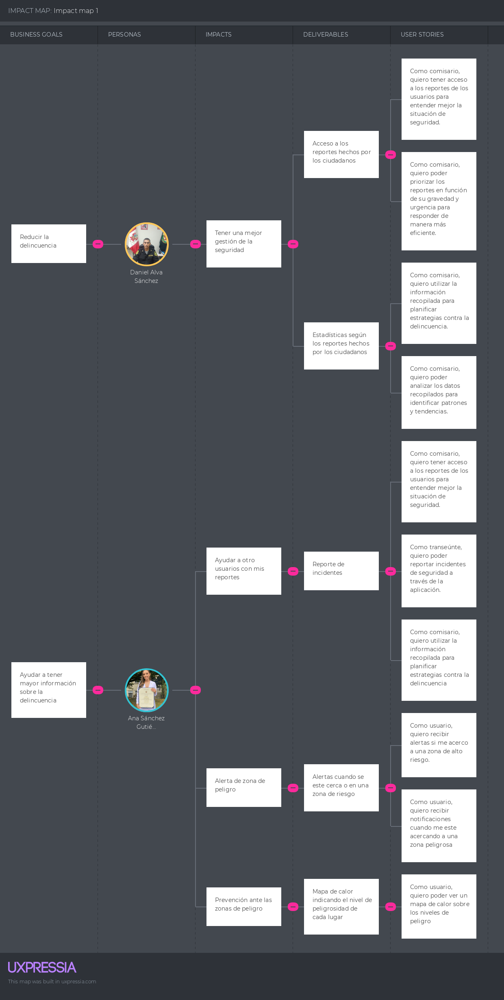

# Capítulo III: Requirements Specification

## 3.1. To-Be Scenario Mapping

El "To-be Scenario Map" representa la visión de la experiencia del usuario una vez que se han implementado las soluciones o mejoras planificadas. 
Este mapa proporciona una representación visual de cómo queremos que sea la experiencia del usuario en el futuro, destacando las actividades que realizarán, 
los pensamientos que tendrán y los sentimientos que experimentarán en cada fase del proceso. Al visualizar el futuro deseado, el "To-be Scenario Map" nos ayuda a 
alinear al equipo en torno a una visión compartida y a identificar las áreas en las que necesitamos enfocarnos para lograr esa experiencia mejorada para el usuario.

**Segmento 1: Ciudadanos preocupados por su seguridad personal en espacios públicos**

**Segmento 2: Entidades Gubernamentales responsables de la seguridad pública y la planificación urbana**

## 3.2. User Stories
| Epic Story ID | Título| Descripción | Criterios de aceptación | Relacionado con (Epic ID) |
|---|---|---|---|---|
| EP01| Diseño y Desarrollo de la Landing Page| Como visitante de la Landing Page, quiero encontrar una landing page bien diseñada y fácil de usar que me proporcione información clara y concisa sobre la aplicación, para poder entender el propósito de la aplicación.| No corresponde| No corresponde|
| EP02| Seguridad en el desplazamiento| Como visitante de la landing page quiero que me recomieden la ruta mas segura para asi poder tener un viaje sin preocupaciones.| No corresponde| No corresponde|
| EP03| Gestion de seguridad | Como usuario de la municipalidad quiero poder ver todos los reportes hechos por los ciudadanos para asi poder tener mayor informacion sobre los lugares con mayor delincuencia.| No corresponde          | No corresponde |
| EP04| Servicios de la Aplicación| Como visitante de la Landing Page, quiero encontrar los servicios que ofrece la aplicación, para poder comprender como PeaceApp puede satisfacer mis necesiades de seguridad y bienestar. | No corresponde| No corresponde|
| EP05| Sistema de notificaciones| Como usuario de PeaceApp, quiero recibir notificaciones en tiempo real sobre incidentes de seguridad en mi área, para estar siempre informado y tomar precauciones.| No corresponde|No corresponde|
| EP06| Perfiles de usuario| Como usuario de PeaceApp, quiero poder crear y personalizar mi perfil de usuario, para tener una identidad dentro de la comunidad de la aplicación.| No corresponde| No corresponde |

<table>
    <tr>
        <td align="center">User Story ID</td>
        <td align="center">Título</td>
        <td align="center">Descripción</td>
        <td align="center">Criterios de Aceptación</td>
        <td align="center">Relacionado con (Epic ID)</td>
    </tr>
    <tr>
        <td align="center">US01</td>
        <td align="justify">Planificación de rutas seguras</td>
        <td align="justify">Como transeúnte, quiero recibir actualizaciones en tiempo real sobre las zonas de peligrosidad en mi ruta.</td>
        <td align="justify">
            Escenario: Un transeúnte está planeando su ruta y quiere recibir actualizaciones en tiempo real sobre las zonas peligrosas. 
            Given el transeúnte ha iniciado la aplicación 
            And ha ingresado su ruta. 
            When la aplicación detecta cambios en la peligrosidad de las zonas en la ruta del transeúnte. 
            Then la aplicación actualiza la información de peligrosidad en tiempo real y la muestra al transeúnte.
        </td>
        <td align="center">EP02</td>
    </tr>
    <tr>
        <td align="center">US02</td>
        <td align="justify">Actualizaciones en tiempo real</td>
        <td align="justify">Como transeúnte, quiero que la aplicación me sugiera la ruta más segura para llegar a mi destino.</td>
        <td align="justify">
            Escenario: Un transeúnte quiere que la aplicación le sugiera la ruta más segura para llegar a su destino. 
            Given el transeúnte ha ingresado su destino en la aplicación. 
            When la aplicación ha calculado todas las rutas posibles. 
            Then la aplicación sugiere la ruta más segura basada en la información de peligrosidad actual.
        </td>
        <td align="center">EP02</td>
    </tr>
    <tr>
        <td align="center">US03</td>
        <td align="justify">Personalización de rutas</td>
        <td align="justify">Como transeúnte, quiero poder personalizar mis rutas en función de mis preferencias de seguridad.</td>
        <td align="justify">
            Escenario: Un transeúnte quiere personalizar su ruta en función de sus preferencias de seguridad. 
            Given el transeúnte ha ingresado su ruta y ha accedido a las opciones de personalización. 
            When el transeúnte ajusta sus preferencias de seguridad. 
            Then la aplicación personaliza la ruta del transeúnte en función de sus preferencias.
        </td>
        <td align="center">EP02</td>
    </tr>
    <tr>
        <td align="center">US04</td>
        <td align="justify">Reporte de incidentes</td>
        <td align="justify">Como transeúnte, quiero poder reportar incidentes de seguridad a través de la aplicación.</td>
        <td align="justify">
            Escenario: Un transeúnte quiere reportar un incidente de seguridad a través de la aplicación. 
            Given el transeúnte ha presenciado un incidente de seguridad. 
            When el transeúnte ingresa los detalles del incidente en la aplicación. 
            Then la aplicación registra el incidente y actualiza la información de peligrosidad de la zona correspondiente.
        </td>
        <td align="center">EP05</td>
    </tr>
    <tr>
        <td align="center">US05</td>
        <td align="justify">Alertas de Zonas de Riesgo</td>
        <td align="justify">Como usuario, quiero recibir alertas si me acerco a una zona de alto riesgo.</td>
        <td align="justify">
            Escenario: Un usuario recibe una alerta cuando se acerca a una zona de alto riesgo. 
            Given el usuario está utilizando la aplicación mientras se desplaza. 
            When la aplicación detecta que el usuario se está acercando a una zona de alto riesgo. 
            Then la aplicación envía una alerta al usuario.
        </td>
        <td align="center">EP05</td>
    </tr>
    <tr>
        <td align="center">US06</td>
        <td align="justify">Visualización de reportes</td>
        <td align="justify">Como transeúnte, quiero poder ver los reportes de otros usuarios en el mapa de calor de peligrosidad.</td>
        <td align="justify">
            Escenario: Un transeúnte quiere ver los reportes de otros usuarios en el mapa de calor de peligrosidad. 
            Given el transeúnte ha abierto el mapa de calor de peligrosidad en la aplicación. 
            When hay reportes de otros usuarios disponibles para la zona que está viendo el transeúnte. 
            Then la aplicación muestra los reportes de otros usuarios en el mapa de calor.
        </td>
        <td align="center">EP04</td>
    </tr>
    <tr>
        <td align="center">US07</td>
        <td align="justify">Acceso a reportes</td>
        <td align="justify">Como comisario, quiero tener acceso a los reportes de los usuarios para entender mejor la situación de seguridad.</td>
        <td align="justify">
            Escenario: Un comisario quiere tener acceso a los reportes de los usuarios para entender mejor la situación de seguridad. 
            Given el comisario ha iniciado sesión en la aplicación con su cuenta de comisario. 
            When el comisario accede a la sección de reportes de la aplicación. 
            Then la aplicación muestra al comisario los reportes de los usuarios.
        </td>
        <td align="center">EP03</td>
    </tr>
    <tr>
        <td align="center">US08</td>
        <td align="justify">Análisis de datos</td>
        <td align="justify">Como comisario, quiero poder analizar los datos recopilados para identificar patrones y tendencias.</td>
        <td align="justify">
            Escenario: Un comisario quiere analizar los datos recopilados para identificar patrones y tendencias. 
            Given el comisario tiene acceso a los datos recopilados por la aplicación. 
            When el comisario utiliza las herramientas de análisis de datos de la aplicación. 
            Then la aplicación proporciona al comisario los resultados del análisis de datos.
        </td>
        <td align="center">EP03</td>
    </tr>
    <tr>
        <td align="center">US09</td>
        <td align="justify">Planificación de estrategias</td>
        <td align="justify">Como comisario, quiero utilizar la información recopilada para planificar estrategias contra la delincuencia.</td>
        <td align="justify">
            Escenario: Un comisario quiere utilizar la información recopilada para planificar estrategias contra la delincuencia. 
            Given el comisario ha analizado los datos recopilados y ha identificado áreas problemáticas. 
            When el comisario utiliza la información recopilada para planificar estrategias. 
            Then la aplicación registra las estrategias del comisario y las asocia con las áreas problemáticas correspondientes.
        </td>
        <td align="center">EP03</td>
    </tr>
    <tr>
        <td align="center">US10</td>
        <td align="justify">Priorización de reportes</td>
        <td align="justify">Como comisario, quiero poder priorizar los reportes en función de su gravedad y urgencia para responder de manera más eficiente.</td>
        <td align="justify">
            Escenario: Un comisario quiere poder priorizar los reportes en función de su gravedad y urgencia para responder de manera más eficiente. 
            Given el comisario tiene acceso a los reportes de los usuarios. 
            When el comisario clasifica los reportes en función de su gravedad y urgencia. 
            Then la aplicación prioriza los reportes según la clasificación del comisario.
        </td>
        <td align="center">EP03</td>
    </tr>
    <tr>
        <td align="center">US11</td>
        <td align="justify">Comunicación con entidades asociadas</td>
        <td align="justify">Como comisario, quiero poder compartir información relevante con otras entidades de seguridad para coordinar esfuerzos.</td>
        <td align="justify">
            Escenario: Un comisario quiere compartir información relevante con otras entidades de seguridad para coordinar esfuerzos. 
            Given el comisario ha identificado información relevante que desea compartir. 
            When el comisario utiliza la función de compartir de la aplicación. 
            Then la aplicación comparte la información seleccionada con las entidades de seguridad seleccionadas por el comisario.
        </td>
        <td align="center">EP03</td>
    </tr>
    <tr>
        <td align="center">US12</td>
        <td align="justify">Visualización de Rutas Seguras</td>
        <td align="justify">Como comisario, quiero poder ver las rutas seguras más utilizadas por los usuarios para entender mejor sus patrones de desplazamiento.</td>
        <td align="justify">
            Escenario: Un comisario quiere ver las rutas seguras más utilizadas por los usuarios para entender mejor sus patrones de desplazamiento. 
            Given el comisario ha accedido a la sección de rutas seguras de la aplicación. 
            When hay datos disponibles sobre las rutas seguras más utilizadas por los usuarios. 
            Then la aplicación muestra al comisario las rutas seguras más utilizadas.
        </td>
        <td align="center">EP03</td>
    </tr>
    <tr>
        <td align="center">US13</td>
        <td align="justify">Añadir foto de perfil</td>
        <td align="justify">Como usuario, quiero poder añadir una foto de perfil.</td>
        <td align="justify">
            Escenario: 
            Given que el usuario está en su perfil, 
            When el usuario selecciona la opción para añadir una foto de perfil, 
            Then se debe abrir un cuadro de diálogo que permita al usuario seleccionar una foto de su dispositivo, 
            And cuando el usuario selecciona una foto y confirma la acción, la foto de perfil del usuario debe actualizarse con la foto seleccionada.
        </td>
        <td align="center">EP06</td>
    </tr>
    <tr>
        <td align="center">US14</td>
        <td align="justify">Recibir notificaciones sobre zona peligrosa</td>
        <td align="justify">Como usuario, quiero recibir notificaciones cuando me este acercando a una zona peligrosa</td>
        <td align="justify">
            Escenario: 
            Given que el usuario ha activado las notificaciones de zonas peligrosas en la configuración de la aplicación, 
            When el usuario se acerca a una zona marcada como peligrosa, 
            Then el usuario debe recibir una notificación alertándole de la proximidad a la zona peligrosa.
        </td>
        <td align="center">EP04</td>
    </tr>
    <tr>
        <td align="center">US15</td>
        <td align="justify">Ver reportes</td>
        <td align="justify">Como usuario, quiero poder ver los reportes de otros usuarios en las denuncias.</td>
        <td align="justify">
            Escenario: 
            Given que el usuario está viendo una denuncia, 
            When el usuario selecciona la opción para ver los reportes de otros usuarios, 
            Then se debe mostrar una lista de reportes con las calificaciones y comentarios de otros usuarios.
        </td>
        <td align="center">EP04</td>
    </tr>
    <tr>
        <td align="center">US16</td>
        <td align="justify">Editar información de perfil</td>
        <td align="justify">Como usuario, quiero poder editar mi información de perfil.</td>
        <td align="justify">
            Escenario: 
            Given que el usuario está en su perfil, 
            When el usuario selecciona la opción para editar su información de perfil, 
            Then se debe abrir una página o un cuadro de diálogo que permita al usuario editar su información de perfil, 
            And cuando el usuario realiza los cambios y confirma la acción, la información de perfil del usuario debe actualizarse con la nueva información.
        </td>
        <td align="center">EP06</td>
    </tr>
    <tr>
        <td align="center">US17</td>
        <td align="justify">Ver denuncias más recientes</td>
        <td align="justify">Como usuario, quiero poder ver las denuncias más recientes en mi área.</td>
        <td align="justify">
            Escenario: 
            Given que el usuario está en la página principal de la aplicación, 
            When el usuario selecciona la opción para ver las denuncias más recientes, 
            Then se debe mostrar una lista de las denuncias más recientes en su área.
        </td>
        <td align="center">EP04</td>
    </tr>
    <tr>
        <td align="center">US18</td>
        <td align="justify">Mapa de calor</td>
        <td align="justify">Como usuario, quiero poder ver un mapa de calor sobre los niveles de peligro</td>
        <td align="justify">
            Escenario: 
            Given que el usuario está en la página principal de la aplicación, 
            When el usuario selecciona el mapa de calor, 
            Then se debe mostrar el mapa de calor señalando las zonas peligrosas y/o seguras
        </td>
        <td align="center">EP04</td>
    </tr>
    <tr>
        <td align="center">US19</td>
        <td align="justify">Optimización de la Experiencia del Usuario</td>
        <td align="justify">Como visitante de la Landing Page, quiero encontrar una landing page responsive</td>
        <td align="justify">
            Escenario: 
            Given que el usuario ingresa a la landing page, 
            When desee, donde desee y desde cualquier dispositivo, 
            Then disfruta una experiencia fluida desde.
        </td>
        <td align="center">EP01</td>
    </tr>
    <tr>
        <td align="center">US20</td>
        <td align="justify">Desarrollo de Secciones Clave de la Landing Page</td>
        <td align="justify">Como visitante de la Landing Page, quiero encontrar información clara y atractiva.</td>
        <td align="justify">
            Escenario: 
            Given que la Landing Page funciona 
            When esta recibe un visitante 
            Then cada sección de la landing page de la aplicación, permite ser comprendida con facilidad y motiva su uso.
        </td>
        <td align="center">EP01</td>
    </tr>
    <tr>
        <td align="center">US21</td>
        <td align="justify">Implementación de Formularios de Contacto</td>
        <td align="justify">Como visitante de la Landing Page, deseo encontrar formularios de contacto funcionales y accesibles</td>
        <td align="justify">
            Escenario: 
            Given un usuario que visita la landing Page 
            When tiene preguntas o preocupaciones 
            Then la landing page de la aplicación ofrece un medio de comunicación efectiva con el equipo de desarrollo de PeaceApp.
        </td>
        <td align="center">EP04</td>
    </tr>
    <tr>
        <td align="center">US22</td>
        <td align="justify">Compartir ubicación</td>
        <td align="justify">Como usuario de PeaceApp, quiero poder compartir mi ubicación con mis contactos cercanos.</td>
        <td align="justify"> 
            Escenario: 
            Given un usuario que comparte su ubicación con sus contactos cercanos 
            When se desplaza por las distintas zonas de la ciudad 
            Then podrán monitorear su trayecto y saber si estoy seguro.
        </td>
        <td align="center">EP04</td>
    </tr>
    <tr>
        <td align="center">US23</td>
        <td align="justify">Testimonios de Usuarios</td>
        <td align="justify">Como visitante de la Landing Page, quiero encontrar las opiniones de los diferentes usuarios que han probado la aplicación. </td>
        <td align="justify">
            Escenario: 
            Given un usuario que visita la Landing Page 
            When tiene curiosidad por la eficiencia de la aplicación 
            Then podrá ver opiniones de otros usuarios 
            And tener una idea clara de su experiencia y satisfacción con PeaceApp
        </td>
        <td align="center">EP04</td>
    </tr>
    <tr>
		<td align="center">TS01</td>
        <td align="justify">Integración del mapa interactivo</td>
        <td align="justify">Como desarrollador quiero implementar un mapa interactivo para ser el eje de funcionamiento.</td>
        <td align="justify">
	        Escenario:
	        Given que se desea desplegar un mapa de calor 
	        When el usuario cargue la página 
	        Then debería usar una API de mapas para hacerlo posible. 
	    </td>
        <td align="center">-</td>
	</tr>
	<tr>
		<td align="center">TS02</td>
        <td align="justify">GET and POST de reportes de seguridad</td>
        <td align="justify">Como desarrollador quiero habilitar la creación y retorno de reportes de incidentes de seguridad para la seguridad de los usuarios.</td>
        <td align="justify">
            Escenario 1: Crear un nuevo reporte de seguridad 
            Given que el usuario está en la página de reportes 
            When el usuario completa el formulario con los detalles del incidente 
            And el usuario envía el reporte 
            Then debería ver un mensaje de confirmación y el reporte debería almacenarse en la API y aparecer en la lista de reportes  
            Escenario 2: Ver detalles de un reporte existente
            Given que el usuario está en la página de reportes 
            When el usuario selecciona un reporte de la lista 
            Then la aplicación hace el GET con la API 
            And debería ver los detalles completos del reporte
        </td>
        <td align="center">-</td>
	</tr>
	<tr>
		<td align="center">TS03</td>
        <td align="justify">GET and POST User</td>
        <td align="justify">Como desarrollador quiero registrar los datos de nuevos usuario mediantes una API para obtener a los que se encuentran afiliados.</td>
        <td align="justify">
	        Escenario 1: Usuario se registra en la página web 
	        Given que tengo acceso a la API de registro de usuarios 
	        When se envía una solicitud con datos válidos de un nuevo usuario 
	        Then el usuario se registra exitosamente y se envía una confirmación.   
	        Escenario 2: Usuario ingresa a la página web 
	        Given que el usuario accede a la página de inicio de sesión 
	        When hace clic en el botón de iniciar sesión 
	        Then los datos ingresados se comparan con los de la API 
	        And se autoriza el ingreso de ser al caso.
		</td>
        <td align="center">-</td>
	</tr>
	<tr>
		<td align="center">TS04</td>
        <td align="justify">Implementación de medidas de seguridad</td>
        <td align="justify">Como desarrollador quiero incorporar medidas de seguridad robustas para proteger la información sensible de los usuarios y garantizar la integridad del sistema.</td>
        <td align="justify">
	        Escenario: Encriptación de datos de usuario 
	        Given que un usuario se registra en la plataforma 
	        When se ingresan los datos personales 
	        Then los datos de usuario se almacenan en la base de datos de forma encriptada 
	        And el usuario puede iniciar sesión utilizando su contraseña encriptada
        </td>
        <td align="center">-</td>
	</tr>
	<tr>
		<td align="center">TS05</td>
        <td align="justify">Pruebas y depuración</td>
        <td align="justify">Como desarrollador quiero realizar pruebas exhaustivas para identificar y corregir los errores o fallos de todas las funcionalidades implementadas.</td>
        <td align="justify">
	        Escenario 1: Pruebas de funcionamiento de todas las funcionalidades 
	        Given la implementación de todas las funcionalidades de la página web 
	        When se realizan pruebas exhaustivas para verificar el correcto funcionamiento 
	        Then se verifican los datos almacenados en la API 
	        And que las medidas de seguridad funcionen correctamente.  
	        Escenario 2: Corrección de errores identificados en las pruebas 
	        Given errores o fallos de funcionamiento en la página web 
	        When se identifica la causa de los errores 
	        Then se implementan las correcciones necesarias 
	        And se realizan más pruebas para verificar que se corrigieron los errores.
	    </td>
        <td align="center">-</td>
	</tr>
	<tr>
		<td align="center">TS06</td>
        <td align="justify">Mantenimiento y actualizaciones</td>
        <td align="justify">Como desarrollador quiero establecer un plan de mantenimiento continuo para realizar actualizaciones periódicas y agregar nuevas funcionalidades según sea necesario.</td>
        <td align="justify">
	        Escenario: Actualización del sistema 
	        Given que se han creado nuevas funcionalidadas 
	        When los administradores inician sesión en el panel de administración 
	        Then la actualización del sistema se despliega correctamente 
	        And está disponible para los usuarios.
	    </td>
        <td align="center">-</td>
	</tr>
	<tr>
		<td align="center">TS07</td>
        <td align="justify">GET and POST comentarios y valoraciones</td>
        <td align="justify">Como desarrollador quiero Implementar un sistema de comentarios y valoraciones para que los usuarios puedan compartir sus experiencias</td>
        <td align="justify">
	        Escenario 1: Un usuario puede agregar un comentario 
	        Given el usuario está en la página del mapa 
	        When el usuario selecciona un área específica en el mapa 
	        Then escribe un comentario sobre el área 
	        And se almacena el comentario en la sección de comentarios de la API  
	        Escenario 2: Un usuario puede ver un comentario
	        Given el usuario está en la página del mapa 
	        When el usuario selecciona un área específica en el mapa 
	        Then se hace el llamdo a la sección de comentarios de la API 
	        And el usuario pueder ver los comentarios.
	     </td>
        <td align="center">-</td>
	</tr>
	<tr>
		<td align="center">TS08</td>
        <td align="justify">Establecer un canal de comunicación directa entre los usuarios y las autoridades </td>
        <td align="justify">Como desarrollador quiero establecer un canal de comunicación directa entre los usuarios y las autoridades para que se envíen alertas o se solicite asistencia en tiempo real.</td>
        <td align="justify">
	        Escenario 1: Un usuario puede enviar una alerta a las autoridades 
	        Given el usuario experimenta una mala experiencia 
	        When se selecciona la opción de enviar una alerta a las autoridades 
	        And proporciona detalles sobre la situación y ubicación 
	        And presiona el botón de enviar alerta 
	        Then se envía una alerta a las autoridades de seguridad  
	        Escenario 2: Un usuario puede solicitar asistencia en tiempo real 
	        Given se requiere asistencia inmediata 
	        When el usuario selecciona la opción adecuada 
	        And especifica el tipo de ayuda que necesita 
	        Then se obtiene la ubicación en tiempo real 
	        And se envía la solicitud
        </td>
        <td align="center">-</td>
	</tr>
	<tr>
		<td align="center">TS09</td>
        <td align="justify">Optimización del rendimiento</td>
        <td align="justify">Como desarrollador quiero mejorar el rendimiento de la página web para garantizar una experiencia fluida para los usuarios.</td>
        <td align="justify">
	        Escenario 1: Carga rápida de la página principal 
	        Given que el usuario accede a la página principal 
	        When la página se carga completamente 
	        Then la página se muestra en menos de 3 segundos 
	        And todos los elementos son visibles y funcionales  
	        Escenario 2: Optimización de recursos estáticos 
	        Given el tamaño total de los recursos descargados es mínimo 
	        When el usuario ingresa a la página 
	        Then los recursos estáticos se cargan de manera eficiente y rápida 
	        And la página carga con rapidez y fluidez.
        </td>
        <td align="center">-</td>
	</tr>
</table>

## 3.3. Impact Mapping

## 3.4. Product Backlog
|#Orden| ID | User Story | Story Points |
|:-----|:---|:----------|:--------------|
|  01  |US20|Desarrollo de Secciones Clave de la Landing Page|3|
|  02  |US19|Optimización de la Experiencia del Usuario|5|
|  03  |US22|Compartir ubicación|8|
|  04  |US02|Actualizaciones en tiempo real|8|
|  05  |US18|Mapa de calor|8|
|  06  |US01|Planificación de rutas seguras|8|
|  07|US03|Personalización de rutas|3|
|  08|US12|Visualización de Rutas Seguras|3|
|  09|US04|Reporte de incidentes|8|
|  10|US05|Alertas de Zonas de Riesgo|5|
|  11|US06|Visualización de reportes|8|
|  12|US07|Acceso a reportes|8|
|  13|US08|Análisis de datos|8|
|  14|US09|Planificación de estrategias|5|
|  15|US10|Priorización de reportes|3|
|  16|US11|Comunicación con entidades asociadas|5|
|  17|US13|Añadir foto de perfil|2|
|  18|US14|Recibir notificaciones sobre zona peligrosa|5|
|  19|US15|Ver reportes|3|
|  20|US16|Editar información de perfil|3|
|  21|US17|Ver denuncias más recientes|5|
|  22|US21|Implementación de Formularios de Contacto|4|
|  23|US23|Testimonios de Usuarios|3|
