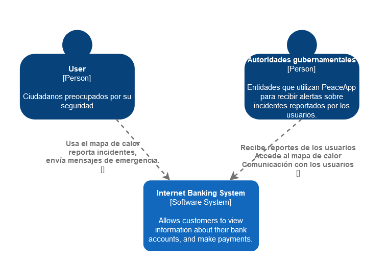
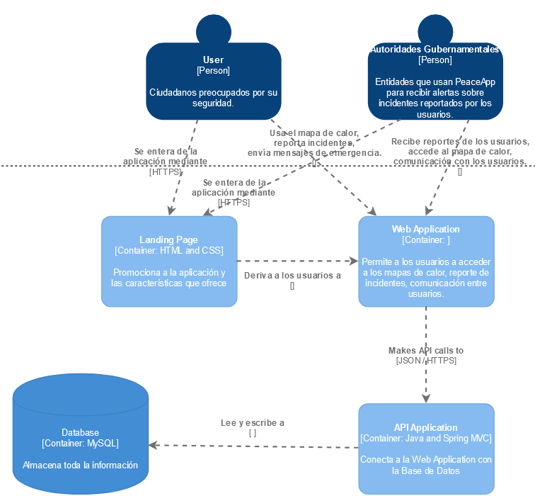
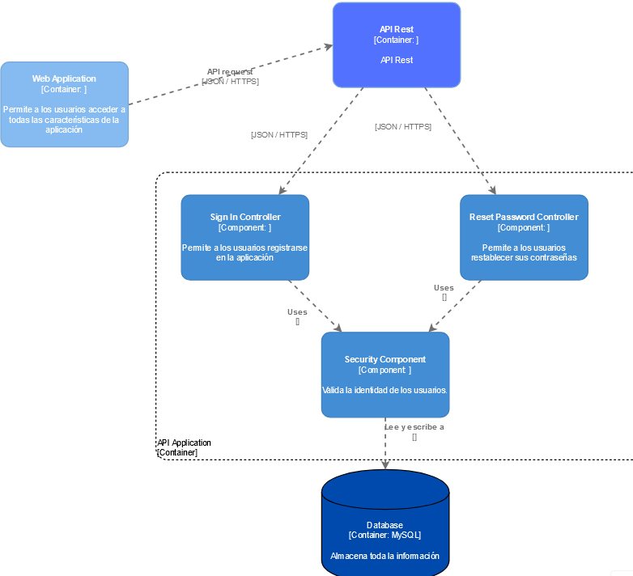

# Capítulo IV: Product Design
## 4.1. Style Guidelines.
### 4.1.1. General Style Guidelines.

  <b>Branding:</b>  
  <b>Brand Overview:</b> 
  PeaceApp, se enfoca en ofrecer una solución tecnológica para la problemática que es la inseguridad ciudadana. Por ello, predisponemos que atraiga la atención del usuario desde el principio
  mediante la creación y el diseño agradable e identificable. Para ello, implementa una plataforma encargada de diseñar un mapa de calor que permita a las personas mantener actualizada la
  información de seguridad disponible. A su vez, permite un contacto directo con las autoridades para recibir ayuda ante actividades delictivas.
  
  <b>Brand Name:</b> 
  PeaceApp recibe su nombre de la unión de las palabras Peace y App. Peace significa paz en español y App corresponde a la abreviación de application, que significa aplicación. Con ello,
  el nombre se entiende, literalmente, como Aplicación de la paz. Este nombre busca reflejar un tono formal y sereno, que se adecue a nuestros objetivos y permita a los usuarios recordarnos
  con facilidad y reflejar los ideales de búsqueda tranquilidad. 

   

  <b>Colores:</b> 
  Los colores toman protagonismo de la primera percepción visual de los usuarios. Para diseñar el logo, se hizo uso del color azul de manera predominante, pues es un color relacionado a la seguridad. 
  Además, para complementarlo de manera estética, se complementara con el color amarilo y se utilizaran tonalidades frías para complementar en la Landing Page.. 
   
  
  <b>Tipografía:</b> 
  La distribución de la tipografía establece la jerarquía entre los diversos grupos de contenido de la página. Asimismo, cumple un rol importante al momento de guiar al usuario a través de la 
  interfaz. Para ello, se decidio utilizar las tipografía Monteserrat, una tipografía sobria y elegnate que refleja profesionalidad. Por último, para una correcta diferenciación entre 
  jerárquias se considerara: . 
  <ul>
    <li>Heading 01: Presenta un tamaño de 52px.</li>
    <li>Heading 02: Presenta un tamaño de 36px.</li>
    <li>Heading 03: Presenta un tamaño de 24px.</li>
    <li>Heading 04: Presenta un tamaño de 18px.</li>
  </ul>
   
  
  <b>Spacing:</b> 
  Para que la información se identifique con claridad, se estarán utilizando espacio desde los 8 hasta los 96px para un diseño equilibrado y una experiencia visual agradable. 
   

### 4.1.2. Web Style Guidelines.

  <ul>
    <li>Imágenes:</li>
    Se incluirán imágenes descriptivas y de utilidad puntual. En primer lugar, la imagen de perfil del usuario y se encontrarán en todo momento en la parte superior derecha, sirvidno como el boton de
    acceso al perfil del usuario. Adicionalmente, se contará con imágenes representativas para cada una de las secciones que representan el núcleo de la aplicación. Por la alta resolución de pantalla 
    resulta importante que el usuario cuente con guías visuales fácilmente identificables. Por esta misma razón, el fondo de las interfaces se verán limitadas a un color único.
    <li>Botones:</li>
    Estarán presentes en la parte superior de la aplicación y los lugares como al inico de sesión o para ingresar al mapa de calor. Estos botones permiten al usuario realizar acciones como ingresar a 
    una ventana, aceptar el ingreso de información o eliminar algún registro. Por otro lado, se deben mostrar botones de confirmación para las acciones que sean de suma importancia para el funcionamiento
    del mapa de calor. Cada botón contará con un estilo distintivo y un alto contraste con los colores del resto de la aplicación. Por ejemplo, se utiliza el color verde y rojo para remarcar el inicio y
    fin de un proceso, respectivamente.
    <li>Pantallas Emergentes:</li>
    Las pantallas emergentes tienen el objetivo de confirmar acciones clave para el funcionamiento de la plataforma. Los pop-ups cuentan con colores con un valor de matiz mayor que sus contrapartes del
    resto de la aplicación web. Además, su aparición oscurecerá el resto de la pantalla para contrastar y darse a conocer, resaltando la importancia del asunto en pantalla antes de que el usuario continúe
    con la navegación.
    <li>Diseño: </li>
    Se implementará un diseño adaptable (Web Responsive Design) que permita mostrar la información de manera óptima en cualquier dispositivo, garantizando que el contenido se vea siempre optimizado para 
    todos los usuarios. Por ello, se opto por emplear el patrón de diseño en forma de "Z" en el sitio web, dirigiendo la atención hacia los elementos clave y potencia la eficacia del contenido. Por ejemplo,
    se verá primero el logotipo en la esquina superior izquierda, seguida hacia la derecha con el menú de navegación, terminando con la imagen de perfil del usuario. Acto seguido, se podrá acceder a toda la
    información en pantalla y las opciones que puedan verse en la parte inferior. 
    
  </ul>

## 4.2. Information Architecture.
### 4.2.1. Organization Systems.

  Para organizar la página, hemos decidido estructurar el contenido con un encabezado donde las secciones se declaren de manera clara.
  <ul>
    <li>
      Organización Visual del Contenido (Visual Hierarchy): La información será mostrada de forma jerárquica, para resaltar la información más relevante y ayudar a los usuarios a navegar de manera 
      eficiente.
    </li>
    <li>
      Organización Secuencial (Step-by-Step to Accomplish): Se guiará a los usuarios de manera progresiva, empezanod por lo más simple y básica para avnazar a lo más detallado. Esto garantiza que
      los usuarios puedan completar tareas de manera intuitiva.
    </li>
  </ul>

### 4.2.2. Labeling Systems.

  En PeaceApp, las etiquetas seguiran las implicaciones de SEO, lo que significa que deben cumplir con los siguientes objetivos:
  <ul>
    <li>
      Nivel de Experiencia de Usuario (UX): Las etiquetas ofrecerán información clara para los usuarios puedan navegar de forma intuitiva.
    </li>
    <li>
      Nivel SEO: Utilizaremos el etiquetado interno para enlazar las páginas complementarias y optimizar el motor de búsqueda.
    </li>
    <li>
      Palabras Clave y Etiquetado Adecuado: Cada subpágina contendrá palabras clave relevantes y un etiquetado apropiado para distribuir los términos de manera efectiva y evitar la competencia 
      interna entre páginas.
    </li>
    <li>
      Impacto de las Etiquetas en Menús y Bloques Estáticos: Reconocemos que las palabras clave contenidas en los menús y en los bloques estáticos tienen un mayor impacto en la navegación y 
      visibilidad de la página.
    </li>
  </ul>
  Tipos de Etiquetas:
  <ul>
    <li>
      Etiquetas Contextuales: Describen los enlaces internos de la página y son cruciales para conectar diferentes funciones. Deberán tener contenido claro, sin ambiguedades.
    </li>
    <li>
      Etiquetas de Encabezado: Indicaran la temática y jerarquía del contenido.
    </li>
    <li>
      Etiquetas con Parámetro ALT: Seran de utilidad para proveer información alterna a las imágenes en nuestra plataforma. Estas descripciones facilitarán la accesibilidad web, permitiendo mejor 
      acceso a mayor cantidad de usuarios, como el uso de lectores de pantalla o fallos en la conexión.
    </li>
  </ul>

### 4.2.3. SEO Tags and Meta Tags

  Estas etiquetas nos ayudan a indicar información codificada y especificar los metadatos. No se ven directamente en las interfaces, pero facilitan el análisis de archivos HTML y del archivo. Además, 
  ayudan en el posicionamiento de nuestra página web en los buscadores.
  <ul>
    <li>
      Title (Título): El título de una página es lo más importante. Utilizaremos títulos descriptivos y atractivos para cada página, que reflejen claramente su contenido y propósito.
    </li>
    
    <li>
      Descripción (Meta Description): Breves resúmenes que aparecen en los resultados de búsqueda. Se utilizaran para traer usuarios al sitio. La meta descripción es "Sientete seguro de visitar la 
      ciudad. Ayuda en a la lucha con la delncuencia."
    </li>
    
    <li>
      Codificación de carácteres: Esta etiqueta ayudará a que muestre correctamente los caracteres especiales en la página.
    </li>
    
  </ul>

### 4.2.4. Searching Systems.

  PeaceApp tiene un sistema de búsqueda simple e intuitivo para ser fácil de usar por todos los usuarios. Primero, en la página principal podrán visualizar las principales funciones, como elegir un
  destino o buscar un lugar en específico. Seguidamente, podrán observar y elegir una ruta basandose en el nivel de peligro que posea. Por último, tendrá un vínculo rápido con el sistem de marcación
  rápida para contactar con las autoridades competentes.

### 4.2.5. Navigation Systems.

  Hemos implementado una barra de navegación en la parte superior de nuestra plataforma que ofrece tres opciones principales:
  <ul>
    <li>
      Inicio: Esta opción llevará al mapa de calor donde los usuarios podrán ver la peligrosidad de la situación. Tambíen tendran el acceso a la marcación rápida.
    </li>
    <li>
      Sistema de denuncias: Aquí los usuarios podrán realizar la denuncia correspondiente tras ver una situación de peligro. Esta información sera de utildad para actualizar el mapa de calor y agilizar
      el trabajo de las autoridades.
    </li>
    <li>
      Historial de denuncias: Aquí los ususarios podrán realizar un seguimiento de las denuncias que presentaron.
    </li>
  </ul>
  Nuestro sistema de navegación se ha diseñado para la comodidad del usuario. Queremos que los usuarios puedan cumplir sus objetivos de manera satisfactoria, ya sea recorrer la ciudad de forma segura,
  realizar una denuncia o realizar su seguimiento.

## 4.3. Landing Page UI Design.
### 4.3.1. Landing Page Wireframe.
#### Lading Page Wireframe - Inicio

#### Lading Page Wireframe - Nosotros

#### Lading Page Wireframe - App

#### Lading Page Wireframe - Servicios

#### Lading Page Wireframe - Planes

#### Lading Page Wireframe - Contáctanos

### 4.3.2. Landing Page Mock-up.
#### Lading Page Mock-up - Inicio

#### Lading Page Mock-up - Nosotros

#### Lading Page Mock-up - App

#### Lading Page Mock-up - Servicios

#### Lading Page Mock-up - Planes

#### Lading Page Mock-up - Contáctanos

## 4.4. Web Applications UX/UI Design.
### 4.4.1. Web Applications Wireframes.

#### Web Applications Wireframes - Página Principal

#### Web Applications Wireframes - Recuperacion Contraseña

#### Web Applications Wireframes - Correo de Cambio de Contraseña

#### Web Applications Wireframes - Registro de Usuarios

#### Web Applications Wireframes - Formulario de Ciudadanos

#### Web Applications Wireframes - Formulario de Municipalidades

#### Web Applications Wireframes - Suscripción de Municipalidades

#### Web Applications Wireframes - Buscar una Ruta

#### Web Applications Wireframes - Ruta Encontrada con Mapa de Calor

#### Web Applications Wireframes - Mapa de la Municipalidad

#### Web Applications Wireframes - Sección de Reportes

#### Web Applications Wireframes - Envio de Reporte

#### Web Applications Wireframes - Detalles del Reporte

#### Web Applications Wireframes - Lista de Reportes Municipalidad

#### Web Applications Wireframes - Notificaciones y Alertas de Ciudadanos

#### Web Applications Wireframes - Notificaciones y Alertas de Municipalidades

#### Web Applications Wireframes - Perfil de Ciudadanos

#### Web Applications Wireframes - Perfil de Municipalidades

#### Web Applications Wireframes - Editar Perfil

### 4.4.2. Web Applications Wireflow Diagrams.
### 4.4.3. Web Applications Mock-ups.

### Web Applications Mock-Ups - Página Principal

### Web Applications Mock-Ups - Recuperación Contraseña

### Web Applications Mock-Ups - Correo de Cambio de Contraseña

### Web Applications Mock-Ups - Registro de Usuarios

### Web Applications Mock-Ups - Formulario de Ciudadanos

### Web Applications Mock-Ups - Formulario de Municipalidades

### Web Applications Mock-Ups - Suscripción de Municipalidades

### Web Applications Mock-Ups - Buscar una Ruta

### Web Applications Mock-Ups - Ruta Encontrada con Mapa de Calor

### Web Applications Mock-Ups - Mapa de la Municipalidad

### Web Applications Mock-Ups - Sección de Reportes

### Web Applications Mock-Ups - Envío de Reporte

### Web Applications Mock-Ups - Detalles del Reporte

### Web Applications Mock-Ups - Lista de Reportes Municipalidad

### Web Applications Mock-Ups - Notificaciones y Alertas de Ciudadanos

### Web Applications Mock-Ups - Notificaciones y Alertas de Municipalidades

### Web Applications Mock-Ups - Perfil de Ciudadanos

### Web Applications Mock-Ups - Perfil de Municipalidades

### Web Applications Mock-Ups - Editar Perfil

### 4.4.4. Web Applications User Flow Diagrams.
## 4.5. Web Applications Prototyping.
## 4.6. Domain-Driven Software Architecture.
### 4.6.1. Software Architecture Context Diagram.
  
  

### 4.6.2. Software Architecture Container Diagrams.

  

### 4.6.3. Software Architecture Components Diagrams.
  Log In Context  
  
## 4.7. Software Object-Oriented Design.
### 4.7.1. Class Diagrams.
### 4.7.2. Class Dictionary.
## 4.8. Database Design.
### 4.8.1. Database Diagram.
