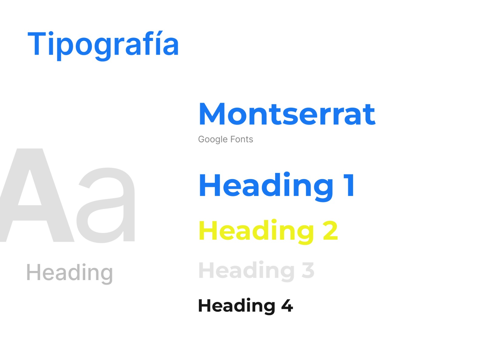

# Capítulo IV: Product Design
## 4.1. Style Guidelines.
### 4.1.1. General Style Guidelines.

  <b>Brand Overview:</b> 
  PeaceApp, se enfoca en ofrecer una solución tecnológica para la problemática que es la inseguridad ciudadana. Por ello, predisponemos que atraiga la atención del usuario desde el principio
  mediante la creación y el diseño agradable e identificable. 
  
  <b>Brand Name:</b> 
  PeaceApp recibe su nombre de la unión de las palabras Peace y App. Peace significa paz en español y App corresponde a la abreviación de application, que significa aplicación. Con ello,
  el nombre se entiende, literalmente, como Aplicación de la paz. Con este nombre se busca que los usuarios puedan recordarnos con facilidad y reflejar los ideales de búsqueda tranquilidad. 
  
  <b>Colores:</b> 
  Los colores toman protagonismo de la primera percepción visual de los usuarios. Para verse coherente con nuestra búsqueda de seguridad, el diseño del logo busca representar xxxxx. Para
  diseñarlo, se hará uso del color azul de manera predominante, pues es un color relacionado a la seguridad. Además, para complementarlo de manera estética, se estaran utilizando tonalidades 
  frías. 
  
   
  
  <b>Tipografía:</b> 
  La distribución de la tipografía establece la jerarquía entre los diversos grupos de contenido de la página. Asimismo, cumple un rol importante al momento de guiar al usuario a través de la 
  interfaz. Para ello, se decidio utilizar las tipografía Monteserrat, una tipografía sobria y elegnate que refleja profesionalidad. Por último, para una correcta diferenciación entre 
  jerárquias se considerara: . 
  <ul>
    <li>Heading 01: Presenta un tamaño de 52px.</li>
    <li>Heading 02: Presenta un tamaño de 36px.</li>
    <li>Heading 03: Presenta un tamaño de 24px.</li>
    <li>Heading 04: Presenta un tamaño de 18px.</li>
  </ul>
  

### 4.1.2. Web Style Guidelines.

  PeaceApp sere desarrollado para entorno web y por lo tanto, tendrá implementado un diseño adaptable (Web Responsive Design) que permita mostrar la información de manera óptima en cualquier
  dispositivo, garantizando que el contenido se vea siempre optimizado para todos los usuarios. Además, se opto por emplear el patrón de diseño en forma de Z en el sitio web, ya que esta técnica
  dirige la atención hacia los elementos clave y potencia la eficacia del contenido. Primero, se verá el logotipo en la esquina superior izquierda y en el lado derecho, el menú de navegación, 
  que haga un llamado a la acción. 
  

## 4.2. Information Architecture.
### 4.2.1. Organization Systems.

  Para organizar la página, hemos decidido estructurar el contenido con un encabezado donde las secciones se declaren de manera clara.
  <ul>
    <li>
      Organización Visual del Contenido (Visual Hierarchy): La información será mostrada de forma jerárquica, para resaltar la información más relevante y ayudar a los usuarios a navegar de manera 
      eficiente.
    </li>
    <li>
      Organización Secuencial (Step-by-Step to Accomplish): Se guiará a los usuarios de manera progresiva, empezanod por lo más simple y básica para avnazar a lo más detallado. Esto garantiza que
      los usuarios puedan completar tareas de manera intuitiva.
    </li>
  </ul>

### 4.2.2. Labeling Systems.

  En PeaceApp, las etiquetas seguiran las implicaciones de SEO, lo que significa que deben cumplir con los siguientes objetivos:
  <ul>
    <li>
      Nivel de Experiencia de Usuario (UX): Las etiquetas ofrecerán información clara para los usuarios puedan navegar de forma intuitiva.
    </li>
    <li>
      Nivel SEO: Utilizaremos el etiquetado interno para enlazar las páginas complementarias y optimizar el motor de búsqueda.
    </li>
    <li>
      Palabras Clave y Etiquetado Adecuado: Cada subpágina contendrá palabras clave relevantes y un etiquetado apropiado para distribuir los términos de manera efectiva y evitar la competencia 
      interna entre páginas.
    </li>
    <li>
      Impacto de las Etiquetas en Menús y Bloques Estáticos: Reconocemos que las palabras clave contenidas en los menús y en los bloques estáticos tienen un mayor impacto en la navegación y 
      visibilidad de la página.
    </li>
  </ul>
  Tipos de Etiquetas:
  <ul>
    <li>
      Etiquetas Contextuales: Describen los enlaces internos de la página y son cruciales para conectar diferentes funciones. Deberán tener contenido claro, sin ambiguedades.
    </li>
    <li>
      Etiquetas de Encabezado: Indicaran la temática y jerarquía del contenido.
    </li>
    <li>
      Etiquetas con Parámetro ALT: Seran de utilidad para proveer información alterna a las imágenes en nuestra plataforma. Estas descripciones facilitarán la accesibilidad web, permitiendo mejor 
      acceso a mayor cantidad de usuarios, como el uso de lectores de pantalla o fallos en la conexión.
    </li>
  </ul>

### 4.2.3. SEO Tags and Meta Tags

  Estas etiquetas nos ayudan a indicar información codificada y especificar los metadatos. No se ven directamente en las interfaces, pero facilitan el análisis de archivos HTML y del archivo. Además, 
  ayudan en el posicionamiento de nuestra página web en los buscadores.
  <ul>
    <li>
      Title (Título): El título de una página es lo más importante. Utilizaremos títulos descriptivos y atractivos para cada página, que reflejen claramente su contenido y propósito.
    </li>
    <li>
      Descripción (Meta Description): Breves resúmenes que aparecen en los resultados de búsqueda. Se utilizaran para traer usuarios al sitio. La meta descripción es "Sientete seguro de visitar la 
      ciudad. Ayuda en a la lucha con la delncuencia."
    </li>
    <li>
      Codificación de carácteres: Esta etiqueta ayudará a que muestre correctamente los caracteres especiales en la página.
    </li>
  </ul>

### 4.2.4. Searching Systems.

  PeaceApp tiene un sistema de búsqueda simple e intuitivo para ser fácil de usar por todos los usuarios. Primero, en la página principal podrán visualizar las principales funciones, como elegir un
  destino o buscar un lugar en específico. Seguidamente, podrán observar y elegir una ruta basandose en el nivel de peligro que posea. Por último, tendrá un vínculo rápido con el sistem de marcación
  rápida para contactar con las autoridades competentes.

### 4.2.5. Navigation Systems.

  Hemos implementado una barra de navegación en la parte superior de nuestra plataforma que ofrece tres opciones principales:
  <ul>
    <li>
      Inicio: Esta opción llevará al mapa de calor donde los usuarios podrán ver la peligrosidad de la situación. Tambíen tendran el acceso a la marcación rápida.
    </li>
    <li>
      Sistema de denuncias: Aquí los usuarios podrán realizar la denuncia correspondiente tras ver una situación de peligro. Esta información sera de utildad para actualizar el mapa de calor y agilizar
      el trabajo de las autoridades.
    </li>
    <li>
      Historial de denuncias: Aquí los ususarios podrán realizar un seguimiento de las denuncias que presentaron.
    </li>
  </ul>
  Nuestro sistema de navegación se ha diseñado para la comodidad del usuario. Queremos que los usuarios puedan cumplir sus objetivos de manera satisfactoria, ya sea recorrer la ciudad de forma segura,
  realizar una denuncia o realizar su seguimiento.

## 4.3. Landing Page UI Design.
### 4.3.1. Landing Page Wireframe.
### 4.3.2. Landing Page Mock-up.
## 4.4. Web Applications UX/UI Design.
### 4.4.1. Web Applications Wireframes.
### 4.4.2. Web Applications Wireflow Diagrams.
### 4.4.3. Web Applications Mock-ups.
### 4.4.4. Web Applications User Flow Diagrams.
## 4.5. Web Applications Prototyping.
## 4.6. Domain-Driven Software Architecture.
### 4.6.1. Software Architecture Context Diagram.
### 4.6.2. Software Architecture Container Diagrams.
### 4.6.3. Software Architecture Components Diagrams.
## 4.7. Software Object-Oriented Design.
### 4.7.1. Class Diagrams.
### 4.7.2. Class Dictionary.
## 4.8. Database Design.
### 4.8.1. Database Diagram.
