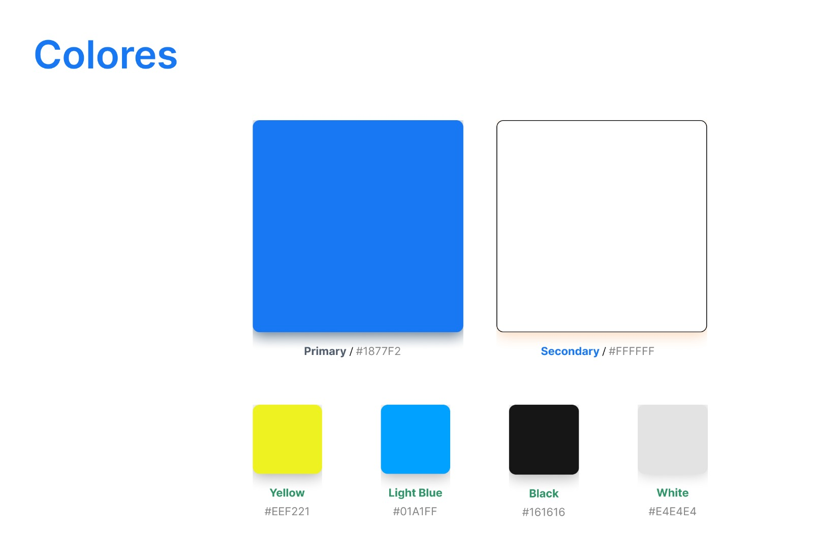
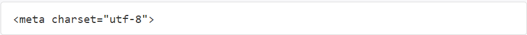
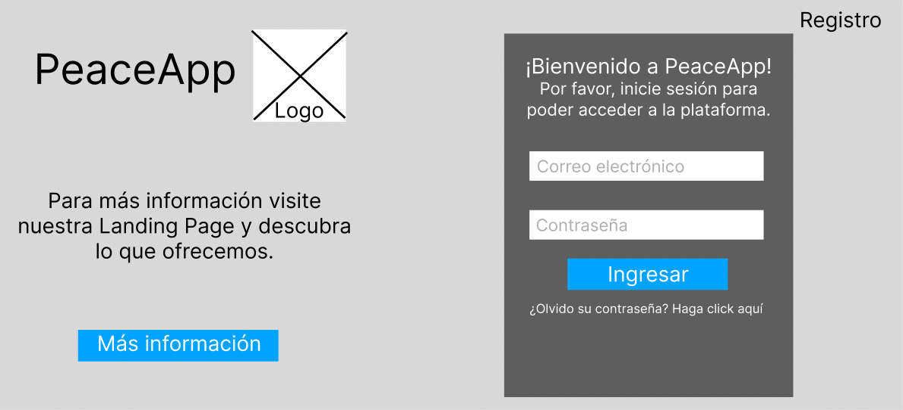
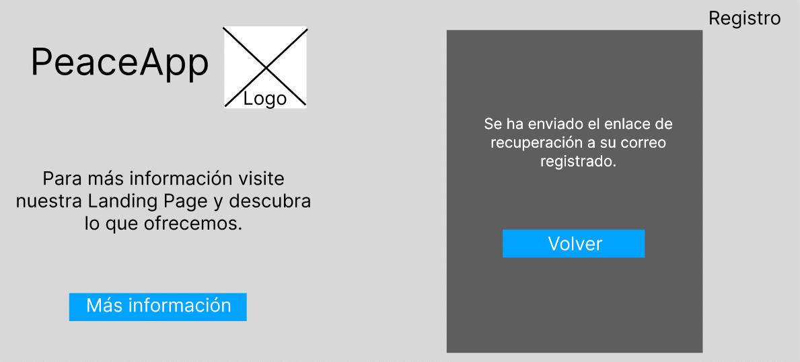
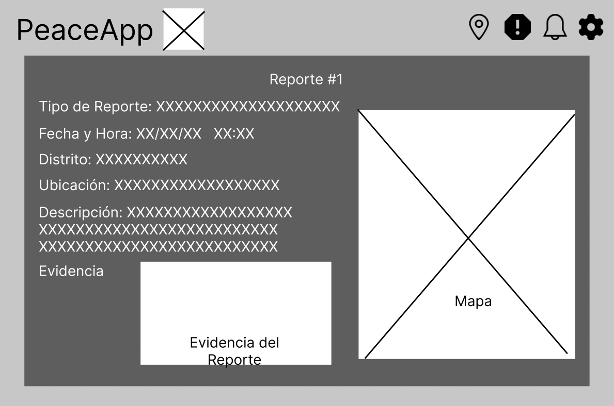
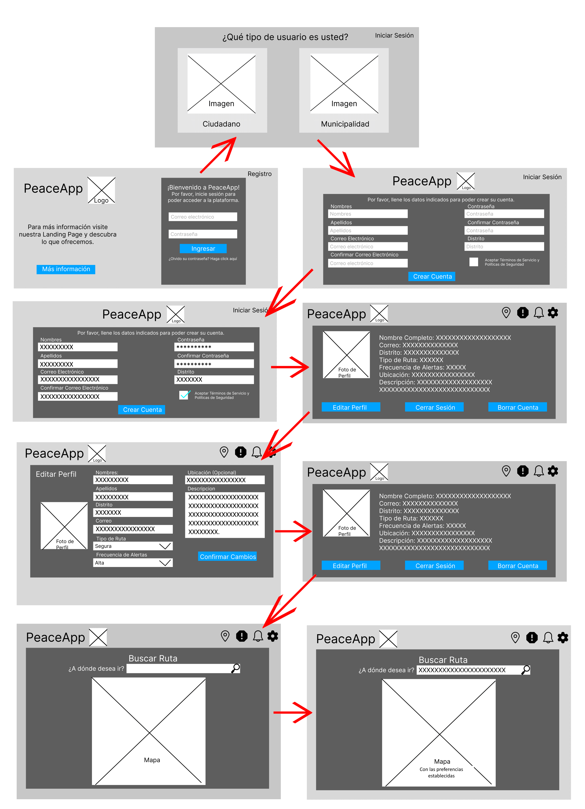
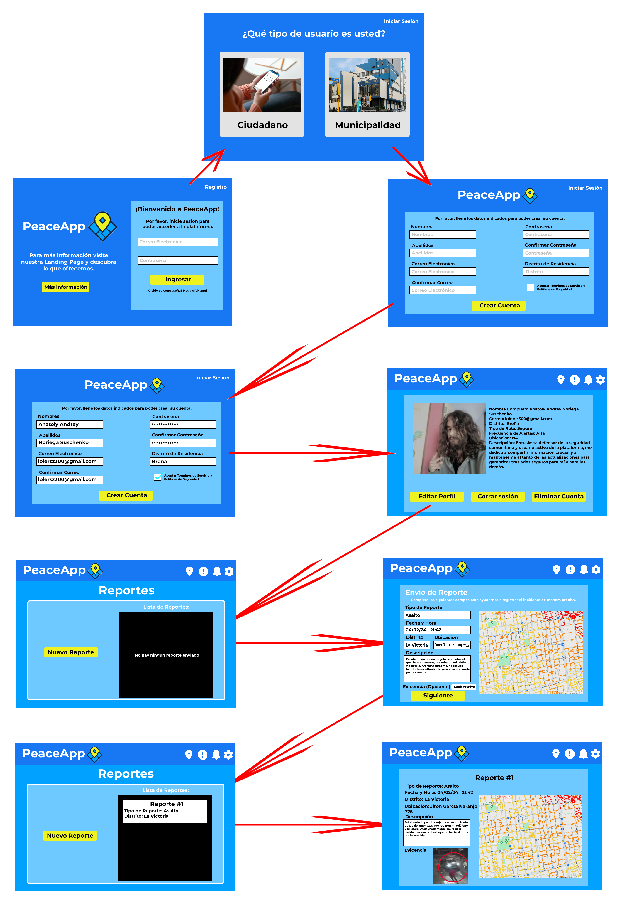
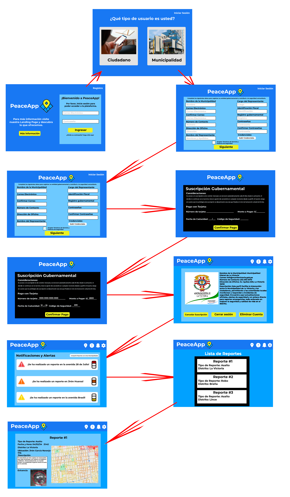
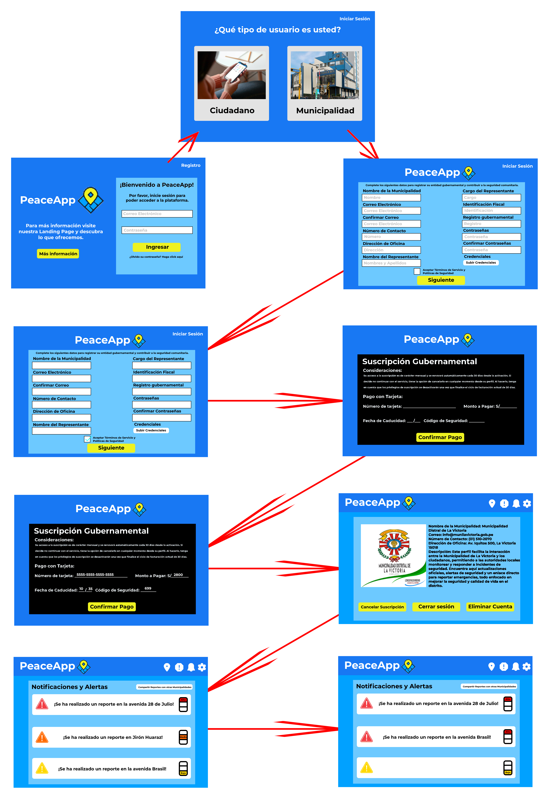

# Capítulo IV: Product Design
## 4.1. Style Guidelines.
### 4.1.1. General Style Guidelines.

  <b>Branding:</b>  
  <b>Brand Overview:</b> 
  PeaceApp, se enfoca en ofrecer una solución tecnológica para la problemática que es la inseguridad ciudadana. Por ello, predisponemos que atraiga la atención del usuario desde el principio
  mediante la creación y el diseño agradable e identificable. Para ello, implementa una plataforma encargada de diseñar un mapa de calor que permita a las personas mantener actualizada la
  información de seguridad disponible. A su vez, permite un contacto directo con las autoridades para recibir ayuda ante actividades delictivas.
  
  <b>Brand Name:</b> 
  PeaceApp recibe su nombre de la unión de las palabras Peace y App. Peace significa paz en español y App corresponde a la abreviación de application, que significa aplicación. Con ello,
  el nombre se entiende, literalmente, como Aplicación de la paz. Este nombre busca reflejar un tono formal y sereno, que se adecue a nuestros objetivos y permita a los usuarios recordarnos
  con facilidad y reflejar los ideales de búsqueda tranquilidad. 

   

  <b>Colores:</b> 
  Los colores toman protagonismo de la primera percepción visual de los usuarios. Para diseñar el logo, se hizo uso del color azul de manera predominante, pues es un color relacionado a la seguridad. 
  Además, para complementarlo de manera estética, se complementara con el color amarilo y se utilizaran tonalidades frías para complementar en la Landing Page.. 
   
  
  <b>Tipografía:</b> 
  La distribución de la tipografía establece la jerarquía entre los diversos grupos de contenido de la página. Asimismo, cumple un rol importante al momento de guiar al usuario a través de la 
  interfaz. Para ello, se decidio utilizar las tipografía Monteserrat, una tipografía sobria y elegnate que refleja profesionalidad. Por último, para una correcta diferenciación entre 
  jerárquias se considerara: . 
  <ul>
    <li>Heading 01: Presenta un tamaño de 52px.</li>
    <li>Heading 02: Presenta un tamaño de 36px.</li>
    <li>Heading 03: Presenta un tamaño de 24px.</li>
    <li>Heading 04: Presenta un tamaño de 18px.</li>
  </ul>
   
  
  <b>Spacing:</b> 
  Para que la información se identifique con claridad, se estarán utilizando espacio desde los 8 hasta los 96px para un diseño equilibrado y una experiencia visual agradable. 
   

### 4.1.2. Web Style Guidelines.

  <ul>
    <li>Imágenes:</li>
    Se incluirán imágenes descriptivas y de utilidad puntual. En primer lugar, la imagen de perfil del usuario y se encontrarán en todo momento en la parte superior derecha, sirvidno como el boton de
    acceso al perfil del usuario. Adicionalmente, se contará con imágenes representativas para cada una de las secciones que representan el núcleo de la aplicación. Por la alta resolución de pantalla 
    resulta importante que el usuario cuente con guías visuales fácilmente identificables. Por esta misma razón, el fondo de las interfaces se verán limitadas a un color único.
    <li>Botones:</li>
    Estarán presentes en la parte superior de la aplicación y los lugares como al inico de sesión o para ingresar al mapa de calor. Estos botones permiten al usuario realizar acciones como ingresar a 
    una ventana, aceptar el ingreso de información o eliminar algún registro. Por otro lado, se deben mostrar botones de confirmación para las acciones que sean de suma importancia para el funcionamiento
    del mapa de calor. Cada botón contará con un estilo distintivo y un alto contraste con los colores del resto de la aplicación. Por ejemplo, se utiliza el color verde y rojo para remarcar el inicio y
    fin de un proceso, respectivamente.
    <li>Pantallas Emergentes:</li>
    Las pantallas emergentes tienen el objetivo de confirmar acciones clave para el funcionamiento de la plataforma. Los pop-ups cuentan con colores con un valor de matiz mayor que sus contrapartes del
    resto de la aplicación web. Además, su aparición oscurecerá el resto de la pantalla para contrastar y darse a conocer, resaltando la importancia del asunto en pantalla antes de que el usuario continúe
    con la navegación.
    <li>Diseño: </li>
    Se implementará un diseño adaptable (Web Responsive Design) que permita mostrar la información de manera óptima en cualquier dispositivo, garantizando que el contenido se vea siempre optimizado para 
    todos los usuarios. Por ello, se opto por emplear el patrón de diseño en forma de "Z" en el sitio web, dirigiendo la atención hacia los elementos clave y potencia la eficacia del contenido. Por ejemplo,
    se verá primero el logotipo en la esquina superior izquierda, seguida hacia la derecha con el menú de navegación, terminando con la imagen de perfil del usuario. Acto seguido, se podrá acceder a toda la
    información en pantalla y las opciones que puedan verse en la parte inferior. 
    
  </ul>

## 4.2. Information Architecture.
### 4.2.1. Organization Systems.

  Para organizar la página, hemos decidido estructurar el contenido con un encabezado donde las secciones se declaren de manera clara.
  <ul>
    <li>
      Organización jerárquica (Visual Hierarchy): La información será mostrada de forma jerárquica, para resaltar la información más relevante y ayudar a los usuarios a navegar de manera eficiente. Se utilizó
      este orden para las pantallas de log-in y los perfiles. Los títulos de los datos destacan más en comparación al resto. 
    </li>
    <li>
      Organización Secuencial (Step-by-Step to Accomplish): Se guiará a los usuarios de manera progresiva, empezando por lo más simple y básico para avanzar a lo más detallado. Esto garantiza que los usuarios
      puedan completar tareas de manera intuitiva. El uso del mapa de calor utiliza esta organización. Al ingresar al mapa se ve primero una vista general de la ciudad. Luego, el usuario podrá acercarse hacia
      su propia ubicación o a una que sea de su interés. Acto seguido tendrá el acceso a la información por cada color del mapa en la zona y dará la opción de crear un nuevo reporte. Finalmente, las autoridades
      tendrán acceso a dichos reportes que utilizaran para tomar acción. 
    </li>
    <li>
      Esquemas de categorización:
      <ul>
        <li>Alfabético:</li>
        Las listas desplegables tendrán la información de manera alfabética. Por ejemplo: Características de personalización, distritos o delitos a reportar.  
        <li>Cronológico: </li>
        La lista de reportes que veran las autoridades estará ordenada de forma cronológica. Además, será de gran valor para definir los colores del mapa de calor.
        <li>Por tópicos:</li>
        Distintas opciones de la plataforma estarán representadas con tarjetas e hipervínculos para ser una ayuda visual adecuada. Por ejemplo, el perfil de usuario, las opciones de contacto y la opción de
        reporte de delitos observados.
        <li>Según audiencia:</li>
        Se identifica el uso diferenciado que le darán los dos segmentos objetivos al usar la plataforma. Las autoridades verán como pantalla principal el reporte de delitos reportados por los usuario, quiene 
        tendrán acceso directo al mapa de calor.
      </ul>
    </li>
  </ul>

### 4.2.2. Labeling Systems.

  En PeaceApp, las etiquetas seguiran las implicaciones de SEO, lo que significa que deben cumplir con los siguientes objetivos:
  <ul>
    <li>
      Nivel de Experiencia de Usuario (UX): Las etiquetas ofrecerán información clara para los usuarios puedan navegar de forma intuitiva.
    </li>
    <li>
      Nivel SEO: Utilizaremos el etiquetado interno para enlazar las páginas complementarias y optimizar el motor de búsqueda.
    </li>
    <li>
      Palabras Clave y Etiquetado Adecuado: Cada subpágina contendrá palabras clave relevantes y un etiquetado apropiado para distribuir los términos de manera efectiva y evitar la competencia 
      interna entre páginas.
    </li>
    <li>
      Impacto de las Etiquetas en Menús y Bloques Estáticos: Reconocemos que las palabras clave contenidas en los menús y en los bloques estáticos tienen un mayor impacto en la navegación y 
      visibilidad de la página.
    </li>
  </ul>
  Tipos de Etiquetas:
  <ul>
    <li>
      Etiquetas Contextuales: Describen los enlaces internos de la página y son cruciales para conectar diferentes funciones. Deberán tener contenido claro, sin ambiguedades.
    </li>
    <li>
      Etiquetas de Encabezado: Indicaran la temática y jerarquía del contenido.
    </li>
    <li>
      Etiquetas con Parámetro ALT: Seran de utilidad para proveer información alterna a las imágenes en nuestra plataforma. Estas descripciones facilitarán la accesibilidad web, permitiendo mejor 
      acceso a mayor cantidad de usuarios, como el uso de lectores de pantalla o fallos en la conexión.
    </li>
  </ul>

### 4.2.3. SEO Tags and Meta Tags

  Estas etiquetas nos ayudan a indicar información codificada y especificar los metadatos. No se ven directamente en las interfaces, pero facilitan el análisis de archivos HTML y del archivo. Además, 
  ayudan en el posicionamiento de nuestra página web en los buscadores.
  <ul>
    <li>
      Title (Título): El título de una página es lo más importante. Utilizaremos títulos descriptivos y atractivos para cada página, que reflejen claramente su contenido y propósito.
    </li>
    
    <li>
      Descripción (Meta Description): Breves resúmenes que aparecen en los resultados de búsqueda. Se utilizaran para traer usuarios al sitio. La meta descripción es "Sientete seguro de visitar la 
      ciudad. Ayuda en a la lucha con la delncuencia."
    </li>
    
    <li>
      Codificación de carácteres: Esta etiqueta ayudará a que muestre correctamente los caracteres especiales en la página.
    </li>
    
  </ul>

### 4.2.4. Searching Systems.

  PeaceApp sabe lo importante que es representar de forma adecuada, fácil y rápida la gran cantidad de información que se verá en la plataforma. PeaceApp tiene un sistema de búsqueda simple e intuitivo 
  para ser fácil de usar por todos los usuarios. Primero, podrán elegir un destino o buscar un lugar en específico. Estos datos se verán de manera listada, incluyendo el tiempo de viaje y los valores
  correspondientes al mapa de calor. Tambien se tendrá la opción de buscar con filtros por distrito, delito o intensidad en el mapa. Con ello, se podrán observar lso resultaods de manera listada, matricial
  o representada en el mapa, respectivamente. Por último, se tendrá un apartado buscar el contacto con las autoridades competentes. Estos resultados se verán como una imagen en conjunto a los datos de
  contacto.

### 4.2.5. Navigation Systems.

  Los sistemas de navegación principales serán los menús superiores, inferiores, el sistema de búsqueda y el mapa de calor. El sistema de labeling desplazara a los usuarios a las secciones que desean visualizar
  dentro de la página. En caso no se utilicen, el usuario verá la página a medida que desciende. La plataforma permitirá a los usuarios navegar libremente por el mapa usando su puntero o visitar las distintas 
  interfaces de manera secuencial. Tambien se tienen los botones que, de igual manera, representan la apertura, confirmación o finalización de los registros. 
  Por último, cabe mencionar que nuestro sistema de navegación se ha diseñado para la comodidad del usuario, pues Queremos que los usuarios puedan cumplir sus objetivos de manera satisfactoria, ya sea recorrer la 
  ciudad de forma segura, realizar una denuncia o realizar su seguimiento.

## 4.3. Landing Page UI Design.
### 4.3.1. Landing Page Wireframe.
La landing page de PeaceApp, diseñada para ser intuitiva y accesible, inicia con una sección de bienvenida que destaca las principales funciones y beneficios de la aplicación. Se continúa con "Nosotros", donde se detalla la misión y visión, reforzando el compromiso de la empresa con la seguridad personal y comunitaria. La sección "App" ofrece una vista previa interactiva de sus características, mientras que "Servicios" explica los distintos servicios como notificaciones de alerta y análisis de seguridad. "Planes" presenta las opciones de suscripción adaptadas a diferentes necesidades de los usuarios. Finalmente, "Contacto" facilita un formulario para comunicaciones directas con el equipo de PeaceApp, asegurando un soporte eficaz y personalizado.

#### Lading Page Wireframe - Inicio

#### Lading Page Wireframe - Nosotros

#### Lading Page Wireframe - App

#### Lading Page Wireframe - Servicios

#### Lading Page Wireframe - Planes

#### Lading Page Wireframe - Contáctanos

### 4.3.2. Landing Page Mock-up.
El wireframe de la landing page para la vista de escritorio ha sido esencial para estructurar la disposición de los elementos visualmente. Siguiendo este diseño inicial, se desarrolló el mock-up de la landing page, manteniendo la coherencia con el contenido previamente descrito. En la imagen siguiente, se puede observar la implementación efectiva de la paleta de colores primarios y secundarios, así como la tipografía seleccionada, demostrando la atención al detalle y la consistencia del estilo visual a lo largo del diseño.

#### Lading Page Mock-up - Inicio

#### Lading Page Mock-up - Nosotros

#### Lading Page Mock-up - App

#### Lading Page Mock-up - Servicios

#### Lading Page Mock-up - Planes

#### Lading Page Mock-up - Contáctanos

## 4.4. Web Applications UX/UI Design.
### 4.4.1. Web Applications Wireframes.

#### Web Applications Wireframes - Página Principal

Pantalla de bienvenida que invita al nuevo usuario a registrarse o iniciar sesión para acceder a la plataforma.

#### Web Applications Wireframes - Recuperacion Contraseña

Interfaz segura de inicio de sesión con recuperación de contraseña para asegurar la cuenta del usuario.

#### Web Applications Wireframes - Correo de Cambio de Contraseña

Mensaje de confirmación que informa al usuario que el enlace para recuperar su contraseña ha sido enviado a su correo electrónico.

#### Web Applications Wireframes - Registro de Usuarios

Pantalla de selección de tipo de usuario que ofrece opciones para "Ciudadano" o "Municipalidad", seguida de la opción para iniciar sesión.

#### Web Applications Wireframes - Formulario de Ciudadanos

Formulario de creación de cuenta nueva para ciudadanos con selección segura de correo electrónico y distrito.

#### Web Applications Wireframes - Formulario de Municipalidades

Formulario de registro para entidades gubernamentales, enfocado en la contribución a la seguridad comunitaria.

#### Web Applications Wireframes - Suscripción de Municipalidades

Detalles de la suscripción gubernamental con consideraciones de renovación, y un formulario de pago con tarjeta para confirmar la transacción.

#### Web Applications Wireframes - Buscar una Ruta

Interfaz de mapa para buscar rutas seguras basadas en la ubicación actual del usuario.

#### Web Applications Wireframes - Ruta Encontrada con Mapa de Calor

Visualización de mapa de calor centrada en el usuario para resaltar los niveles de seguridad de diferentes zonas de la ciudad.

#### Web Applications Wireframes - Mapa de la Municipalidad

Función interactiva de mapa de calor que muestra áreas de alto riesgo para la Municipalidad en cuestión.

#### Web Applications Wireframes - Sección de Reportes

Sección que lista los reportes enviados por los ciudadanos, con detalles para cada reporte y la opción de enviar un nuevo reporte.

#### Web Applications Wireframes - Envio de Reporte

Formulario para reportar incidentes con opción de subir evidencia para una documentación precisa.

#### Web Applications Wireframes - Detalles del Reporte

Interfaz para visualizar la información del reporte realizado de usuario, con campos como el tipo de reporte, fecha y hora, descripción, ubicación y evidencia.

#### Web Applications Wireframes - Lista de Reportes Municipalidad

Lista resumida de informes para que las autoridades revisen y tomen las acciones necesarias.

#### Web Applications Wireframes - Notificaciones y Alertas de Ciudadanos

Interfaz de la aplicación que muestra una lista de notificaciones y alertas para el usuario, permitiendo mantenerse informado sobre las actualizaciones de seguridad.

#### Web Applications Wireframes - Notificaciones y Alertas de Municipalidades

Ajustes de notificaciones personalizables que permiten compartir informes con otras municipalidades.

#### Web Applications Wireframes - Perfil de Ciudadanos

Pantalla de perfil del usuario puede actualizar su información personal, cerrar sesión o borrar su cuenta.

#### Web Applications Wireframes - Perfil de Municipalidades

Vista del perfil de una entidad en la aplicación con opciones para cancelar suscripción, cerrar sesión o borrar la cuenta.

#### Web Applications Wireframes - Editar Perfil

Opciones de edición de perfil de usuario, incluyendo tipos de ruta preferidos y frecuencia de alertas.

### 4.4.2. Web Applications Wireflow Diagrams.

#### User Flow User Goal 1 (Como transeúnte, quiero que la aplicación me sugiera la ruta más segura.)
User Task: El usuario se registra como ciudadano, busca un destino y recibe sugerencias de la ruta más segura a través del mapa de calor.

#### User Flow User Goal 2 (Como transeúnte, quiero poder personalizar mis rutas en función de mis preferencias.)
User Task: El usuario ajusta sus preferencias de seguridad en su perfil para obtener rutas personalizadas que se ajusten a sus necesidades.

#### User Flow User Goal 3 (Como transeúnte, quiero poder reportar incidentes.)
User Task: El usuario accede a la sección de reportes, completa un formulario con los detalles del incidente y visualiza el nuevo reporte en su lista.

#### User Flow User Goal 4 (Como comisario, quiero tener acceso a los reportes de los usuarios.)
User Task: El comisario registra información de su municipalidad, revisa reportes de incidentes y planifica estrategias contra la delincuencia.

#### User Flow User Goal 5 (Como comisario, quiero poder priorizar los reportes en función de su gravedad y urgencia.)
User Task: El comisario establece la prioridad de los reportes basándose en su gravedad y urgencia para gestionar las respuestas de forma eficaz.

### 4.4.3. Web Applications Mock-ups.

### Web Applications Mock-Ups - Página Principal
Interfaz de bienvenida finalizada, que muestra un diseño interactivo donde los nuevos usuarios son alentados a registrarse o iniciar sesión para utilizar la plataforma.

### Web Applications Mock-Ups - Recuperación Contraseña
Interfaz de usuario final para inicio de sesión con funcionalidad de recuperación de contraseña, proporcionando seguridad y accesibilidad.

### Web Applications Mock-Ups - Correo de Cambio de Contraseña
Mensaje de confirmación detallado y diseñado que notifica a los usuarios el envío del enlace para restablecer su contraseña.

### Web Applications Mock-Ups - Registro de Usuarios
Selección visual de tipo de usuario con un diseño claro y opciones para "Ciudadano" o "Municipalidad", con acceso directo para iniciar sesión.

### Web Applications Mock-Ups - Formulario de Ciudadanos
Diseño definitivo del formulario de registro para ciudadanos, con campos de entrada y selecciones seguras.

### Web Applications Mock-Ups - Formulario de Municipalidades
Formulario interactivo de registro para entidades gubernamentales, diseñado para fomentar la contribución a la seguridad comunitaria.

### Web Applications Mock-Ups - Suscripción de Municipalidades
Vista completa de la suscripción gubernamental con detalles sobre la renovación y formulario de pago seguro.

### Web Applications Mock-Ups - Buscar una Ruta
Interfaz de usuario para la búsqueda de rutas seguras, mostrando un mapa interactivo y opciones de filtrado.

### Web Applications Mock-Ups - Ruta Encontrada con Mapa de Calor
Representación visual de un mapa de calor en el contexto de la aplicación, destacando las áreas de interés de seguridad.

### Web Applications Mock-Ups - Mapa de la Municipalidad
Funcionalidad de mapa de calor personalizado para municipalidades, con información detallada sobre áreas de alto riesgo.

### Web Applications Mock-Ups - Sección de Reportes
Sección de reportes con una lista detallada y diseño interactivo para visualizar y enviar nuevos reportes.

### Web Applications Mock-Ups - Envío de Reporte
Interfaz detallada para el envío de reportes, incluyendo la opción de adjuntar evidencia para verificar los incidentes.

### Web Applications Mock-Ups - Detalles del Reporte
Pantalla que muestra en detalle la información de los reportes enviados por los usuarios, con todas las opciones relevantes.

### Web Applications Mock-Ups - Lista de Reportes Municipalidad
Lista resumida de informes para revisión de las autoridades, con diseño enfocado en la accesibilidad y toma de decisiones.

### Web Applications Mock-Ups - Notificaciones y Alertas de Ciudadanos
Diseño de la interfaz para mostrar notificaciones y alertas a los ciudadanos, manteniendo al usuario informado sobre la seguridad.

### Web Applications Mock-Ups - Notificaciones y Alertas de Municipalidades
Sistema de alertas para municipalidades que permite la personalización y el intercambio de información entre entidades.

### Web Applications Mock-Ups - Perfil de Ciudadanos
Diseño completo de la página de perfil de usuario, ofreciendo control total sobre la información personal y la cuenta.

### Web Applications Mock-Ups - Perfil de Municipalidades
Interfaz del perfil de la municipalidad con opciones claras para la gestión de la cuenta y suscripción.

### Web Applications Mock-Ups - Editar Perfil
Página de edición de perfil de usuario con un diseño intuitivo y fácil de usar para la personalización del perfil.

### 4.4.4. Web Applications User Flow Diagrams.

#### User Flow User Goal 1 (Como transeúnte, quiero que la aplicación me sugiera la ruta más segura.)
User Task: El usuario se registra como ciudadano, busca un destino y recibe sugerencias de la ruta más segura a través del mapa de calor.

#### User Flow User Goal 2 (Como transeúnte, quiero poder personalizar mis rutas en función de mis preferencias.)
User Task: El usuario ajusta sus preferencias de seguridad en su perfil para obtener rutas personalizadas que se ajusten a sus necesidades.

#### User Flow User Goal 3 (Como transeúnte, quiero poder reportar incidentes.)
User Task: El usuario accede a la sección de reportes, completa un formulario con los detalles del incidente y visualiza el nuevo reporte en su lista.

#### User Flow User Goal 4 (Como comisario, quiero tener acceso a los reportes de los usuarios.)
User Task: El comisario registra información de su municipalidad, revisa reportes de incidentes y planifica estrategias contra la delincuencia.

#### User Flow User Goal 5 (Como comisario, quiero poder priorizar los reportes en función de su gravedad y urgencia.)
User Task: El comisario establece la prioridad de los reportes basándose en su gravedad y urgencia para gestionar las respuestas de forma eficaz.

## 4.5. Web Applications Prototyping.
En esta parte del documento, se incluye el enlace al prototipo de la Aplicación Web, el cual fue creado utilizando la herramienta de prototipado Figma. 
https://www.figma.com/proto/g2UjaaatgDwqOfmLg1rFFW/PeaceApp-Prototype?type=design&node-id=201-31&t=NWFD8ug873xPiMio-1&scaling=scale-down&page-id=0%3A1&starting-point-node-id=2%3A2&mode=design
## 4.6. Domain-Driven Software Architecture.
### 4.6.1. Software Architecture Context Diagram.
  
  

### 4.6.2. Software Architecture Container Diagrams.

  

### 4.6.3. Software Architecture Components Diagrams.
  Log In Context  
  

  Incident Context  
  

## 4.7. Software Object-Oriented Design.
### 4.7.1. Class Diagrams.
   

### 4.7.2. Class Dictionary.  

  
  

## 4.8. Database Design.
### 4.8.1. Database Diagram.
  